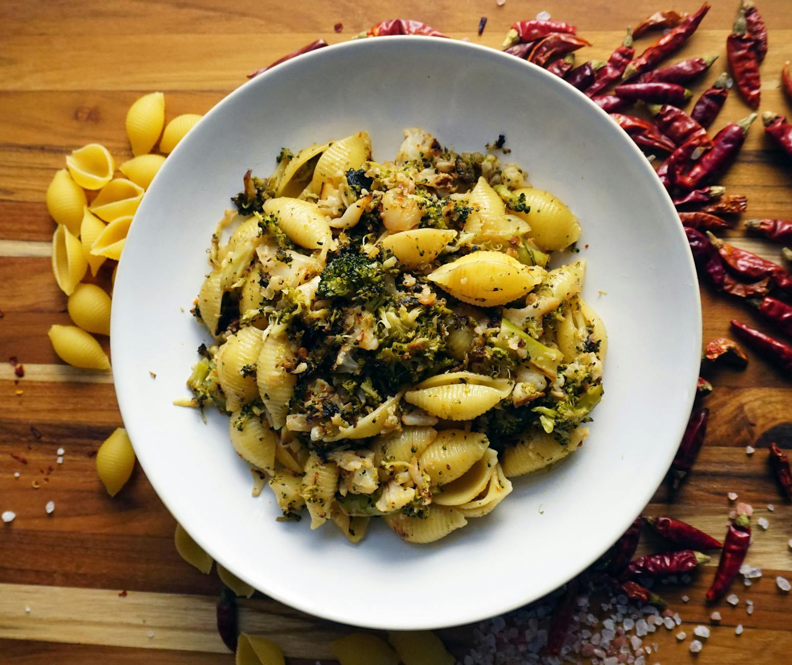

# Pasta Shells with Sprouting Broccoli, Chilli, and Pine Nuts

*Orecchiette al broccoli, the fresh, firm al dente broccoli mingles beautifully with nutty pine nuts and mild spicy undertones. The pasta shells capture every bit of the light oil sauce. This is vegetarian cooking at its most satisfying.*

**Serves:** 4

## Overview
This simple vegetarian dish relies on technique and proper timing to shine. Tender sprouting broccoli is stir-fried with garlic, toasted pine nuts, and a hint of chilli. A splash of white wine adds acidity and complexity. The broccoli must stay al dente, retaining bite and bright green color. Shell pasta combines beautifully with this light style sauce.

## Ingredients

### Broccoli & Aromatics
- 8 tablespoons olive oil
- 300 grams sprouting broccoli (cut into 2 cm pieces)
- 2 garlic cloves (finely sliced)
- 6 tablespoons pine nuts
- 1 medium-hot chilli (de-seeded and finely chopped)
- 100 ml dry white wine
- Salt to taste

### Pasta & Finishing
- 500 grams orecchiette shells
- 150 grams Parmesan (freshly grated)
- 10 fresh basil leaves

## Method

### Stage 1 – Cook Broccoli
1. Heat oil in a large frying pan over medium heat.
2. Add broccoli, garlic, pine nuts, and chilli.
3. Stir-fry for 3 minutes, stirring occasionally with a wooden spatula.
4. Broccoli should remain al dente and bright green.

### Stage 2 – Add Wine
1. Season with salt.
2. Add white wine and continue cooking over medium heat for a further 8 minutes.
3. Stir occasionally.
4. The broccoli stays al dente, not soft.

### Stage 3 – Cook Pasta
1. Meanwhile, cook pasta in a large saucepan of boiling salted water until al dente.
2. Drain thoroughly and return to the same pan.

### Stage 4 – Combine
1. Add the broccoli mixture to the pan with the pasta.
2. Place the pan over low heat.
3. Sprinkle over Parmesan cheese and mix everything together for 20 seconds.
4. The sauce should coat the pasta evenly.

### Stage 5 – Serve
1. Divide among warmed bowls.
2. Serve immediately, garnished with fresh basil leaves.

## Notes
- **Broccoli Selection:** Sprouting broccoli is more delicate and tender than standard broccoli; look for bright, firm florets.
- **Timing:** The broccoli must not be overcooked; it should retain slight firmness and bright green color.
- **Pine Nuts:** Essential for texture and nutty flavor. Toast briefly for better flavor development.
- **Wine Choice:** A crisp, dry white wine adds acid without heavy flavor; the wine should enhance, not dominate.

## Variations
**With Garlic Crumbs:** Toss raw breadcrumbs with garlic oil and brown in the pan for textural topping.
**Walnut Version:** Replace pine nuts with toasted walnuts for earthier flavor.

## Serving
Serve with: A crisp white wine and crusty bread
Garnish with: Fresh basil leaves, Parmesan shavings, and cracked pepper

## Storage
- Best eaten immediately while broccoli remains firm
- Can refrigerate 1-2 days but broccoli texture suffers with reheating
- Not recommended for freezing