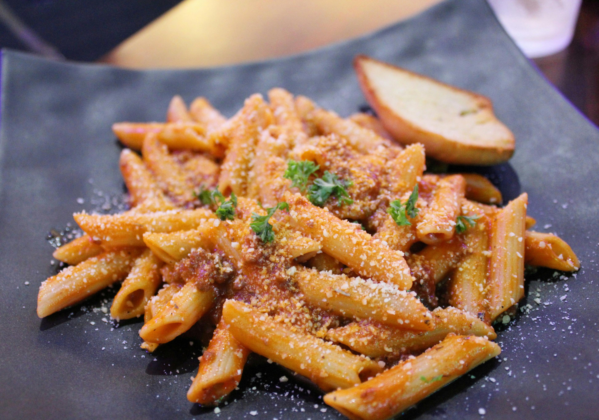

# Penne with Red Chillies, Garlic, and Chopped Tomatoes

*Penne all' Arrabbiata, "in the manner of the angry cook", a Roman classic of brutal simplicity: fresh tomatoes, fierce chilli, golden garlic, and excellent pasta. The dish's name refers to the chilli's heat; the sauce's beauty lies in its straightforwardness. Fresh tomatoes are preferred; if using canned, discard seeds to avoid wateriness.*

**Serves:** 4

## Overview
This is peasant cooking at its finest: five ingredients combine to create something utterly satisfying. The gentle cooking of tomatoes with chilli and garlic creates a sauce that clings to pasta without cream or oil to muddy it. Fresh flat-leaf parsley adds brightness. This dish proves that simplicity, when executed with care, requires nothing more.

## Ingredients

### Sauce
- 6 tablespoons extra virgin olive oil
- 2 garlic cloves (peeled and chopped)
- 2 medium-hot red chillies (de-seeded and finely chopped)
- 800 grams chopped tomatoes (fresh if possible; canned acceptable)
- 4 tablespoons fresh flat-leaf parsley (finely chopped)
- Salt to taste

### Pasta
- 500 grams penne rigate

## Method

### Stage 1 – Infuse Oil
1. Heat oil in a large frying pan over medium heat.
2. Add chopped garlic and chilli.
3. Fry for about 1 minute, stirring with a wooden spatula.
4. Do not let the garlic color or it becomes bitter.

### Stage 2 – Cook Tomatoes
1. Pour in chopped tomatoes and 3 tablespoons of the parsley.
2. Stir well and simmer gently uncovered for about 10 minutes.
3. Stir every couple of minutes to ensure even cooking.

### Stage 3 – Cook Pasta & Combine
1. While sauce simmers, cook pasta in a large saucepan of boiling salted water until al dente.
2. Drain thoroughly and tip back into the same pan.
3. Put the saucepan back over low heat.
4. Pour in the Arrabbiata sauce and stir everything together for about 1 minute to allow flavors to combine.

### Stage 4 – Serve
1. Divide among warmed bowls.
2. Serve immediately, sprinkled with remaining chopped parsley.
3. Add grated Parmesan only if desired (though traditionally served without).

## Notes
- **Fresh Tomatoes:** Ripe, in-season tomatoes produce superior sauce. Off-season, good canned are better than poor fresh.
- **Seed Removal:** Fresh tomato seeds and surrounding jelly contain excessive water; remove them to avoid watery sauce.
- **Chilli Heat:** The name "arrabbiata" refers to the chilli's bite. Adjust heat to your preference, but the chilli should be noticeable.
- **Garlic Color:** Golden is acceptable; brown means bitter. Watch carefully.

## Variations
**With Anchovy:** Add 2 finely chopped anchovy fillets with the garlic for depth.
**Bacon Version:** Add 100g pancetta, cooked first, for richness.

## Serving
Serve with: Crusty bread for sauce soaking
Garnish with: Fresh parsley, cracked black pepper, and a drizzle of excellent olive oil

## Storage
- Keeps 3-4 days refrigerated
- Freezes well up to 2 months (thaw fully before reheating gently)
- Best eaten fresh; flavors develop in first 24 hours