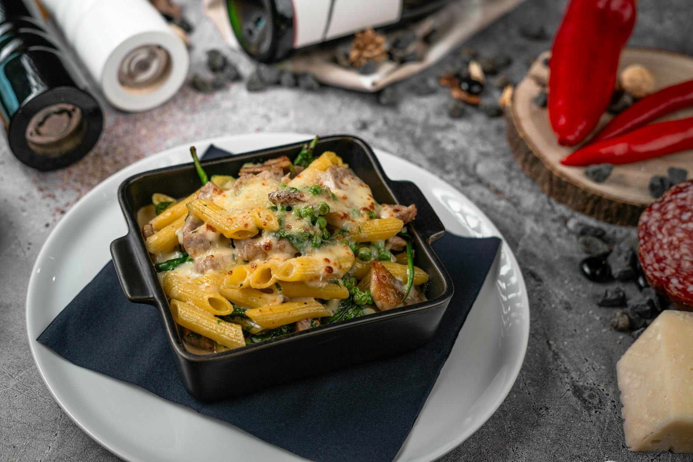

# Penne with Red Chicory, Sausages, and Red Wine

*Penne alla trevisana, Italian sausage, crumbled and browned, meets bitter red chicory that wilts then absorbs the wine-enriched sauce. A slight cream finish adds richness without overwhelming the delicate interplay between the sausage's seasoning and chicory's subtle bitterness. Top-quality sausages are essential.*

**Serves:** 4

## Overview
This is peasant cooking with refined sensibilities. Sausage, freed from its casing and crumbled, browns deeply and flavors the oil. Red chicory (radicchio), shredded and quick-cooked, becomes tender yet retains its distinctive bitter-sweet character. Red wine deglazes the pan and adds complexity. A small amount of cream marries everything into a sophisticated sauce that coats each penne tube.

## Ingredients

### Sauce Base
- 150 grams top-quality pork sausages (preferably Italian)
- 3 tablespoons extra virgin olive oil
- 1 red onion (peeled and finely chopped)
- 2 whole red chicory heads (washed and shredded)
- 100 ml dry red wine
- 30 ml double cream
- Salt and pepper to taste

### Pasta & Finish
- 500 grams penne rigate
- 2 tablespoons fresh flat leaf parsley (chopped)
- 30 grams Parmesan (freshly grated)

## Method

### Stage 1 – Brown Sausage & Soften Onion
1. Remove the skins from the sausages and discard; place the sausage meat in a small bowl.
2. Heat the olive oil in a large frying pan over low heat.
3. Add the crumbled sausage meat and finely chopped red onion.
4. Fry for 5 minutes, stirring occasionally with a wooden spatula to allow the meat to crumble and cook evenly.
5. The sausage should brown and render its fat; the onion should soften and meld with the meat.

### Stage 2 – Wilt Chicory
1. Add the shredded red chicory to the pan.
2. Season with salt and pepper.
3. Continue cooking for 1 minute, stirring occasionally.
4. The chicory will begin to wilt and absorb the flavorful oil.

### Stage 3 – Deglaze with Red Wine
1. Pour the red wine into the pan, scraping the bottom to release any caramelized bits.
2. Continue cooking for 1 minute to allow the alcohol to evaporate.
3. The pan should smell of wine cooking off, not harsh spirits.
4. Set aside away from the heat.

### Stage 4 – Cook Pasta
1. Meanwhile, cook the penne in a large saucepan of boiling salted water until al dente.
2. Drain thoroughly.

### Stage 5 – Finish & Combine
1. Return the sausage pan to medium heat.
2. Add the cooked penne to the pan with the sauce.
3. Pour in the double cream and scatter over the parsley.
4. Sprinkle with Parmesan.
5. Toss everything together over medium heat for 3 seconds to allow the flavors to combine and cream to emulsify.
6. Serve immediately.

## Notes
- **Sausage Quality:** Use best-quality Italian sausages; they have superior seasoning and better fat distribution than generic pork sausages.
- **Chicory Timing:** Cook chicory only 1 minute; any longer and it loses its distinctive bitter-sweet character and becomes mushy.
- **Wine Alcohol:** The 1-minute cook time is essential to drive off harsh alcohol flavors while retaining the wine's depth.
- **Cream Finish:** The cream is just a finish; it shouldn't overpower the sausage and chicory flavors.

## Variations
**Add Garlic:** Include 1 crushed garlic clove with the onion for more depth.
**Spicy Heat:** Add 1/2 teaspoon chilli flakes to the sausage mixture for heat.
**With Roasted Vegetables:** Substitute some chicory with roasted red peppers for sweetness.

## Serving
Serve with: Crusty bread, green salad, red wine (Chianti or Barbera)
Garnish with: Fresh parsley, cracked black pepper, extra grated Parmesan

## Storage
- Refrigerate leftovers in an airtight container for up to 2 days
- Reheat gently on stovetop with a splash of water
- The sauce improves slightly after 24 hours as flavors meld
- Do not freeze; texture suffers significantly