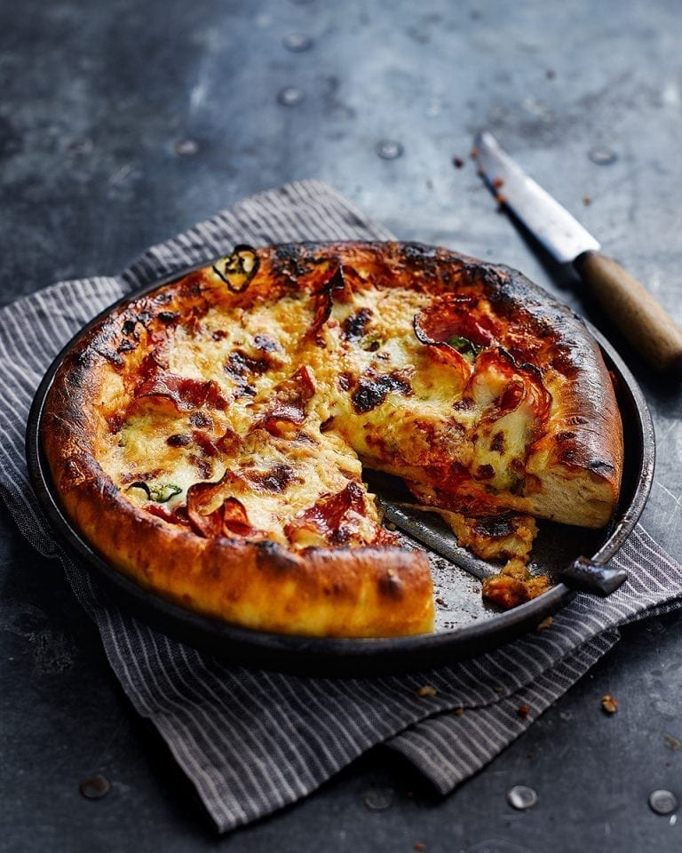

# American Hot Deep-Pan Pizza

*The American deep-pan style is built in a cake tin rather than on a stone, with a thick, breadlike crust and a long-cooked tomato sauce reduced almost to ketchup. This version layers two salamis, melted cheese and jalapeños for a proper hot pizza.*

**Serves:** 2 large pizzas
**Prep Time:** 30 minutes
**Cook Time:** 1 hour

## Overview
A breadlike yeasted dough is pressed into 23 cm cake tins, given a thick rim, and baked over a deeply reduced tomato sauce sharpened with red wine, vinegar, Worcestershire and Tabasco. Two kinds of salami sit beneath grated mozzarella and cheddar, with jalapeños scattered on top. The pan technique gives a chewy crumb and a crisp, cheese-lacquered base.

## Ingredients

### Dough
- 7 grams sachet fast-action dried yeast
- 1½ teaspoons caster sugar
- 1½ teaspoons fine sea salt
- 340 ml lukewarm water
- 600 grams strong plain flour (plus extra for dusting)
- Vegetable oil (for greasing)

### Tomato Sauce
- 4 tablespoons olive oil
- 3 shallots (finely chopped)
- 2 garlic cloves (crushed)
- 1 teaspoon caster sugar
- ½ teaspoon sea salt
- 1 tablespoon white wine vinegar
- 150 ml red wine
- 300 grams passata
- 1 tablespoon Worcestershire sauce
- 1 teaspoon Tabasco sauce

### Topping
- 12 slices spicy salami
- 12 slices regular salami
- 150 grams cooking mozzarella (grated)
- 50 grams strong cheddar (grated)
- 1 to 2 jalapeño chillies (sliced)

### Equipment
- 2 x 23 cm cake tins

## Method

### Stage 1 – Make the Dough
1. Combine the yeast, sugar and salt in a measuring jug.
2. Pour over the warm water and leave for a few minutes to froth and dissolve.
3. Sift the flour into a large mixing bowl and pour in the liquid.
4. Stir to bring the dough together.
5. Knead in a mixer with a dough hook for 5 minutes on medium, or by hand on a lightly floured surface for 10 to 15 minutes.
6. Stop when the dough springs back when gently pressed.
7. Put the dough in a lightly oiled bowl, cover with cling film, and leave to rise in a warm room for about 1 hour, until almost doubled.

### Stage 2 – Make the Tomato Sauce
1. Heat the olive oil in a saucepan and gently fry the shallots for about 10 minutes, until softened.
2. Add the garlic and fry for a few minutes more.
3. Stir in the sugar, salt, vinegar and red wine.
4. Bring to the boil and bubble for 10 minutes to reduce by three-quarters.
5. Add the passata and simmer over a low heat for 45 minutes, stirring occasionally, until reduced and thick.
6. Season with salt and pepper, then stir in the Worcestershire and Tabasco to taste.

### Stage 3 – Shape & Top the Pizzas
1. Heat the oven to 240°C (220°C fan, gas 9).
2. Grease the two 23 cm cake tins.
3. Knock back the dough to expel any large air bubbles and divide in half.
4. Shape each piece into a flat disc and press into a tin, moulding and stretching the dough so the crust at the rim is thicker than the centre.
5. Divide the sauce between the bases and spread to cover.
6. Top with the two salamis, grated cheeses and sliced jalapeños.

### Stage 4 – Bake
1. Bake for 15 minutes, until the cheese is golden and the crust is cooked through.
2. If the crust threatens to burn, cover loosely with foil for the rest of the bake.
3. Serve hot with a bitter leaf salad alongside.

## Notes
- **Reduce the sauce hard:** The long simmer is what gives this pizza its assertive flavour. A thin sauce makes a soggy base.
- **Pan thickness:** A heavy 23 cm tin gives the best crust. A thin springform may scorch the bottom before the centre cooks through.
- **Tabasco at the end:** Adding the Tabasco off the heat preserves its heat. Cooking it dulls the kick.
- **Salami pairing:** A spicy and a milder salami balance each other. All-spicy can dominate the cheese.

## Variations
**Mushroom and olive:** Replace the salamis with sliced portobellos and pitted black olives, sauté the mushrooms first to drive off moisture.
**Hawaiian deep-pan:** Drop the salamis and jalapeños; top with diced ham and pineapple chunks.

## Serving
Serve with: A bitter leaf salad and chilli oil for drizzling
Garnish with: A scatter of fresh oregano leaves and extra grated cheddar

## Storage
- Keeps 2 days refrigerated; reheat in a hot oven (200°C) for 8 to 10 minutes, not the microwave
- Sauce keeps 5 days refrigerated or 3 months frozen
- Dough keeps 1 day refrigerated after the first rise; let it come back to room temperature before shaping
