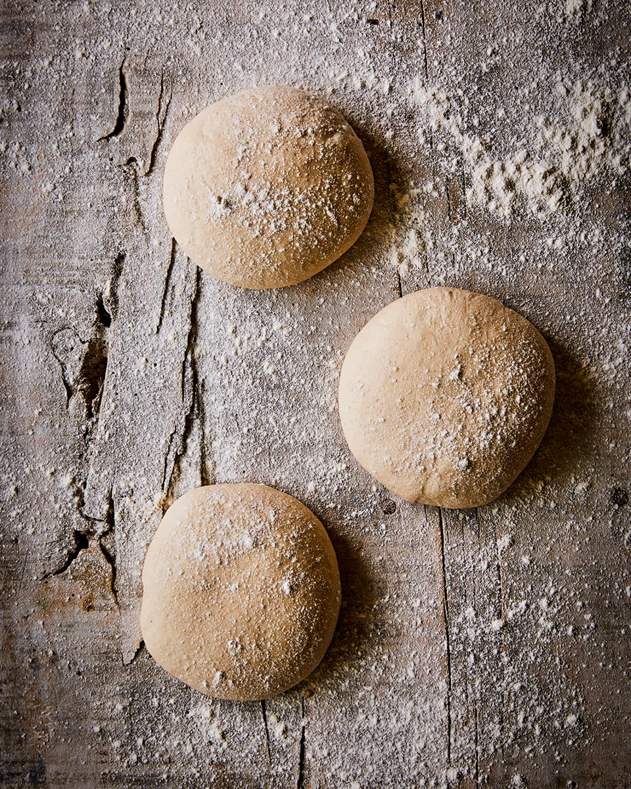

# Basic Pizza Dough

*A workhorse pizza dough made with a 50/50 blend of plain and strong bread flour, given a long, slow cold prove in the fridge to develop flavour and a more open crumb.*

**Serves:** Makes 9 x 30 cm pizza bases
**Prep Time:** 20 minutes
**Cook Time:** 50 minutes (passive, plus overnight proof)

## Overview
A high-hydration overnight dough that sits in the fridge for 8 to 24 hours, slowly building flavour while you sleep. The blend of plain flour for tenderness and strong bread flour for chew gives a base that's crisp at the edges and soft in the middle. Each portion stretches into a 25 to 30 cm round, ready to top and bake on a hot stone.

## Ingredients

### Dough
- 450 grams plain flour (plus extra for dusting)
- 450 grams strong white bread flour
- 2 teaspoons fine sea salt
- 1 tablespoon dried active yeast
- 1 tablespoon olive oil (plus extra for greasing)
- 570 ml cold water

## Method

### Stage 1 – Mix the Dough
1. Combine both flours and the salt in a large mixing bowl.
2. In a separate bowl, stir the yeast into the cold water until dissolved.
3. Pour the yeast water and olive oil into the flour mixture.
4. Use your hands to bring the dough together until just combined; add a splash more water if needed (the dough should feel slightly sticky).
5. Cover and chill for 15 minutes.

### Stage 2 – Knead & Divide
1. Tip the dough onto a lightly floured surface.
2. Knead briskly for 5 minutes, until smooth.
3. Divide into 9 equal pieces and shape each into a round.

### Stage 3 – Cold Prove
1. Transfer the rounds to two well-floured baking trays.
2. Cover loosely with lightly oiled cling film.
3. Chill overnight (8 to 24 hours).

### Stage 4 – Stretch & Shape
1. Take the dough out of the fridge 1 hour before cooking.
2. Generously flour 9 sheets of non-stick baking paper and set them aside.
3. Lightly flour your work surface.
4. Take one piece of dough and gently press it into a flat disc.
5. Press the dough outwards from the middle with your fingers, leaving a 1 cm rim around the edge for the crust.
6. Repeat the press 2 or 3 times, each time spreading the dough wider and thinner.
7. Pick the dough up and let it hang to stretch, turning several times until it forms a 25 to 30 cm circle.
8. Place on a floured sheet of baking paper.
9. Top immediately or chill until ready to cook.

## Notes
- **Cold water:** Cold water slows the yeast and gives a longer, more flavourful fermentation. Don't substitute warm water unless you intend to skip the overnight rest.
- **Overnight prove:** Anything between 8 and 24 hours works well. Beyond that the dough begins to over-prove and loses structure.
- **Stretching, not rolling:** Rolling a pizza base flattens the air bubbles and gives a tougher crust. Stretching by hand keeps the airy edges that define a good pizza.
- **Floured baking paper:** A generous dusting on the paper means the topped pizza slides cleanly onto the hot stone without sticking.

## Variations
**Sourdough version:** Replace the dried yeast with 100 grams of active sourdough starter and increase the cold prove to 24 hours.
**Wholegrain blend:** Substitute up to 25 percent of the strong flour for wholemeal for a nuttier, denser base.

## Serving
Serve with: Any of the topping recipes in this section, including [calabrese](calabrese.md), [margherita](margherita.md) and [meatball](meatball-pizza.md)
Garnish with: Olive oil and flaky sea salt for the rim before baking

## Storage
- Shaped bases keep 1 day refrigerated under cling film; bring to room temperature before topping
- Unbaked dough freezes well up to 2 months; thaw overnight in the fridge then prove for 1 hour at room temperature
- Cooked pizza is best eaten fresh; reheat slices in a dry frying pan over medium heat
