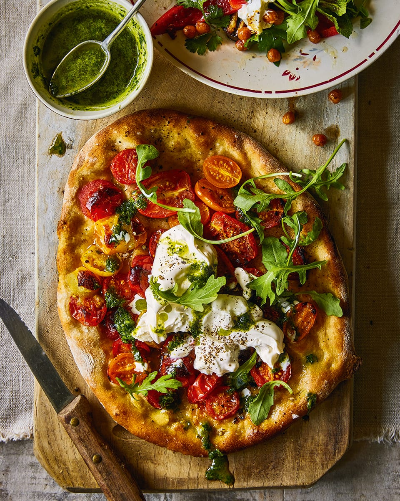

# Cherry Tomato, Burrata and Herb Pesto Pizza

*A summery pizza built around heirloom tomatoes, milky burrata and a vibrant herb pesto, all added off the heat after a quick bake. The base is the only thing that meets the oven; everything else stays fresh.*

**Serves:** 3 pizzas
**Prep Time:** 15 minutes
**Cook Time:** 30 minutes

## Overview
The dough is baked plain with just tomatoes and oil, then crowned off the heat with torn burrata, a herb pesto of basil, mint and parsley, and a tangle of rocket and parmesan shavings. The pesto is what carries the flavour; the burrata adds creamy contrast to the bright, lightly cooked tomatoes. A pizza that depends entirely on good produce.

## Ingredients

### Bases
- 3 prepared [pizza dough](basic-pizza-dough.md) bases
- 1 kg mixed heirloom tomatoes (halved, quartered or sliced depending on size)
- Olive oil (for drizzling)
- Salt and pepper

### Herb Pesto
- 30 grams mixed fresh herbs (basil, mint, parsley, finely chopped)
- 1 garlic clove (chopped)
- 2 teaspoons lemon juice
- 1 teaspoon dijon mustard
- Pinch of caster sugar
- 75 to 100 ml extra-virgin olive oil (plus extra to drizzle)

### To Finish
- 2 x 100 gram balls burrata or buffalo mozzarella (roughly torn)
- Rocket leaves
- Parmesan shavings (or vegetarian equivalent)

## Method

### Stage 1 – Make the Pesto
1. In a mini food processor, combine the herbs, garlic, lemon juice, mustard, sugar, olive oil, salt and pepper.
2. Pulse until smooth and a vibrant green.
3. Alternatively, crush the ingredients in a pestle and mortar (except the oil), then drizzle the oil in slowly to emulsify.

### Stage 2 – Heat the Oven
1. Heat the oven to its highest setting.
2. Place a pizza stone or heavy baking sheet inside to heat.

### Stage 3 – Bake the Bases
1. Transfer one prepared base, still on its baking paper, to a flat baking sheet.
2. Top with one third of the tomatoes.
3. Drizzle with a little olive oil and season with salt and pepper.
4. Slide the pizza, paper and all, onto the hot stone.
5. Bake for 6 to 8 minutes, until the dough is puffed at the edges and turning golden.

### Stage 4 – Top & Serve
1. Transfer the cooked pizza to a board.
2. Top with one third of the torn burrata.
3. Drizzle with herb pesto and scatter over rocket leaves and parmesan shavings.
4. Slice and serve immediately.
5. Repeat with the remaining bases and toppings, returning the stone to the oven between bakes.

## Notes
- **Tomatoes off the heat:** A short bake just heats the tomatoes through and concentrates their juices. A longer bake collapses them.
- **Burrata over mozzarella:** Burrata's molten centre makes the pizza feel lush. If you can only find buffalo mozzarella, tear it more roughly to mimic the contrast.
- **Pesto temperature:** Adding the pesto off the heat preserves its colour and freshness. Cooking it dulls the green and the flavour.
- **One pizza at a time:** Returning the stone to the oven between bakes is what keeps each base crisp.

## Variations
**Stone-fruit:** Replace half the tomatoes with sliced peaches or nectarines for a late-summer version.
**Anchovy and caper:** Drop the burrata and pesto; top with anchovies, capers and a drizzle of chilli oil after baking.

## Serving
Serve with: A glass of cold rosé and a dressed leaf salad
Garnish with: A grind of black pepper and an extra drizzle of pesto

## Storage
- Best eaten immediately; the burrata and pesto don't survive reheating
- Pesto keeps 4 days refrigerated under a layer of olive oil
- Plain baked bases keep 1 day at room temperature; re-crisp briefly in a hot oven before topping
