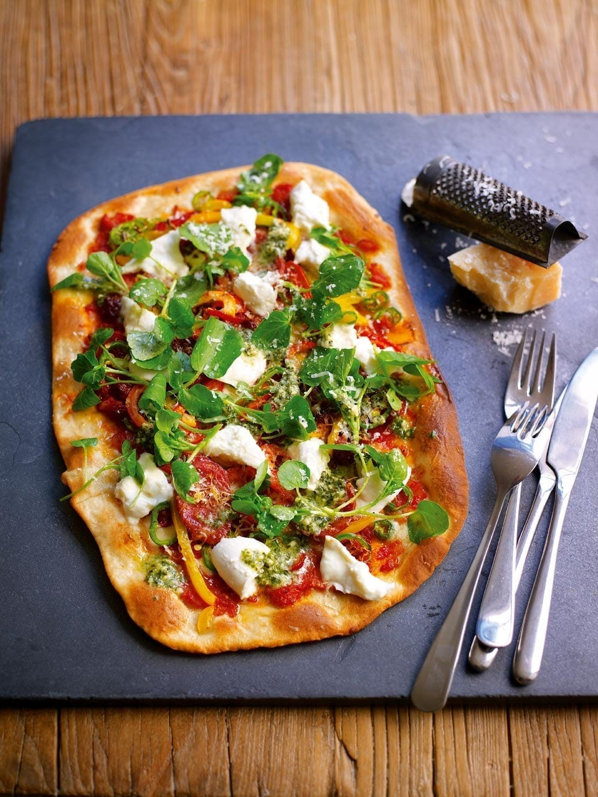

# Calabrese Pizza

*Calabria is Italy's spicy southern toe, home of nduja, hot peppers and the boldly flavoured Calabrese sausage. This pizza brings them together with a watercress-pesto finish for fresh contrast.*

**Serves:** 1 large pizza
**Prep Time:** 15 minutes
**Cook Time:** 12 minutes

## Overview
A pizza built on layered heat: nduja, roquito peppers, fresh green chilli, Calabrese sausage and a touch of dried oregano. After baking, torn fior di latte and a watercress-pesto salad are scattered on top for cool, peppery contrast. A bold pizza that needs a properly hot oven and a confident hand with the spice.

## Ingredients

### Base
- ½ quantity [pizza dough](basic-pizza-dough.md)
- 80 grams [tomato sauce](pizza-sauce.md)

### Topping (Pre-Bake)
- 45 grams mozzarella (cubed)
- 30 grams nduja sausage (optional, from a good Italian deli)
- 30 grams roquito peppers (chopped)
- 4 large fresh green chillies (finely sliced)
- ¼ yellow pepper (sliced)
- ¼ red pepper (sliced)
- 20 grams Grana Padano (grated)
- 30 grams Calabrese sausage or spicy salami (sliced)
- Pinch of dried oregano

### Topping (Post-Bake)
- 20 grams watercress (stalks trimmed)
- 1 teaspoon fresh pesto
- 50 grams fior di latte mozzarella or buffalo mozzarella

## Method

### Stage 1 – Heat the Oven
1. Place a baking sheet or pizza stone in the oven.
2. Heat to 220°C (200°C fan, gas 7), or as hot as your oven will go.

### Stage 2 – Shape & Top the Base
1. Stretch and roll the dough into a rectangle or rustic circle.
2. Remove the hot sheet from the oven and place the dough on top.
3. Quickly spread the tomato sauce over the base, leaving a 1 cm gap around the edge.
4. Scatter over the cubed mozzarella.
5. Break the nduja into small pieces and dot evenly over the base.
6. Add the roquito peppers, green chilli, yellow and red peppers.
7. Sprinkle with half the Grana Padano.
8. Top with slices of Calabrese sausage and season with the dried oregano.

### Stage 3 – Bake
1. Place the pizza in the oven for 10 to 12 minutes, until the base is crisp and golden.
2. While it bakes, toss the watercress with the pesto in a small bowl.

### Stage 4 – Finish
1. Remove the pizza from the oven.
2. Tear the fior di latte into 10 pieces and scatter over the hot pizza.
3. Spoon the watercress and pesto mixture over the top.
4. Finish with the remaining Grana Padano.

## Notes
- **Nduja:** A spreadable Calabrian sausage rich with chilli. Look for it at Italian delis or larger supermarkets. The recipe still works without it but loses some character.
- **Two cheeses:** Grated mozzarella melts into the sauce while the fior di latte stays soft and milky on top. Don't skip either.
- **Watercress salad:** The peppery freshness is what stops the pizza from feeling heavy; tossing it with the pesto coats every leaf.
- **Order of layering:** Cheese under sausage helps the salami crisp instead of slip off.

## Variations
**Mild calabrese:** Replace the nduja and roquito peppers with sun-dried tomatoes and roasted red peppers; keep the salami for character.
**All-meat:** Add 30 grams of pancetta or speck alongside the Calabrese sausage.

## Serving
Serve with: A glass of robust red (Cirò or Aglianico work beautifully) and a few green olives
Garnish with: A drizzle of chilli oil for those who want more heat

## Storage
- Best eaten straight from the oven
- Leftovers keep 1 day refrigerated; reheat in a hot oven, never the microwave
- Watercress salad goes limp and should be made fresh each time
