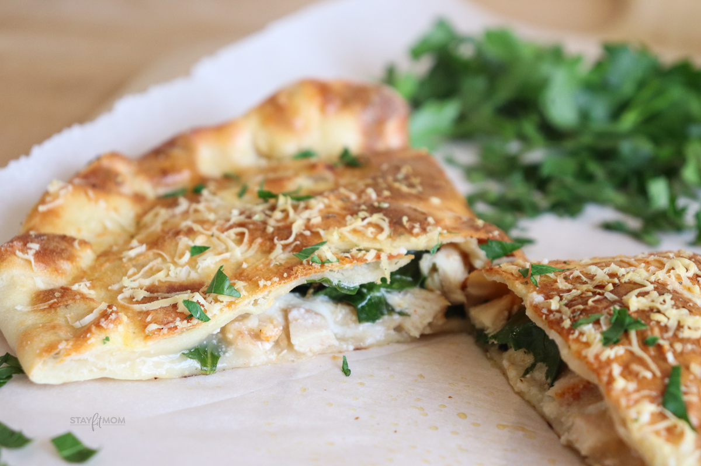

# Calzone Pollo Spinaci

*A Lombardy-style filled calzone with a creamy béchamel base, shredded chicken, prosciutto, mozzarella and spinach. The thin dough is folded into a crescent and crisped fast at very high heat, then brushed with garlic butter and finished under a blanket of grated Riserva at the last moment.*

**Serves:** 1
**Prep Time:** 15 minutes
**Cook Time:** 10 minutes

## Overview
A solo calzone built around a béchamel base rather than the more common tomato sauce, giving the filling a richer, lasagna-like character. Cooked chicken, prosciutto, button mushrooms and spinach pile onto a single oval of thin pizza dough, drenched in white sauce and folded into a sealed half-moon. Two finishing flourishes lift the bake: a final brush of garlic butter and a snowfall of grated Riserva that bubbles in the last minute.

## Ingredients

### Filling
- 110 grams mozzarella (broken into small chunks)
- 1 small chicken breast (cooked and torn into thin chunks)
- 2 slices prosciutto
- 50 grams spinach
- 5 button mushrooms (sliced)
- 60 grams béchamel sauce
- Pinch of fresh rosemary (chopped)

### Dough & Finish
- 200 grams pizza dough ball
- Plain flour (for dusting)
- Garlic butter (for brushing)
- 1 teaspoon Riserva cheese (grated)

### To Serve
- Red pepper tapenade (for dipping)

## Method

### Stage 1 – Heat the Oven
1. Preheat the oven to its maximum setting.
2. If using a pizza oven, heat to 300°C (570°F).

### Stage 2 – Roll the Dough
1. On a lightly floured surface, roll the dough into a large oval roughly 30 cm across.
2. Aim for a very thin sheet so it crisps and cooks quickly in the oven.
3. Lift the rolled dough onto a baking sheet or pizza paddle.

### Stage 3 – Layer the Filling
1. Scatter the mozzarella chunks across the middle of the dough.
2. Top with the torn chicken pieces and the slices of prosciutto.
3. Add the spinach leaves and sliced mushrooms.
4. Sprinkle with the chopped rosemary.
5. Spoon the béchamel evenly over the ingredients.

### Stage 4 – Fold & Seal
1. Lift the empty half of the dough over the filling.
2. Press flat with your fist to seal and remove any pockets of air.
3. Crimp the edges firmly to make a sealed crescent shape.

### Stage 5 – Bake & Finish
1. Slide the calzone into the oven.
2. Bake until the dough has risen, the filling is steaming and the crust is golden.
3. Toward the end of cooking, remove briefly and brush with garlic butter.
4. Scatter the grated Riserva over the top and return to the oven for a few more minutes, until bubbling.
5. Lift onto a board and serve with red pepper tapenade alongside.

## Notes
- **Thin dough is non-negotiable:** The calzone has to crisp before the steamy filling can sog it. Roll the dough as thin as you can without tearing.
- **Pre-cooked chicken:** Use leftover roast chicken or poached breast. Raw chicken won't cook through in a fast oven bake.
- **Béchamel consistency:** A medium-thick sauce (coats the back of a spoon) holds in the calzone. Too thin and it leaks; too thick and the filling feels stodgy.
- **Riserva at the end:** Adding the cheese late keeps it bubbling and salty rather than baked into a thick crust.

## Variations
**With pesto:** Replace the béchamel with 2 tablespoons of basil pesto for a sharper, herbier filling.
**Without prosciutto:** Drop the prosciutto and double the chicken for a milder, child-friendly version.
**Truffle finish:** Drizzle a few drops of truffle oil over the cut calzone instead of the Riserva.

## Serving
Serve with: A side of dressed leaves and red pepper tapenade for dipping
Garnish with: A scatter of fresh rosemary leaves and a grind of black pepper

## Storage
- Best eaten immediately, while the crust is crisp and the cheese still molten
- Leftovers keep 1 day refrigerated; reheat in a hot oven (200°C / 400°F) for 6 to 8 minutes
- Not recommended for freezing once filled with béchamel
