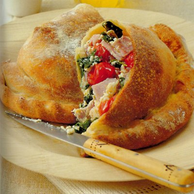

# Calzone

*Folded pizza encloses a fragrant filling with lovely intense flavours. Unlike most calzoni, the dough here is fine and the filling is generous. The sealed envelope of dough creates steam inside, keeping the filling moist whilst the exterior crisps.*

**Serves:** 2 (makes 2 calzone)

## Overview
The calzone is pizza's elegant cousin, pizza dough folded like an envelope and sealed, enclosing a luxurious filling of pancetta, cherry tomatoes, ricotta, and basil. The sealed construction creates its own moist environment, keeping the filling tender while the exterior becomes crisp and golden. This is rustic Italian cooking with refinement.

## Ingredients

### Pizza Dough
- 320 grams [pizza dough](../../bread-pasta/pizza-dough.md) (prepared and rested)

### Filling
- 200 grams cherry tomatoes (halved)
- 200 grams pancetta (cut into small cubes)
- 40 small fresh basil leaves (or more)
- 60 ml extra virgin olive oil
- Salt and freshly ground pepper to taste
- 200 grams fresh ricotta cheese

### Finishing
- Extra olive oil for brushing
- Flour for dusting

## Method

### Stage 1 – Prepare & Marinate Filling
1. Place the halved cherry tomatoes in a mixing bowl.
2. Add the cubed pancetta and the small basil leaves.
3. Drizzle over the 60 ml extra virgin olive oil.
4. Season lightly with salt and freshly ground pepper.
5. Mix very gently so all components are coated with oil.
6. Allow to marinate at room temperature for 20 minutes; this allows flavors to meld and tomatoes to soften slightly.
7. Just before shaping the calzone, crumble the fresh ricotta into the mixture.
8. Toss very gently to combine; be careful not to break up ricotta chunks.

### Stage 2 – Shape First Calzone
1. Preheat the oven to 200°C (about 25-30 minutes before baking).
2. On a lightly floured surface, divide the pizza dough into two equal portions.
3. Working with the first portion, roll it out gently to a disc roughly 20 cm in diameter and about 3 mm thick.
4. Lightly flour the dough and roll it loosely over a rolling pin.
5. Unroll it onto a baking sheet lined with parchment paper.
6. Dip your fingertips in flour and push the dough gently outwards to create an even, thin, perfectly round base.

### Stage 3 – Fill & Seal First Calzone
1. Spoon half of the filling over one half of the dough base, leaving a 2 cm margin around the edge for sealing.
2. Being careful not to tear the dough, fold the empty half of dough over the filling to create a half-moon shape.
3. Press the edges together firmly with your fingertips along the entire circumference.
4. Now, using a sophisticated sealed-edge technique:
   - Starting at one end, pinch the dough edge between your thumb and index finger
   - Gently push the filling toward the center as you work
   - Move your pinching position along the edge, rotating it 90 degrees every centimeter
   - This creates a plaited (braided) appearance and ensures a strong seal
5. The dough should be fully sealed with no gaps where steam could escape.

### Stage 4 – Prepare Second Calzone
1. Repeat Stages 2-3 with the second portion of pizza dough and remaining filling.
2. You should now have 2 calzone on your baking sheet.

### Stage 5 – Bake the Calzone
1. Brush the exterior of each calzone lightly with a little extra olive oil (this encourages browning).
2. Place the baking sheet in the preheated oven.
3. Bake for approximately 20 minutes until the exterior is golden, crisp, and puffed slightly.
4. If the calzone puff up significantly (which is normal as internal steam builds), this is perfect.

### Stage 6 – Finish & Serve
1. Remove from the oven and immediately slide each calzone onto a wire rack using a palette knife.
2. Allow to rest for 3-4 minutes before cutting (this allows the steam to settle slightly and the dough to set).
3. Carefully cut each calzone in half along its natural fold line.
4. Serve immediately while still warm, with filling intact.

## Notes
- **Dough Thickness:** 3 mm is ideal; thinner dough will tear when sealing, thicker dough won't cook through evenly.
- **Filling Distribution:** Don't overfill; the 2 cm margin is crucial for a proper seal. Too much filling will burst out during baking.
- **Sealing Technique:** The plaited edge is not just decorative; it creates multiple contact points that seal thoroughly and prevent leaking.
- **Puffing:** Calzone will puff slightly as steam builds inside; this is correct and indicates proper cooking.
- **Rest Before Cutting:** The rest time allows steam to settle and the dough to firm up, making cutting cleaner and serving easier.

## Variations
**With Mozzarella:** Add 50 grams mozzarella torn into pieces before folding.
**Spinach Version:** Add 100 grams sautéed spinach to the filling for earthiness.
**Anchovy Accent:** Add 2-3 chopped anchovy fillets for salty depth.
**Extra Herbs:** Include fresh oregano or thyme in the filling.

## Serving
Serve with: Simple green salad, tomato dipping sauce
Garnish with: Fresh basil, cracked black pepper
Pair with: Crisp white wine (Pinot Grigio) or light red (Chianti)

## Storage
- Best served immediately while warm and steam is still trapped inside
- Refrigerate leftovers in an airtight container for up to 2 days
- Reheat in a 160°C oven; the dough will become less crispy but filling will be warm
- Can be frozen uncooked: freeze on a tray, then transfer to freezer bags for up to 3 months; add 5-7 minutes to baking time when frozen