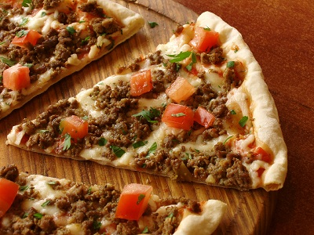

# Chilli Beef Pizza

*This pizza is packed with flavour and a satisfying spicy kick. Ground beef browned with red onion, garlic, and fresh chillies, enriched with kidney beans and cumin, and finished with two cheeses. Serve as a main course with salad and garlic bread, or cut into fingers for canapés and picnics.*

**Serves:** 4 (makes one 25-30 cm pizza)

## Overview
This is a pizza with substance and spice. A generous topping of seasoned beef and kidney beans sits over a thin crust, topped with a blend of mozzarella and cheddar cheeses. The beef is properly browned and simmered to develop flavor, while chillies and cumin add warmth and complexity. This is not minimalist Italian pizza; this is bold, flavorful, filling pizza.

## Ingredients

### Pizza Base
- 220 grams [pizza dough](../../bread-pasta/pizza-dough.md) (prepared and rested)

### Tomato Sauce (Passata)
**Either:**
- 200 grams plum tomatoes (tinned)
- 1 teaspoon dried oregano
- Salt and pepper to taste   

**Or:**
- 220 grams [Pizza Sauce](pizza-sauce.md)

### Beef & Topping
- 175 grams lean ground beef
- 1 tablespoon extra virgin olive oil
- 1 red onion (very finely chopped)
- 1 garlic clove (crushed)
- 1/2 red bell pepper (finely chopped)
- 1/2 teaspoon ground cumin
- 2 fresh red chillies (de-seeded and chopped)
- 115 grams canned red kidney beans (drained and rinsed)
- Salt and freshly ground pepper to taste

### Cheese Topping
- 50 grams mozzarella (shredded)
- 75 grams cheddar cheese (grated)
- 1 tablespoon fresh oregano (chopped)

## Method

### Stage 1 – Make Tomato Sauce (Passata)
1. Place a fine-meshed sieve over a bowl.
2. Tip the tinned plum tomatoes into the sieve.
3. Using the back of a ladle, press down on the tomatoes to strain all their juices into the bowl.
4. Pour the strained juice into a small saucepan.
5. Simmer over very low heat, stirring occasionally, for 10-12 minutes until reduced to a thick consistency.
6. Add the dried oregano and mix well.
7. Season lightly with salt and pepper.
8. Remove from heat and allow to cool.

### Stage 2 – Cook Beef Topping
1. Heat the olive oil in a frying pan over medium heat.
2. Add the finely chopped red onion, crushed garlic, and finely chopped red pepper.
3. Fry gently for 3-4 minutes, stirring occasionally, until the vegetables begin to soften.
4. Increase the heat to medium-high and add the ground beef.
5. Brown the beef, stirring continuously and breaking it into small pieces, for 5-6 minutes.
6. The beef should be crumbly and thoroughly cooked, with no pink remaining.
7. Add the chopped chillies and ground cumin.
8. Continue cooking for about 5 minutes, stirring frequently.
9. The chillies will soften and distribute their heat; the cumin will perfume the mixture.
10. Add the drained kidney beans.
11. Check the seasoning and adjust with salt and pepper as needed.
12. Reduce the heat to low and simmer gently for about 10 minutes (this allows flavors to meld).
13. Remove from heat and set aside to cool slightly.

### Stage 3 – Shape Pizza Base
1. Place the pizza dough on a lightly floured surface (preferably marble or granite).
2. Using your hands and a rolling pin, gently stretch the dough into a round roughly 3 mm thick and about 25-30 cm diameter.
3. Flour lightly and drape over a rolling pin.
4. Unroll onto a lightly oiled baking sheet or pizza stone.
5. Using fingertips, gently push the dough outward to the edges for even thickness.

### Stage 4 – Top the Pizza
1. Preheat the oven to 220°C (about 25-30 minutes before use).
2. Use the back of a spoon to spread the cooled passata over the pizza base, leaving a 1 cm border.
3. Spoon the cooked beef and kidney bean mixture evenly over the sauce.
4. Sprinkle the fresh oregano over the beef topping.
5. Distribute the shredded mozzarella and grated cheddar cheese evenly over the top.

### Stage 5 – Bake the Pizza
1. Place the assembled pizza in the preheated oven.
2. Bake for approximately 18 minutes until crisp, golden, and the cheese has melted and begins to brown slightly at the edges.
3. Keep watch towards the end to prevent over-browning.

### Stage 6 – Serve
1. Use a palette knife to immediately slide the pizza onto a wire rack.
2. Allow to rest for 2-3 minutes (this makes cutting and serving easier).
3. Cut into wedges and serve piping hot.

## Notes
- **Beef Browning:** Don't skip the browning step; proper browning develops the complex flavors that make this topping special.
- **Chilli Heat:** The heat from the chillies will intensify as the pizza bakes; adjust the amount to your preference.
- **Kidney Beans:** Canned beans are convenient; drain and rinse them to remove excess sodium.
- **Two Cheeses:** The combination of mozzarella's creaminess and cheddar's sharpness creates balance; don't omit either.
- **Oven Temperature:** 220°C is hotter than traditional margherita; it ensures the meat topping heats through and cheese melts properly.

## Variations
**Extra Spice:** Add 1/2 teaspoon chilli flakes to the beef mixture for additional heat.
**Add Corn:** Include 50 grams corn kernels with the kidney beans.
**Sour Cream Drizzle:** Add a dollop of sour cream on top after baking for cooling creaminess.
**Pepperoni Addition:** Scatter 30 grams sliced pepperoni over the cheese before baking.

## Serving
Serve with: Green salad, garlic bread, cold beer or cola
Garnish with: Fresh coriander (optional), cracked black pepper
Pair with: Cold lager or pale ale that cuts through the richness

## Storage
- Best served immediately while the crust is crisp and cheese is melted
- Refrigerate leftovers for up to 2 days in an airtight container
- Reheat in a 160°C oven until warmed through (crust will be softer than original)
- Not recommended for freezing; texture suffers significantly