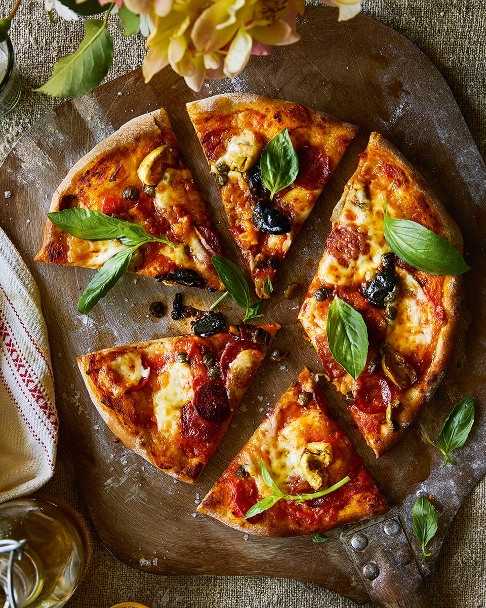

# Chorizo Margherita Pizza

*A margherita given a Spanish twist with crisp slices of chorizo, salty capers, and pitted black olives. The tomato ragù is reduced for a full hour, concentrating its sweetness against the smoky paprika of the chorizo.*

**Serves:** 3 pizzas
**Prep Time:** 20 minutes
**Cook Time:** 1 hour 24 minutes

## Overview
Three margherita-style pizzas with a long-cooked plum tomato ragù as the base, topped with thinly sliced chorizo, capers, olives and torn buffalo mozzarella. The chorizo crisps and renders its smoky, paprika-rich oil over the cheese as it bakes. A scatter of fresh basil at the end adds the herbal lift.

## Ingredients

### Tomato Ragù
- 500 grams ripe plum tomatoes (roughly chopped)
- 1 large garlic clove (finely chopped)
- 2 tablespoons olive oil
- ¼ teaspoon sugar

### Pizza
- 3 prepared [pizza dough](basic-pizza-dough.md) bases
- 100 grams chorizo (thinly sliced)
- 3 tablespoons capers (drained)
- 30 grams pitted black olives (halved)
- 250 grams buffalo mozzarella (sliced)
- Handful of fresh basil leaves

## Method

### Stage 1 – Make the Tomato Ragù
1. Place all the ragù ingredients in a saucepan and bring to the boil.
2. Reduce the heat and simmer gently for about 1 hour, until thickened and reduced by half.
3. Set aside to cool.

### Stage 2 – Heat the Oven
1. Heat the oven to its highest setting.
2. Place a pizza stone or heavy baking sheet inside to heat.

### Stage 3 – Top the Pizzas
1. Transfer one prepared base, still on its baking paper, to a flat baking sheet.
2. Spoon over a third of the ragù, spreading it to within 2 cm of the edges.
3. Add a third of the chorizo, capers, olives and torn mozzarella.

### Stage 4 – Bake & Finish
1. Slide the topped pizza onto the hot stone using the baking paper.
2. Bake for 6 to 8 minutes, until the dough is puffed and golden at the edges.
3. Transfer to a board.
4. Scatter with fresh basil and slice.
5. Repeat with the remaining bases and toppings, returning the stone to the oven each time.

## Notes
- **Reduce the ragù hard:** A full hour is what concentrates the tomato sweetness. A thin sauce dilutes the chorizo's smokiness.
- **Spanish chorizo:** Cured, paprika-rich Spanish chorizo (not Mexican) is what gives this pizza its character. Look for the firm, deeply red sticks.
- **Buffalo mozzarella:** Drain and pat the mozzarella dry before tearing; otherwise it pools water onto the base as it bakes.
- **Capers and olives:** A small amount of each goes a long way. Their saltiness should accent, not dominate.

## Variations
**Spicy chorizo:** Use picante chorizo and add a pinch of chilli flakes for more heat.
**With manchego:** Scatter shavings of manchego over the hot pizza alongside the basil for a more pronounced Spanish lean.

## Serving
Serve with: A glass of crisp Albariño or a chilled tempranillo and a green leaf salad
Garnish with: A drizzle of good olive oil and a few extra capers

## Storage
- Best eaten fresh; the chorizo loses its crispness on standing
- Tomato ragù keeps 4 days refrigerated or freezes well up to 2 months
- Leftover slices reheat well in a hot dry frying pan over medium heat
