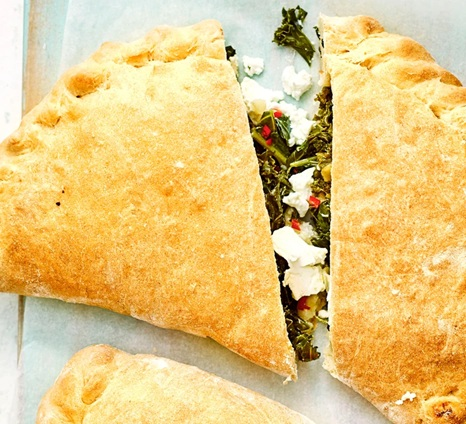

# Kale and Chilli Calzone

*A vegetarian calzone with garlic-fried kale and red chilli, folded into a quick ciabatta-mix dough and baked until puffed and golden. Ricotta or torn mozzarella inside keeps the filling creamy against the assertive greens and heat.*

**Serves:** 2
**Prep Time:** 15 minutes
**Cook Time:** 25 minutes

## Overview
A weeknight-friendly calzone built on a packet ciabatta mix that handles the dough work without a long prove. The filling is garlicky kale wilted briefly in olive oil, sharpened with fresh red chilli, then folded over a generous dollop of ricotta or mozzarella into pasty-shaped half-moons. Baked at moderate heat for 15 to 20 minutes; the dough puffs, the cheese melts, and the kale stays bright.

## Ingredients

### Dough
- 250 grams ciabatta bread mix
- Plain flour (for dusting)

### Kale Filling
- 3 tablespoons olive oil
- 2 garlic cloves (sliced)
- 1 red chilli (deseeded and finely chopped)
- 100 grams kale (chopped, woody stems discarded)

### Cheese
- 8 tablespoons ricotta (or 250 grams mozzarella, torn)

## Method

### Stage 1 – Make the Dough
1. Heat the oven to 200°C (180°C fan, gas 6).
2. Make the ciabatta dough following the packet instructions.
3. Set aside while you prepare the filling.

### Stage 2 – Cook the Kale
1. Heat the olive oil in a frying pan over medium heat.
2. Add the garlic, chilli and chopped kale.
3. Fry until the kale wilts a little, 3 to 4 minutes.
4. Tip out onto a plate and leave to cool.

### Stage 3 – Shape the Calzones
1. Divide the dough in half on a lightly floured surface.
2. Roll each piece into a rough circle, about 25 cm across.
3. Heap half the kale mixture onto one side of each circle, leaving a 2 cm border.
4. Dot the ricotta (or scatter the torn mozzarella) over the kale.
5. Fold the empty half of dough over the filling.
6. Crimp the edges firmly so they look like two large pasties.

### Stage 4 – Bake
1. Dust the tops with a little flour.
2. Lift onto a baking-paper-lined baking sheet.
3. Bake for 15 to 20 minutes, until puffed and golden.
4. Rest for a couple of minutes before serving.

## Notes
- **Ciabatta mix:** Packet mixes vary; follow the resting time on yours. Most need 30 to 60 minutes after kneading.
- **Wilt, don't braise:** The kale only needs to soften slightly. Over-cooking it before the calzone goes in dulls its colour and turns the filling bitter.
- **Cool the filling:** Adding hot kale to the dough makes the calzone soggy. Even a few minutes' rest helps.
- **Ricotta vs mozzarella:** Ricotta gives a softer, creamier filling; mozzarella stretches when pulled apart. Choose by mood.

## Variations
**Spicy sausage:** Add 100 grams of crumbled cooked Italian sausage to the kale filling.
**Three cheese:** Use a mix of ricotta, mozzarella and 2 tablespoons of grated parmesan for a richer fill.
**With sun-dried tomato:** Stir 4 chopped sun-dried tomatoes into the kale during the last minute of cooking.

## Serving
Serve with: A simple tomato salad dressed with olive oil and red wine vinegar
Garnish with: A drizzle of chilli oil and a few extra fresh chilli rings

## Storage
- Keeps 1 day refrigerated; reheat in a hot oven for 6 to 8 minutes
- Unfilled dough keeps 1 day refrigerated, sealed
- Not recommended for freezing once filled with ricotta
