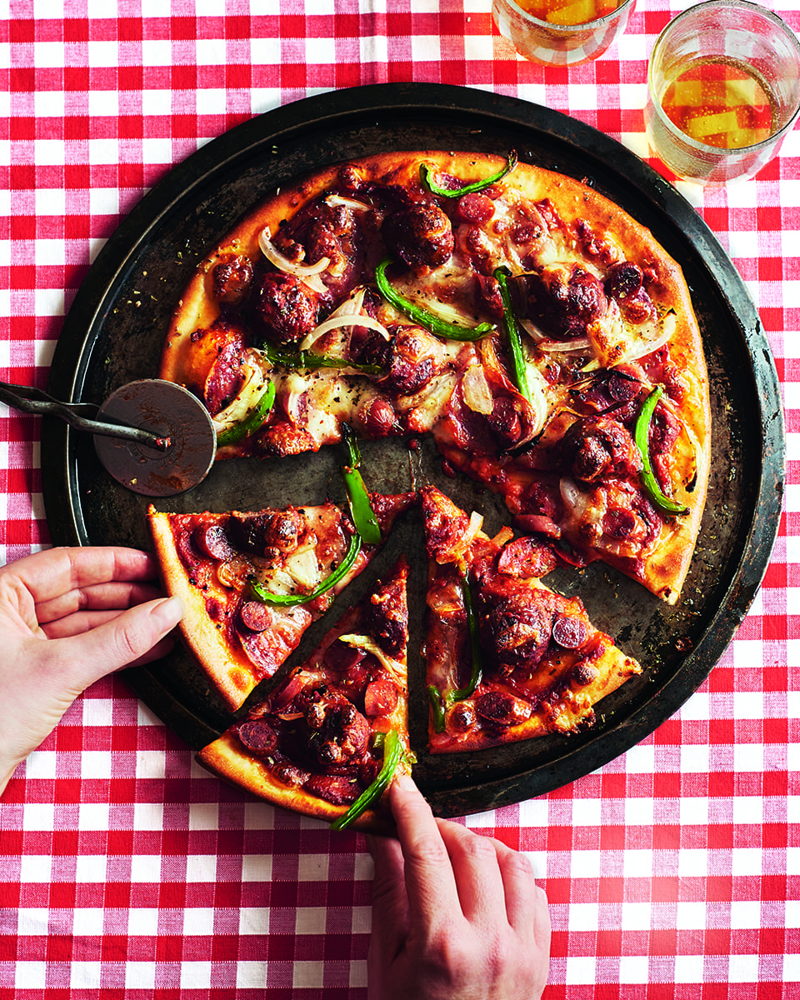

# Meatball and Pepperoni Pizza

*A New York style pizza loaded with mini beef meatballs, two kinds of cured sausage, mozzarella and a hit of chilli. The meatballs are simmered in their own tomato sauce before they meet the dough.*

**Serves:** 2
**Prep Time:** 20 minutes
**Cook Time:** 35 minutes

## Overview
Mini beef meatballs are first browned, then finished simmering in a quick passata sauce sharpened with vinegar, oregano and chilli flakes. They're scattered over two pizza bases alongside diced mozzarella, sliced pepperoni, spicy cured sausage, green pepper and red onion. A short, hot bake melts everything together; oregano and chilli at the end keep the heat going.

## Ingredients

### Meatballs & Sauce
- 1½ tablespoons olive oil
- 300 grams mini beef meatballs
- 1 to 2 garlic cloves (crushed)
- 400 grams tomato passata
- Splash of red wine vinegar
- ¼ teaspoon dried oregano (plus extra to serve)
- 2 pinches of chilli flakes (plus extra to serve)

### Pizza
- Plain flour (for dusting)
- 2 balls of [pizza dough](basic-pizza-dough.md)
- 100 grams cooking mozzarella (diced or grated)
- 2 spicy cured sausages, e.g. Peperami (sliced)
- 12 slices pepperoni
- ½ green pepper (sliced)
- ½ onion (finely sliced)

## Method

### Stage 1 – Brown the Meatballs
1. Heat a splash of the olive oil in a deep frying pan over medium heat.
2. Add the meatballs and fry, turning occasionally, for 4 to 5 minutes, until well browned all over.
3. Set the meatballs aside on a plate.

### Stage 2 – Build the Sauce
1. Add the remaining oil to the pan and gently warm the garlic for 1 minute.
2. Pour in the passata, vinegar, oregano and chilli flakes.
3. Simmer for 10 minutes.
4. Return the meatballs to the pan and simmer for a further 8 to 10 minutes, until cooked through.
5. Set aside.

### Stage 3 – Shape the Bases
1. Heat the oven to its highest setting.
2. On a well-floured worktop, roll out each ball of dough to a circle about 20 cm in diameter.
3. Transfer to two lightly dusted baking sheets.

### Stage 4 – Top & Bake
1. Spoon some of the meatball sauce onto each base, spreading evenly.
2. Scatter over the diced mozzarella, sausage, pepperoni, green pepper and red onion.
3. Bake for 8 to 10 minutes, until crisp and golden.
4. Sprinkle with extra oregano and a pinch of chilli flakes to serve.

## Notes
- **Brown then simmer:** Browning the meatballs first builds a meaty crust before they finish in the sauce. Simmering raw mince in tomato gives a steamed texture.
- **Mini meatballs:** Bite-sized meatballs cook through in the time the pizza takes to bake. Larger ones risk leaving a doughy patch beneath them.
- **Reserve the sauce:** Use just enough sauce to coat the base; pile the rest into a small bowl to serve alongside as a dip.
- **Two cured sausages:** The Peperami-style sausages add chew while the pepperoni adds spiced grease. Skipping one gives a less interesting bite.

## Variations
**Lamb meatball:** Swap beef mince for lamb and add a pinch of cinnamon and cumin to the sauce.
**Vegetarian:** Replace the meatballs with halved chestnut mushrooms (browned the same way) and use vegetarian salami in place of pepperoni.

## Serving
Serve with: Garlic bread and a sharp leaf salad with a lemony dressing
Garnish with: A drizzle of chilli oil and grated parmesan

## Storage
- Meatballs and sauce keep 3 days refrigerated; freeze well up to 2 months
- Cooked pizza keeps 1 day refrigerated; reheat in a hot oven for 6 to 8 minutes
- Don't freeze the assembled pizza; the toppings turn watery on thaw
