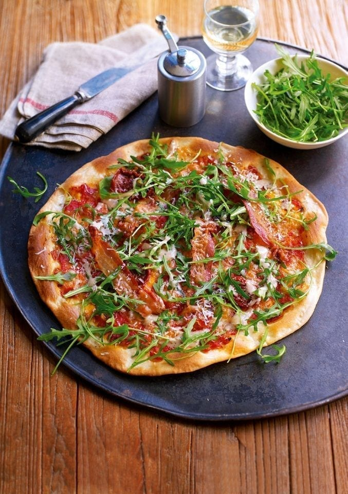

# Pancetta and Rocket Pizza

*A simple white-and-red pizza given lift by crisp slices of smoked pancetta, peppery rocket and a drizzle of Caesar dressing. The pancetta is crisped separately so it stays crunchy on the finished pizza.*

**Serves:** 1 to 2
**Prep Time:** 10 minutes
**Cook Time:** 15 minutes

## Overview
A small pizza built on tomato sauce and cubed mozzarella, baked until crisp and finished with sun-dried tomatoes, rocket, a drizzle of Caesar dressing, oven-crisped pancetta, oregano and Grana Padano. The trick is crisping the pancetta in advance so the finished pizza has texture, not just flavour. Comes together quickly once the dough is shaped.

## Ingredients

### Pizza Base
- ½ quantity [pizza dough](basic-pizza-dough.md)
- 80 grams [pizza sauce](pizza-sauce.md)
- 65 grams mozzarella (cubed)

### Topping
- 4 thin slices Italian smoked pancetta
- 4 whole sun-dried tomatoes
- 40 grams rocket leaves
- 2 tablespoons Caesar dressing
- Pinch of dried oregano
- 15 grams Grana Padano (grated)

## Method

### Stage 1 – Heat the Oven & Crisp the Pancetta
1. Heat the oven to 220°C (200°C fan, gas 7), or as hot as your oven will go.
2. Place a baking sheet or pizza stone inside to heat.
3. Lay the pancetta on a separate baking sheet.
4. Cook in the oven for about 2 minutes, until golden and crisp.
5. Remove and set aside on paper towel.

### Stage 2 – Top the Base
1. Stretch and roll the dough into a rectangle or rustic circle.
2. Remove the hot baking sheet from the oven and place the dough on top.
3. Quickly spread the tomato sauce over the base, leaving a 1 cm gap around the edge.
4. Scatter over the cubed mozzarella.

### Stage 3 – Bake
1. Place the pizza in the oven for 10 to 12 minutes, until the base is crisp and golden and the mozzarella has melted.

### Stage 4 – Finish
1. Remove the pizza from the oven.
2. Top with the sun-dried tomatoes and rocket leaves.
3. Drizzle gently with the Caesar dressing.
4. Place the crisp pancetta on top.
5. Finish with a pinch of oregano and the grated Grana Padano.
6. Serve immediately.

## Notes
- **Crisp the pancetta first:** Baking it on the pizza tends to leave it limp under the rocket. Crisping it separately keeps the texture.
- **Caesar dressing:** A small drizzle is enough; too much overwhelms the pancetta.
- **Sun-dried tomatoes:** Drain them well so they don't bleed oil onto the rocket.
- **Add rocket off the heat:** Rocket wilts within seconds in a hot oven. Always last on, never under heat.

## Variations
**Speck and pear:** Swap the pancetta for thin slices of speck and add a few pear slices for sweet contrast.
**Prosciutto:** Use prosciutto crudo, draped over straight from the packet without crisping.

## Serving
Serve with: A glass of crisp white (Soave or pinot grigio) and an extra side of dressed leaves
Garnish with: A grind of black pepper and a few extra Grana Padano shavings

## Storage
- Best eaten immediately; the rocket and pancetta lose texture on standing
- Crisped pancetta keeps 1 day in an airtight container at room temperature
- Sauce keeps 4 days refrigerated
