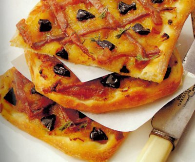

# Pissalàdiers

*These French variations on pizza are, in fact, ideal either as a snack or cut into small fingers and served as canapés. Caramelized onions, slowly cooked for 2 hours until meltingly sweet and tender, topped with a lattice of anchovy fillets and dotted with briny black olives. Rustic, sophisticated, and deceptively simple.*

**Serves:** 4 (makes 2 pissaladières)

## Overview
This is the French answer to Neapolitan pizza. Where Italian pizza celebrates tomato, French pissaladières celebrate caramelized onions cooked until they're almost jam-like in their sweetness and tenderness. A lattice of anchovy fillets and scattered black olives provide salt and briny depth against the onions' sweetness. Baked on a thin pizza crust, this is elegance and restraint.

## Ingredients

### Pizza Dough
- 200 grams [pizza dough](../../bread-pasta/pizza-dough.md) (prepared and rested)

### Caramelized Onions
- 100 ml light extra virgin olive oil
- 800 grams onions (very thinly sliced)
- 2 garlic cloves (peeled)
- 1 bouquet garni (with a few oregano sprigs and fennel stalks)
- Salt and freshly ground pepper to taste

### Topping
- 18 anchovy fillets (soaked in milk for 1 hour if very salty)
- 40 small black olives (Nicoise or similar)
- 1 teaspoon tiny fresh thyme sprigs

## Method

### Stage 1 – Cook Caramelized Onions (Start 2.5 hours before serving)
1. Heat the olive oil in a heavy-based saucepan over low heat.
2. Add the thinly sliced onions, whole peeled garlic cloves, and the bouquet garni.
3. Season very lightly with salt (the anchovies will provide significant salt later).
4. Cover the pan with a lid.
5. Cook very gently over very low heat for 2 hours, stirring with a wooden spoon every 20 minutes.
6. It's crucial that the onions do not brown or color; they should soften and eventually become almost translucent and jam-like.
7. After 2 hours, the onions should be meltingly tender, sweet, and reduced in volume by more than half.
8. Remove from heat.
9. Tip the caramelized onions into a bowl, carefully discarding the garlic cloves and bouquet garni.
10. Allow to cool to room temperature.
11. Drain off any excess oil from the top (reserve this for other uses if desired).

### Stage 2 – Shape Pizza Bases
1. On a lightly floured surface, roll out half the pizza dough into a rectangle roughly 28 x 12 cm and 3 mm thick.
2. Lightly flour the dough and roll it loosely over a rolling pin.
3. Unroll it onto a baking sheet lined with parchment paper.
4. Dip your fingertips in flour and press the dough gently all over to create a very thin, even base.
5. Repeat with the second portion of dough, placing it on the same baking sheet or a separate one.
6. Cover loosely and refrigerate for 20 minutes; this resting helps the dough relax and prevents shrinking in the oven.

### Stage 3 – Assemble Pissaladières
1. Preheat the oven to 200°C (preferably a non-fan oven, which bakes more evenly).
2. Using a fork, spread the cooled caramelized onions lightly and evenly over each pizza base.
3. The onion layer should be thin but complete, covering the dough evenly.
4. Pat the anchovy fillets dry with paper towels.
5. Arrange the anchovies in a diagonal lattice pattern over the onions.
6. Space the anchovies about 3 cm apart to create a regular crosshatch.
7. Place one black olive in the center of each diamond created by the lattice.

### Stage 4 – Bake the Pissaladières
1. Place the assembled pissaladières in the preheated oven.
2. Bake for 10 minutes until the crust is beginning to turn golden and crisp.
3. Remove from the oven and immediately scatter the tiny thyme sprigs evenly over each pissaladière.
4. Return to the oven for 2-3 more minutes if needed, just to ensure the crust is fully crisp and golden.

### Stage 5 – Finish & Serve
1. Remove from the oven.
2. Using a palette knife, immediately slide each pissaladière onto a wire rack.
3. Allow to cool very slightly (they're best served still warm but handled safely).
4. Cut each pissaladière into 4 pieces (or into smaller fingers for canapés).
5. Serve piping hot or warm.

## Notes
- **Onion Caramelization:** The 2-hour gentle cook is essential; it transforms regular onions into something sweet and luxurious. Don't rush this stage by increasing heat.
- **Anchovy Soaking:** Older or very salty anchovies benefit from 1 hour soaking in milk, which mellows excessive saltiness. Fresh anchovies need minimal soaking.
- **Dough Thinness:** Thin dough (3 mm) is crucial; thick dough won't crisp properly and will overpower the delicate toppings.
- **Lattice Spacing:** Even spacing of anchovies creates visual elegance and ensures each bite contains anchovy, olive, and onion.
- **Thyme Addition:** Add thyme only in the last 2-3 minutes; its delicate flavor is lost if cooked too long.

## Variations
**With Tapenade Base:** Spread a thin layer of black olive tapenade under the onions for extra depth.
**Rosemary Addition:** Include rosemary sprigs in the bouquet garni for piney notes.
**Caramelized Garlic:** Use a full head of garlic cloves, allowing them to caramelize with the onions for sweetness.
**Finish with Parmesan:** Grate a small amount of Parmesan over the hot pissaladières just before serving.

## Serving
Serve as: Snack or appetizer, canapé base (cut into small fingers)
Best with: Crisp dry white wine (Sauvignon Blanc), pissaladière pairs beautifully with cold Provençal rosé
Garnish with: Extra fresh thyme, fleur de sel (sea salt) scattered lightly

## Storage
- Refrigerate cooked pissaladières in an airtight container for up to 3 days
- Reheat in a 160°C oven for 10-12 minutes to re-crisp the crust
- Can be served at room temperature; brings qualities of cold appetizer (crust becomes chewier)
- Do not freeze; the dough texture suffers significantly when thawed
- Caramelized onions alone can be made up to 3 days ahead and refrigerated; assemble pissaladières fresh just before baking