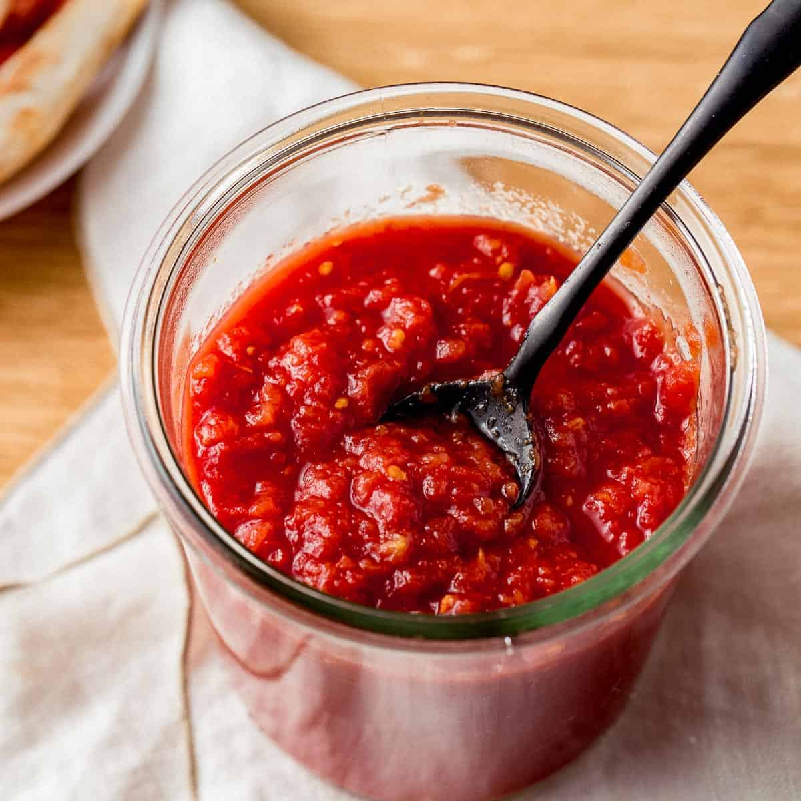

# Pizza Sauce

*This is authentic Italian pizza sauce: simple, raw, and fresh. High-quality tomatoes briefly cooked with aromatics create a vibrant, slightly chunky sauce that's the foundation for perfect pizza.*

**Yield:** Approximately 600 ml (enough for 8 pizzas)

## Overview
Pizza sauce is deceptively simple yet entirely dependent on quality ingredients and proper technique. San Marzano tomatoes are preferred for their low acidity and sweet flavor. The sauce is briefly cooked, never long-simmered, to preserve the fresh tomato character. Garlic, oregano, and basil are the only seasonings; they should enhance, never dominate. This is the classic sauce of Naples and New York, used for Margherita and simple cheese pizzas. 

## Ingredients

### Base Tomatoes
- 1 (400g) can whole San Marzano tomatoes

### Aromatics & Oil
- 2 tablespoons extra virgin olive oil
- 1 onion (peeled and grated)
- 3 cloves garlic (pressed or minced)

### Dry Herbs & Spices
- 3/4 teaspoon dried oregano
- 1 teaspoon dried basil
- 1/4 teaspoon red pepper flakes (adjust to heat preference)

### Balance & Seasoning
- 2 teaspoons sugar
- 1 teaspoon kosher salt

## Method

### Stage 1 – Prepare Tomatoes
1. Pour the canned tomatoes into a large bowl.
1. Using your hands or a blender, break the tomatoes down so they're chunky but not completely liquid. (You want a slightly textured sauce, not a smooth puree; hand-crushing is preferred for authenticity)

### Stage 2 – Cook Aromatics
1. In a medium saucepan placed over medium heat, heat the olive oil.
1. Add the grated onion, dried oregano, dried basil, and red pepper flakes.
1. Allow them to cook for 3-4 minutes, stirring frequently so nothing sticks or burns.
1. Add the pressed garlic and continue to cook for another 30 seconds to 1 minute. (The aromatics should be fragrant and infused into the oil; don't let them brown)

### Stage 3 – Simmer & Develop Flavor
1. Add the prepared tomatoes along with the sugar and salt to the aromatic oil.
1. Stir to combine.
1. Let the sauce reach a simmer, then lower the heat to medium-low.
1. Allow the sauce to simmer gently for 30 minutes.
1. Stir occasionally to prevent sticking on the bottom.

### Stage 4 – Taste & Adjust
1. Taste the sauce and adjust with additional seasonings as desired.
1. Too acidic? Add a pinch more sugar.
1. Not enough tomato flavor? Continue to simmer for up to 15 more minutes (but no longer; overcooked sauce loses its fresh character).
1. Not enough garlic or oregano? Add a small pinch of either.

### Stage 5 – Cool & Store
1. Use the sauce for pizzas immediately while warm.
1. Alternatively, allow the sauce to come to room temperature before storing in containers.

## Notes
- **San Marzano Tomatoes:** These are lower in acidity and sweeter than standard canned tomatoes; they make a significant difference in the final sauce.
- **Hand-Crush vs. Blender:** Hand-crushing preserves chunky texture and authenticity; blending creates a smoother puree (which works but is less traditional).
- **Fresh Garlic:** If possible, use fresh pressed garlic rather than powder; it's livelier and more authentic.
- **Brief Cooking:** 30 minutes is the ideal simmering time; longer cooking dulls the fresh tomato character.
- **Oil Quality:** Extra virgin olive oil adds depth; use good quality.
- **Sugar Balance:** The small amount of sugar balances acidity and enhances tomato flavor; don't omit it.
- **Oregano & Basil:** These are the essential seasonings; dried versions are more concentrated than fresh in this application.

## Variations
**Fresh Basil**: Reserve 1 tablespoon fresh torn basil to stir in at the end for brighter, fresher flavor (don't cook it).
**Spicier Heat:** Increase red pepper flakes to 1/2 teaspoon or add a pinch of cayenne.
**Garlic Emphasis:** Use 4-5 cloves garlic for more pronounced garlic character.
**With Tomato Paste:** Stir in 1 tablespoon tomato paste for deeper, more concentrated tomato flavor.
**Mediterranean:** Add 1/4 teaspoon fennel seed or a small pinch of ground fennel for subtle licorice notes.

## Serving
Serve on: Pizza bases, focaccia, bruschetta, pasta
Amount per pizza: 3-4 tablespoons for a 10-inch pizza
Consistency: Slightly chunky, spreadable but not runny
Temperature: Warm (fresh from cooking) or room temperature

## Storage
- Refrigerate in an airtight container for up to 5 days
- Freeze in portions (ice cube trays work well) for up to 3 months
- Thaw at room temperature or reheat gently in a saucepan
- Fresh sauce (within 1-2 days) tastes better than stored sauce; make fresh when possible
