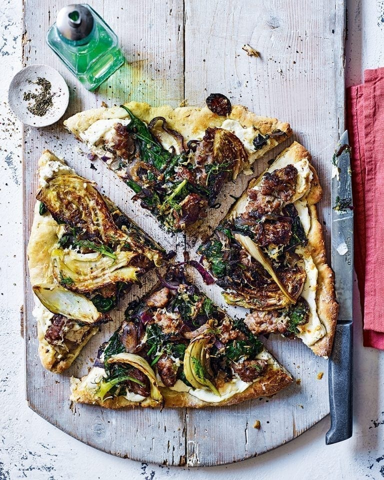

# Sausage, Fennel and Chilli Griddle-Pan Pizza

*A no-yeast, no-prove pizza cooked on the stovetop using a yogurt-based dough and a grill finish. Charred fennel, sausagemeat and ricotta come together for a rustic, weeknight-friendly result.*

**Serves:** 4
**Prep Time:** 15 minutes
**Cook Time:** 20 minutes

## Overview
The dough is a quick mix of plain flour, baking powder and Greek yogurt, rolled out and griddled in a hot pan rather than baked. Fennel wedges are charred separately, then a sausagemeat-and-spinach mixture is spread over the cooked base with ricotta and parmesan, and the lot is finished under the grill. A 35-minute pizza that doesn't need a stone or a long prove.

## Ingredients

### Quick Dough
- 200 grams plain flour
- ½ teaspoon baking powder
- ½ teaspoon chilli flakes
- Pinch of salt
- 200 grams Greek yogurt

### Toppings
- 1 small fennel bulb (cut into wedges)
- 2 tablespoons olive oil
- 200 grams sausagemeat
- 1 small red onion (sliced)
- 1 large garlic clove (crushed)
- 1 teaspoon fennel seeds (lightly crushed)
- 60 grams young leaf spinach
- 3 tablespoons ricotta
- 25 grams parmesan (grated)

## Method

### Stage 1 – Char the Fennel
1. Heat a griddle or frying pan over high heat.
2. Toss the fennel wedges with 1 tablespoon of the olive oil.
3. Griddle for 2 to 3 minutes on each side, until charred and almost tender.
4. Set aside.

### Stage 2 – Make & Cook the Dough
1. Combine the flour, baking powder, chilli flakes and salt in a mixing bowl.
2. Stir in the yogurt to form a shaggy dough.
3. Bring it together with your hands and roll out to roughly the size of the griddle.
4. Cook in the same pan for 4 to 5 minutes on each side, until lightly charred.

### Stage 3 – Cook the Sausage Mixture
1. Heat the remaining olive oil in a separate frying pan.
2. Add the sausagemeat and stir-fry for 3 to 4 minutes, until starting to brown.
3. Add the red onion and cook for a further 3 to 4 minutes, until softened.
4. Stir in the garlic, fennel seeds and spinach.
5. Cook for 1 to 2 minutes, until the spinach has wilted.

### Stage 4 – Assemble & Grill
1. Heat the grill to medium.
2. Spread the ricotta over the cooked flatbread.
3. Top with the sausage and spinach mixture.
4. Dot the griddled fennel slices over the top.
5. Sprinkle with the grated parmesan.
6. Grill for 6 to 8 minutes, until golden and bubbling.

## Notes
- **No-prove dough:** The yogurt and baking powder lift the dough chemically rather than biologically. It's denser than yeasted pizza dough but cooks far faster.
- **Char the fennel first:** Pre-cooking the fennel softens it and adds the smoky note. Adding it raw leaves it tough under the grill.
- **Pan for both:** Using the same griddle for fennel and dough means one less thing to wash and adds a bit of fennel flavour to the base.
- **Don't overload:** This is a thin pizza. Pile the toppings on too thick and the bread will go soggy.

## Variations
**'Nduja:** Swap the sausagemeat for nduja for a smokier, hotter pizza.
**Vegetarian:** Drop the sausagemeat; double the ricotta and add roasted cherry tomatoes alongside the fennel.

## Serving
Serve with: A peppery rocket salad with lemon and olive oil, or a glass of light Italian red
Garnish with: A scatter of extra fennel fronds and a drizzle of chilli oil

## Storage
- Best eaten fresh from under the grill; the dough toughens as it cools
- Sausage mixture keeps 2 days refrigerated and reheats well
- Not recommended for freezing once assembled
