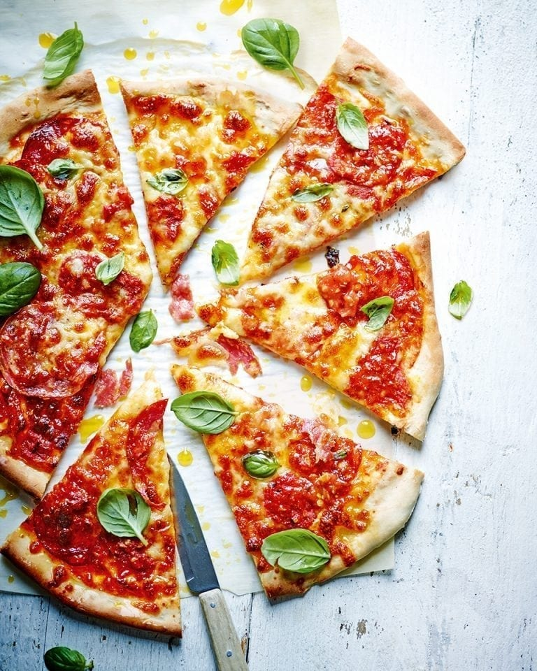

# Sloppy Joe Pizza

*A pizza-meets-bolognese mash-up with passata, salami, a spoonful of bolognese and a generous drizzle of chilli oil. Quick to assemble, ideal for a weeknight when you have leftover ragù to use up.*

**Serves:** 2
**Prep Time:** 15 minutes
**Cook Time:** 15 minutes

## Overview
Two pizza bases topped with passata, salami, dollops of bolognese and grated mozzarella, drizzled with chilli oil and baked until bubbling. Fresh basil and more chilli oil at the table finish the dish. The pizza relies on a good bolognese; using leftover sauce from the fridge actually improves it.

## Ingredients

### Pizza
- 220 grams [pizza dough](basic-pizza-dough.md)
- Plain flour (for dusting)

### Topping
- 50 ml passata
- 80 grams salami
- 50 ml fresh bolognese sauce (or [bolognese](../italian/bolognese.md))
- 100 grams grated mozzarella
- Chilli oil (for drizzling, plus extra to serve)

### To Serve
- Handful of fresh basil leaves
- Extra chilli oil

## Method

### Stage 1 – Heat the Oven
1. Heat the oven to 220°C (200°C fan, gas 7).

### Stage 2 – Shape the Bases
1. On a lightly floured surface, roll out or stretch each dough ball to form a 25 cm base.
2. Place each base on a lightly floured baking sheet.

### Stage 3 – Top the Pizzas
1. Spread the passata over the bases.
2. Top with the salami slices.
3. Dollop over the bolognese sauce.
4. Scatter with the grated mozzarella.
5. Drizzle with chilli oil.

### Stage 4 – Bake & Finish
1. Bake for 10 to 15 minutes, until the cheese is bubbling and the crust is crisp.
2. Scatter with fresh basil leaves.
3. Drizzle with extra chilli oil to serve.

## Notes
- **Use leftover bolognese:** A 50 ml dollop is all you need. Leftover ragù from a pasta night is ideal because it has had time for the flavours to deepen.
- **Don't drown the base:** Restraint with the passata and bolognese keeps the crust crisp; soggy is the enemy.
- **Salami choice:** A peppery salami like sopressata works particularly well against the bolognese.
- **Chilli oil twice:** Drizzle once before baking (the heat infuses the toppings) and once after (to keep the kick fresh).

## Variations
**Carnivore-loaded:** Add cooked spicy sausage and pepperoni alongside the salami.
**Burrata finish:** Drop a torn burrata over the hot pizza after baking for a creamy contrast.

## Serving
Serve with: A green salad with red wine vinegar and a glass of chianti
Garnish with: Grated parmesan and extra basil

## Storage
- Best eaten fresh while the cheese is still molten
- Leftover bolognese keeps 4 days refrigerated or 3 months frozen
- Reheat slices in a hot dry frying pan to keep the base crisp
