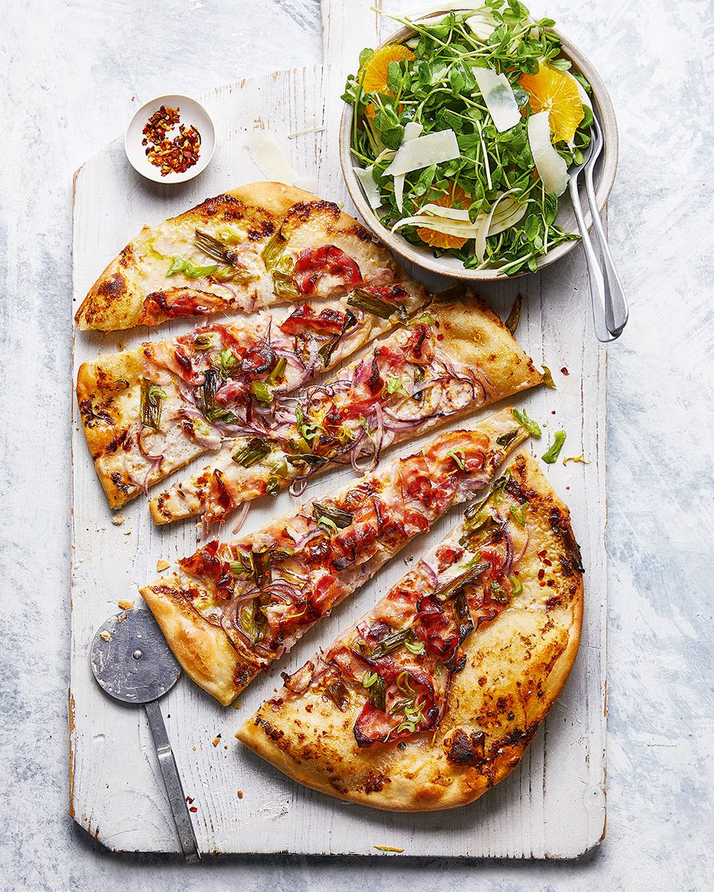

# Smoked Pancetta Pizza with Onions

*A French-leaning white pizza, closer in spirit to a tarte flambée than a Naples-style tomato pie. Crème fraîche stands in for tomato sauce, with smoked pancetta and two kinds of onion on top.*

**Serves:** 3 to 4
**Prep Time:** 10 minutes
**Cook Time:** 25 minutes

## Overview
A no-yeast dough rolled thin and topped with a crème fraîche, parmesan, lemon and nutmeg sauce, finished with thinly sliced salad onions, red onion and smoked pancetta. The lack of tomato keeps the flavour focused on the savoury richness of the pancetta and the slight sweetness of the onions. A 30-minute pizza that needs nothing more than a hot oven.

## Ingredients

### Crème Fraîche Sauce
- 125 grams full-fat crème fraîche
- 30 grams parmesan (finely grated)
- Grated zest and juice of 1 lemon
- Pinch of freshly ground nutmeg
- Black pepper

### Quick Dough
- 250 grams plain flour (plus extra to dust)
- ½ teaspoon baking powder
- ½ teaspoon salt
- 2 tablespoons neutral oil (sunflower or vegetable)
- 120 ml warm water

### Topping
- 1 bunch salad onions (white parts thinly sliced, green parts roughly chopped)
- 1 small red onion (thinly sliced)
- 8 to 9 slices smoked pancetta

### To Serve
- Chilli flakes
- Salad of choice

## Method

### Stage 1 – Heat the Oven
1. Heat the oven to 210°C fan (gas 8).
2. Place a heavy baking sheet or large pizza stone inside to heat.

### Stage 2 – Make the Sauce
1. In a small bowl, mix the crème fraîche with the parmesan, lemon zest, nutmeg and a generous grind of black pepper.
2. Set aside.

### Stage 3 – Make the Dough
1. In a mixing bowl, combine the flour, baking powder, salt, oil and warm water.
2. Mix to a soft dough.
3. Knead for 2 to 3 minutes, until smooth.
4. Roll out on a lightly dusted surface into an oval or rectangle to fit your hot tray.

### Stage 4 – Top & Bake
1. Transfer the dough to the hot tray or pizza stone.
2. Quickly spread the crème fraîche mixture over the base, leaving a small border.
3. Scatter with both types of onion and the smoked pancetta.
4. Bake for 20 to 25 minutes, until the base is crisp and golden.

### Stage 5 – Serve
1. Slide onto a board and slice.
2. Scatter with chilli flakes.
3. Serve with a salad alongside.

## Notes
- **Full-fat crème fraîche:** Lower-fat versions split under high oven heat. Full-fat sets into a rich, lightly browned topping.
- **Lemon zest, not just juice:** The zest carries more of the bright, perfumed lemon character; juice alone makes the sauce too thin.
- **Pre-heat the tray:** A hot tray is the difference between a crisp base and a flabby one. Don't skip this even with a quick dough.
- **Two onions:** Salad onions add freshness and the red onion adds sweetness. Skipping either flattens the onion flavour.

## Variations
**With caramelised onion:** Replace the raw red onion with 100 grams of slow-caramelised onions for a deeper, sweeter pizza.
**Vegetarian:** Drop the pancetta; add a handful of sautéed mushrooms or sliced potato in their place.

## Serving
Serve with: A peppery rocket salad and a glass of dry riesling or Alsatian pinot blanc
Garnish with: A drizzle of good olive oil and a few extra grinds of black pepper

## Storage
- Best eaten fresh; the crème fraîche topping doesn't hold up well overnight
- Sauce keeps 3 days refrigerated
- Leftover slices reheat in a hot dry frying pan over medium heat
