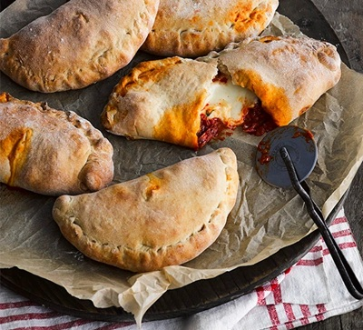

# Spicy Sausage Calzone

*Six freezer-friendly calzones stuffed with a long-simmered chorizo and tomato sauce, melted mozzarella and fresh basil. Made in a batch, frozen raw, then baked straight from the freezer for a 30-minute meal whenever you want one.*

**Serves:** 6 calzones
**Prep Time:** 30 minutes
**Cook Time:** 50 minutes (sauce) + 30 minutes (bake from frozen)

## Overview
A make-ahead calzone built around a deeply reduced chorizo ragù sharpened with paprika and chilli flakes. The sauce simmers for 20 minutes until thick before being parcelled inside ciabatta-mix dough with cubes of mozzarella, sealed with a steam hole, and frozen flat. Pull one (or six) from the freezer, bake at 220°C, and you have a crisp, bubbling calzone in 30 minutes.

## Ingredients

### Dough
- 500 grams ciabatta bread mix
- Plain flour (for dusting)

### Spicy Tomato Sauce
- 2 tablespoons olive oil
- 1 large onion (finely diced)
- 2 garlic cloves (crushed)
- 180 grams chorizo or spicy salami (sliced into strips or diced)
- Pinch of chilli flakes
- Pinch of paprika
- 400 gram tin chopped tomatoes
- 200 ml passata
- Bunch of basil (leaves chopped)
- Salt and pepper to taste

### Cheese
- 250 grams mozzarella block (or 2 x 125 gram balls)

## Method

### Stage 1 – Start the Dough
1. Make the ciabatta bread mix following the packet instructions.
2. Cover and leave it to rise while you make the filling.

### Stage 2 – Build the Sauce
1. Heat 2 tablespoons of olive oil in a frying pan over medium heat.
2. Add the onion and fry for 8 minutes, until soft.
3. Stir in the garlic and cook for 1 minute more.
4. Add the chorizo and cook for 5 minutes, until it starts to release its red oil.
5. Stir in the chilli flakes and paprika.
6. Pour in the chopped tomatoes and passata.
7. Simmer gently for 20 minutes, until thickened and the tomatoes have broken down.
8. Stir in the chopped basil and season generously.
9. Leave the sauce to cool for 10 minutes.

### Stage 3 – Prepare the Cheese
1. Cut the mozzarella into small cubes.
2. Drain in a sieve to shed excess moisture.

### Stage 4 – Shape the Calzones
1. Divide the dough into 6 equal pieces (about 140 grams each) on a lightly floured surface.
2. Roll each piece into a 20 cm round, about ½ cm thick.
3. Spoon a generous portion of the cooled sauce onto half of each round, leaving a 3 cm border.
4. Scatter a few cubes of mozzarella on top.
5. Fold the empty half over the filling and pinch the edges firmly to seal.
6. Fold the sealed edge over once more and crimp tightly so no sauce can leak.
7. Cut a small steam hole in the top of each calzone.

### Stage 5 – Freeze
1. Lift the calzones onto a baking-paper-lined baking sheet.
2. Freeze flat until solid, about 2 hours.
3. Wrap each calzone individually in cling film or foil.
4. Return to the freezer; they keep for up to 2 months.

### Stage 6 – Bake from Frozen
1. Heat the oven to 220°C (200°C fan, gas 7).
2. Unwrap the frozen calzones and place on a baking tray.
3. Bake for 30 minutes, until the dough is puffed and golden.
4. Insert a metal skewer through the steam hole to check the filling is piping hot.
5. Rest for a couple of minutes before serving.

## Notes
- **Reduce the sauce hard:** A 20-minute simmer is the minimum. Watery sauce will leak through the dough no matter how well you crimp.
- **Drain the mozzarella:** Excess water turns the dough soggy. Cube it, leave in a sieve while you cook the sauce.
- **Steam hole is essential:** Without it, the calzones can split open or stay raw inside as steam can't escape.
- **Bake from frozen:** Don't thaw before baking; that introduces moisture and tends to give a soggier crust.

## Variations
**Vegetarian:** Replace the chorizo with 200 grams of sliced chestnut mushrooms and a teaspoon of smoked paprika for the same character.
**Three meat:** Add 100 grams of cooked Italian sausage and 50 grams of pepperoni alongside the chorizo for a meatier filling.
**With ricotta:** Stir 100 grams of ricotta into the cooled sauce for a creamier interior.

## Serving
Serve with: A green salad and a small dish of chilli oil for dipping
Garnish with: Extra fresh basil and a sprinkle of grated parmesan after baking

## Storage
- Raw, frozen calzones keep up to 2 months in the freezer
- Baked calzones keep 2 days refrigerated; reheat in a hot oven for 8 to 10 minutes
- Cooled sauce alone keeps 5 days refrigerated or 3 months frozen
