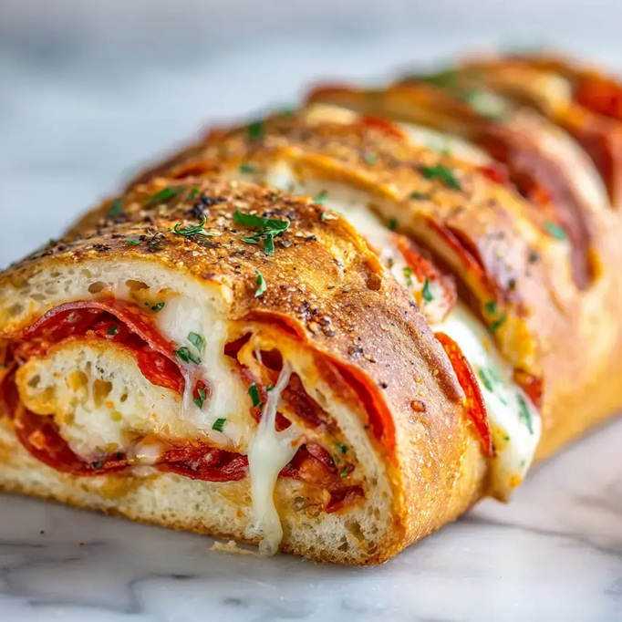

# Stromboli

*Stromboli is the New York Italian-American answer to calzone: a long, rolled, jelly-roll-style log of pizza dough wrapped around layers of cured meats, two cheeses, fresh basil and a brush of garlic butter. Sliced into pinwheels and served with marinara for dipping.*

**Serves:** 2
**Prep Time:** 30 minutes
**Cook Time:** 30 minutes

## Overview
A bricklayer's calzone: pizza dough rolled into a 12 by 18 inch rectangle, brushed with garlic-oregano butter, layered with deli meats, fresh basil and two cheeses, then rolled tight and baked on a hot pizza stone. The crust crisps fast at 200°C; the cheeses melt into the meats inside; a final brush of garlic butter and a scatter of parmesan make the outside glossy. Cuts into thick pinwheel slices, ideal for sharing.

## Ingredients

### Dough & Egg Wash
- 459 grams prepared pizza dough
- 1 egg white
- 1 tablespoon water
- Plain flour (for dusting)

### Filling
- 300 grams sliced Italian deli meat (e.g. salami, capicola, mortadella)
- Handful fresh basil leaves
- 300 grams sliced provolone
- 300 grams mozzarella (drained, finely diced)

### Garlic Butter
- 2 tablespoons salted butter (melted)
- ¼ teaspoon dried oregano
- ¼ teaspoon garlic powder

### To Finish
- Finely chopped fresh parsley or basil
- Flaky sea salt
- Grated parmesan
- Marinara sauce (for dipping)

## Method

### Stage 1 – Heat the Oven
1. Heat the oven to 200°C (400°F).
2. Place a pizza stone or heavy metal baking sheet inside.
3. Let it preheat for at least 20 minutes while you build the stromboli.

### Stage 2 – Make the Garlic Butter
1. In a small bowl, whisk together the melted butter, dried oregano and garlic powder.
2. Set aside (it will firm up slightly as it cools).

### Stage 3 – Roll the Dough
1. On a lightly floured surface, roll the pizza dough into a large rectangle, about 12 by 18 inches.
2. Position it with the long side facing you.

### Stage 4 – Layer the Filling
1. Brush half of the garlic butter evenly over the centre of the dough, leaving a 1.5 inch border on all sides.
2. Layer 4 ounces of the sliced meat evenly across the buttered area.
3. Scatter the basil leaves over the meat.
4. Layer the provolone over the basil.
5. Add another 4 ounces of sliced meat.
6. Scatter the diced mozzarella evenly over the top.
7. Finish with the final 4 ounces of sliced meat.

### Stage 5 – Egg Wash & Roll
1. Whisk the egg white with the water in a small bowl.
2. Lightly brush the 2 inch border of the dough with the egg wash.
3. Fold the short ends inward over the filling and press to seal.
4. Starting with the long side closest to you, roll the dough up tightly like a jelly roll.
5. Pinch the long seam closed and cup the ends to make sure they're sealed.
6. Place seam-side down on a piece of parchment paper.
7. Brush the outside all over with the remaining egg wash.
8. Sprinkle with a pinch of grated parmesan.
9. Cut 5 to 6 small slits along the top so steam can escape.

### Stage 6 – Bake & Finish
1. Carefully transfer the stromboli (with the parchment) onto the hot pizza stone or baking sheet.
2. Bake for 25 to 30 minutes, until golden brown and cooked through.
3. Remove from the oven and immediately brush with the remaining garlic butter.
4. Sprinkle with chopped parsley or basil, flaky sea salt and a little more grated parmesan.

### Stage 7 – Rest & Serve
1. Let the stromboli rest for 15 minutes before slicing.
2. Cut into thick pinwheel slices.
3. Serve warm with marinara or pizza sauce alongside for dipping.

## Notes
- **Hot stone is essential:** A preheated pizza stone or heavy baking sheet gives the bottom enough heat to set the crust before steam from the filling makes it soggy.
- **Drain the mozzarella:** Wet mozzarella turns the inside watery and risks bursting the dough as it bakes.
- **Steam slits:** Without the cuts on top, pressure from the filling can split the seam open. Make them small but unmistakeable.
- **Rest before slicing:** A 15 minute rest lets the cheese set just enough to slice cleanly. Cutting too early sees it ooze.
- **Layering order:** Cheese sandwiched between meat keeps the bread from going soggy on the inside as the filling steams.

## Variations
**Vegetarian:** Drop the deli meats; add 250 grams of sautéed mushrooms (drained well), roasted peppers and a layer of spinach instead.
**Pepperoni and pesto:** Use all pepperoni for the meat, brush the dough with basil pesto in place of garlic butter.
**Ham and cheddar:** Swap the Italian meats for sliced ham and use sharp cheddar in place of provolone.
**Garlic-knot finish:** Brush with the garlic butter twice (before serving) and tie a small knot of dough on each end before baking.

## Serving
Serve with: Marinara, garlic-chilli oil, pickled peperoncini, and a green salad
Garnish with: Extra parmesan and a scatter of basil leaves on each slice

## Storage
- Best eaten within an hour of baking
- Leftovers keep 2 days refrigerated; reheat slices in a hot oven for 8 minutes
- Freezes well unbaked: wrap the assembled, egg-washed stromboli in foil and freeze. Bake from frozen for 40 minutes.
