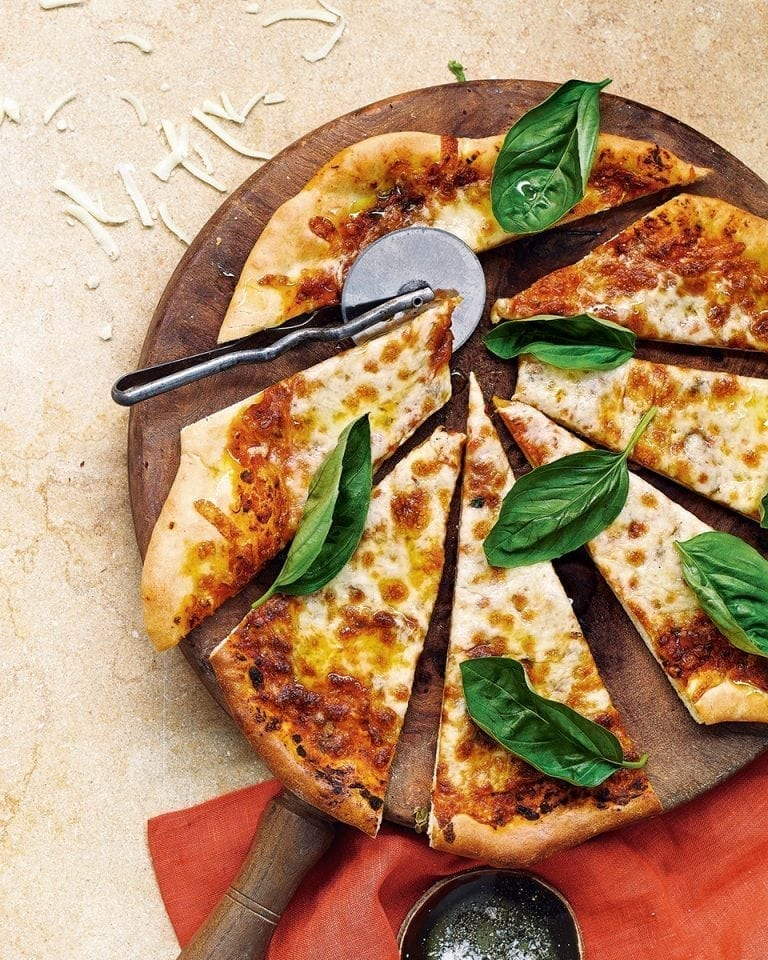

# The Ultimate Margherita Pizza

*A margherita rebuilt from the ground up with a long-cooked tomato sauce and a yeasted dough that proves for an hour. The blend of shallots, garlic, red wine and Worcestershire gives the sauce a depth that supermarket passata can't match.*

**Serves:** 2 pizzas
**Prep Time:** 40 minutes
**Cook Time:** 50 minutes

## Overview
A fresh-yeasted bread-flour dough proves for an hour while a deeply reduced tomato sauce simmers with shallots, garlic, red wine, basil and oregano. The dough is rolled into 30 cm circles, topped with sauce and grated mozzarella, and baked on a screaming-hot baking sheet. Whole basil leaves added off the heat keep the herbal lift fresh on the plate.

## Ingredients

### Dough
- 3.5 grams fast-action dried yeast
- 2 tablespoons extra-virgin olive oil (plus extra for oiling, frying and drizzling)
- ½ teaspoon salt
- ½ teaspoon caster sugar
- 170 ml lukewarm water
- 300 grams strong white bread flour (plus extra to dust)

### Tomato Sauce
- 3 shallots (very finely chopped)
- 2 garlic cloves (crushed)
- 100 ml red wine
- Bunch of fresh basil (leaves picked, half chopped, half left whole)
- A few sprigs of fresh oregano (leaves picked and chopped)
- 350 grams tomato passata
- 1 tablespoon Worcestershire sauce (or Henderson's Relish for vegetarians)
- ¼ teaspoon caster sugar
- Salt and pepper

### Topping
- 300 grams grated mozzarella
- Extra-virgin olive oil (to drizzle)

## Method

### Stage 1 – Make the Dough
1. In a measuring jug, mix the yeast, oil, salt and sugar.
2. Add the warm water and stir.
3. Leave to stand for 10 minutes, then stir again.
4. Place the flour in a mixing bowl and make a well in the centre.
5. Pour in the yeast mixture and stir into the flour.
6. When it starts to come together, use your hands to bring it into a dough.
7. Tip onto a lightly floured surface and knead for 10 minutes, until smooth and springy.
8. Alternatively, knead in a stand mixer with a dough hook on medium for 5 to 8 minutes.
9. Place in a large oiled bowl and cover with cling film.
10. Leave in a warm place for 1 hour, until roughly doubled in size.

### Stage 2 – Make the Sauce
1. While the dough proves, fry the shallots in a glug of olive oil over medium heat for 8 to 10 minutes, until softened.
2. Add the garlic and fry for 2 minutes more.
3. Turn up the heat, pour in the red wine and bubble for 5 minutes to reduce by half.
4. Add the chopped basil, oregano, passata, sugar and Worcestershire sauce.
5. Reduce the heat to low and simmer for 20 to 25 minutes, until rich.
6. Season to taste and leave to cool for 10 minutes.
7. Whizz with a stick blender until smooth.

### Stage 3 – Heat the Oven & Shape the Dough
1. Heat the oven to 240°C (220°C fan, gas 9).
2. Place a baking sheet inside to heat.
3. Knock back the dough on a clean work surface to expel air pockets.
4. Divide in half and cover one piece with cling film while you work the other.
5. Roll the first piece into a 30 cm circle.

### Stage 4 – Top & Bake
1. Lift the rolled circle onto a cold, lightly floured baking sheet using a rolling pin.
2. Spoon 2 to 3 tablespoons of the sauce on top and spread to within 1 cm of the edge.
3. Scatter over half the grated mozzarella and drizzle with a little olive oil.
4. Slide the pizza from the cold sheet directly onto the hot baking sheet.
5. Bake for 10 to 11 minutes, until the base is cooked through and the cheese is golden and bubbling.
6. Repeat with the second base.
7. Scatter with the reserved whole basil leaves and a final drizzle of olive oil.

## Notes
- **Worcestershire in tomato sauce:** A small spoonful adds an unexpected savoury note that ordinary tomato sauces lack. Use Henderson's Relish for a vegetarian version.
- **Blend the sauce:** A stick-blender finish turns the sauce into a perfectly smooth, glossy spread that won't shed water onto the base.
- **Cold sheet to hot sheet:** Sliding the topped pizza off a cold sheet onto a screaming-hot one is the home-oven trick that mimics a pizza stone.
- **Basil in two stages:** The chopped basil cooks into the sauce; the whole leaves go on at the end for fresh, peppery aroma.

## Variations
**Margherita extra:** Add a torn buffalo mozzarella ball to each baked pizza alongside the basil for the molten DOC version.
**Quattro formaggi:** Replace the mozzarella with a mix of mozzarella, fontina, gorgonzola and grated parmesan.

## Serving
Serve with: A glass of Chianti Classico and a tomato salad with red onion
Garnish with: A drizzle of high-quality extra-virgin olive oil and flaky salt

## Storage
- Best eaten straight from the oven
- Sauce keeps 5 days refrigerated and freezes well up to 2 months
- Dough keeps 1 day refrigerated after the first prove; bring back to room temperature before shaping
