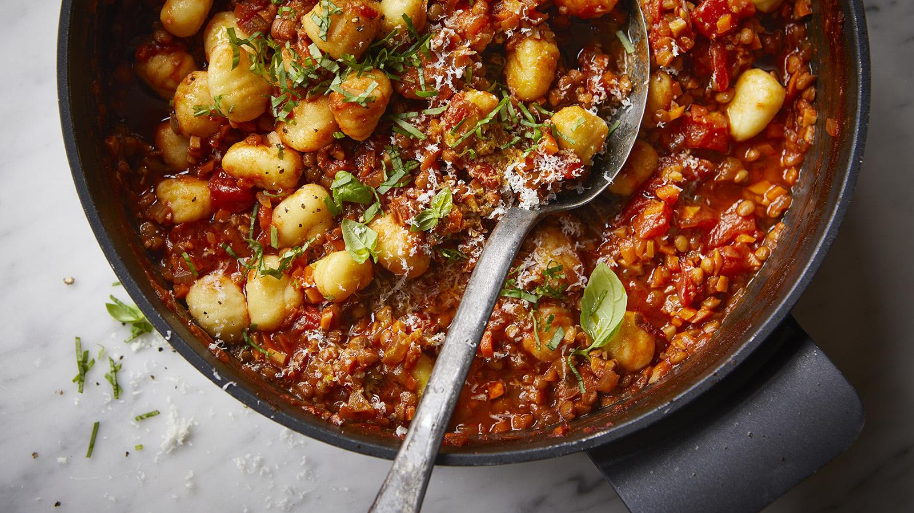

# Ragù with Gnocchi

*A technique-driven ragù using French and European cooking principles for maximum depth, richness, and complexity. Slow-cooked for 4½ hours with layered caramelisation at every stage.*

**Serves:** 4–6

## Overview
This ragù blends deep browning, layered aromatics, and a long, gentle oven braise to create a sauce with rich umami, silky texture, and balanced brightness. A two-milk finish adds softness, while a quick red wine gastrique lifts the sauce at the end.

## Ingredients
 
### Meat & Aromatics
- 100 grams pancetta, finely chopped
- 2 carrots, finely diced
- 1 onion, finely diced
- 2 celery stalks, finely diced
- 4 garlic cloves, grated
- 400 grams beef mince (50% shin, 50% chuck)
- 200 grams pork belly, 1 cm dice
- 3 tablespoons tomato purée

### Liquids & Seasoning
- 150 milliliters whole milk
- 200 milliliters red wine
- 200 milliliters passata
- 1 parmesan rind
- 2 bay leaves
- 1 pinch freshly grated nutmeg
- 500 milliliters chicken or beef stock
- 100 milliliters whole milk (second addition)
- 30 grams butter
- Salt and freshly ground black pepper

### Finishing & Gnocchi
- 100 grams red wine vinegar (good quality)
- 50 grams caster sugar
- 500 grams red-skinned potatoes
- 1 egg yolk
- 65 grams 00 flour
- 1 tablespoon neutral oil
- 30 grams Parmesan, grated (to finish)

## Method

### Stage 1 – Make the soffritto
1. Preheat a heavy-based pan over low-medium heat.
2. Add the pancetta and render slowly until the fat melts and the pancetta becomes translucent, without taking on colour.
3. Add the carrots, onion, celery, and a pinch of salt.
4. Cook gently for 10 minutes, stirring occasionally, until the vegetables are very soft, pale, and sweet-smelling.
5. Add the garlic for the final 2 minutes, then remove the soffritto from the pan and set aside.

### Stage 2 – Brown the meat
1. Increase the heat to high and add the neutral oil.
2. Add the beef mince and spread it in an even layer.
3. Keep the heat high and work constantly with a wooden spoon, breaking up the meat as it cooks.
4. Once the liquid has evaporated, reduce the heat slightly and continue until the meat is deeply browned.
5. Add the diced pork belly and stir on low heat for a few minutes. The belly is there for collagen and richness, not colour.

### Stage 3 – Build the sauce
1. Stir in the tomato purée and cook until it darkens from bright red to deep red-brown, scraping the pan occasionally.
2. Lower the heat and pour in the first addition of milk.
3. Stir until the milk has been absorbed and the meat feels tender.
4. Add the red wine and increase the heat.
5. Reduce the wine by about half, scraping the fond from the bottom of the pan.
6. Return the soffritto to the pan.
7. Add the passata, parmesan rind, bay leaves, nutmeg, and stock.
8. Stir to combine and bring to a gentle simmer.

### Stage 4 – Long oven braise
1. Cover the pan with a lid and transfer to an oven preheated to 120°C.
2. Braise for 4½ hours until the sauce is deeply concentrated and the meat is very tender.
3. Check once or twice during cooking and, if necessary, spoon off any excess fat from the surface.

### Stage 5 – Make the gnocchi
1. While the ragù braises, bake the potatoes whole at 160°C until cooked through.
2. Allow the potatoes to cool slightly, then halve and press the flesh through a fine sieve or drum sieve while still warm.
3. Season the sieved potato lightly.
4. Add the egg yolk and 00 flour and bring together gently into a dough.
5. Handle as little as possible to keep the gnocchi light.
6. Divide the dough, roll into sausages, and cut into bite-sized pieces.
7. Boil the gnocchi in well-salted water until they float to the surface, then remove with a slotted spoon and toss briefly with olive oil.

### Stage 6 – Finish and serve
1. Remove the parmesan rind and bay leaves from the ragù.
2. Stir in the second addition of milk and the butter to give the sauce a glossy finish.
3. In a small saucepan, combine the red wine vinegar and caster sugar.
4. Bring to a boil, then simmer for about 1 minute until very slightly thickened.
5. Add the gastrique to the ragù a little at a time, tasting to balance the richness with brightness.
6. Warm the gnocchi in a pan with a splash of olive oil.
7. Add a ladle of ragù, toss gently, and finish with grated Parmesan.

## Notes
- **On the meat blend:** The 50/50 shin and chuck split gives deep beefy flavour plus rich marbling. Freshly minced meat is best.
- **Soffritto colour:** Keep it pale and sweet; over-browning turns the sauce bitter.
- **Two-milk finish:** The early milk tenderises the meat, while the late milk adds roundness and sweetness.
- **Gastrique:** A small amount of red wine vinegar and sugar balances the rich sauce and brightens the finish.
- **Gentle braise:** The low oven heat gives even, sustained cooking and prevents the sauce from becoming harsh.

## Variations
**Pancetta-free:** Omit the pancetta and use extra neutral oil for a lighter base.
**Stock swap:** Use beef stock for a richer sauce or chicken stock for a slightly lighter character.
**Fresh pasta:** Serve with homemade tagliatelle or pappardelle for a restaurant-style finish.

## Serving
Serve with: fresh tagliatelle, pappardelle, or potato gnocchi
Garnish with: grated Parmesan and cracked black pepper

## Storage
- Refrigerate in an airtight container for up to 4 days.
- Freezes well for up to 3 months; thaw overnight in the refrigerator.
- Reheat gently on low heat with a splash of stock or water to restore texture.
