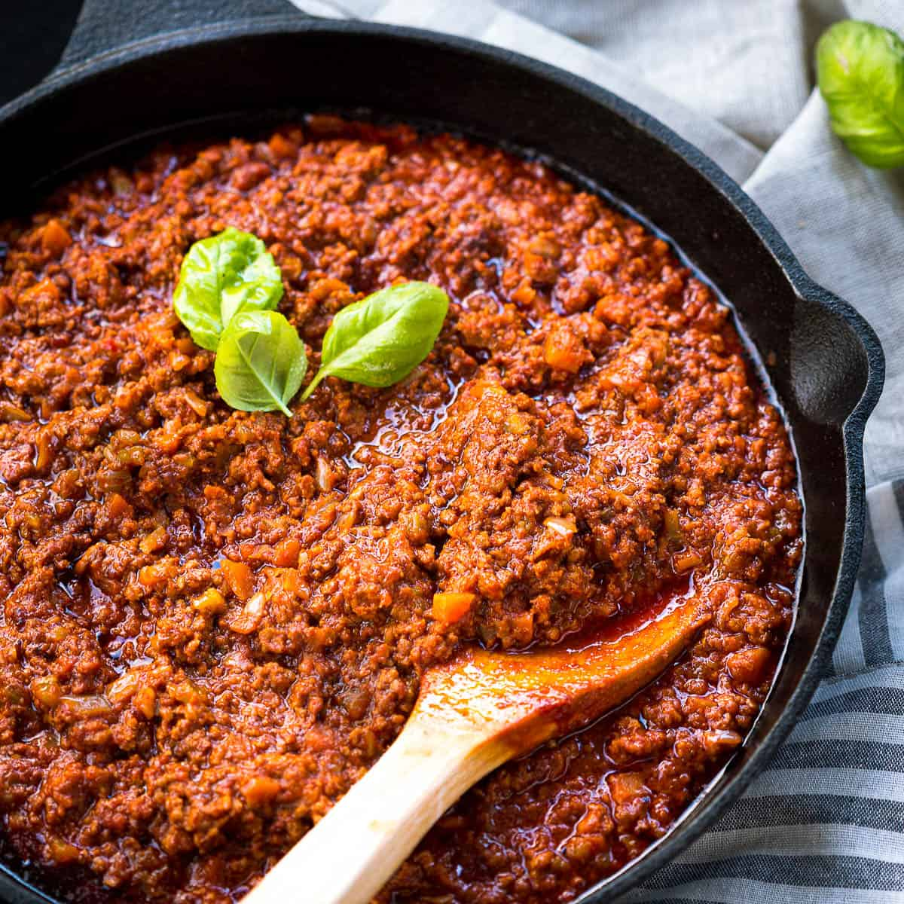

# Restaurant-Style Ragù

*A slow-cooked Italian meat sauce using restaurant techniques to develop deep, complex flavor and a silky, luxurious texture. Patience and proper browning create a sauce worthy of the finest pasta. This is the soul of Italian cooking, humble ingredients transformed through technique and time.*

**Serves:** 4 (with leftover sauce)

## Overview
True ragu demands patience, precision, and respect for the process. Ground beef (or a beef and pork mix) browns deeply in batches to build caramelization without steaming. Aromatic vegetables soften slowly until sweet. Tomato paste darkens and concentrates its flavor through caramelization. Red wine deglazes and cooks off. Then comes the long, gentle simmer, 1 hour 45 minutes to 2 hours, where flavors meld and deepen into something far greater than the sum of its parts. This is not a quick sauce; it is an investment in excellence.

## Ingredients

### Meat & Aromatics
- 2-3 tablespoons extra virgin olive oil
- 500 grams ground beef (or 250g beef + 250g pork mix)
- 75 grams pancetta or bacon (finely chopped, optional but recommended)
- 1 onion (finely diced)
- 1 carrot (finely diced)
- 1 celery stalk (finely diced)
- 3 garlic cloves (minced)

### Building Depth
- 1-2 tablespoons tomato paste
- 150 ml dry red or white wine
- 400 grams canned tomatoes or passata
- 300 ml beef stock or water
- 1 bay leaf or small sprig thyme (optional)
- Salt and freshly ground black pepper

### Finishing
- 1 tablespoon butter or extra virgin olive oil
- Pasta of choice (approximately 500 grams)
- 1 cup reserved pasta water
- Parmesan cheese (freshly grated, for serving)

## Method

### Stage 1 – Brown Meat in Batches
1. Heat a large, heavy pan over medium-high heat for 2 minutes.
2. Add 1 tablespoon olive oil until shimmering.
3. Add half the ground meat, spreading it in an even layer.
4. Cook without stirring for the first 2 minutes to allow deep browning and caramelization to form.
5. After 2 minutes, stir occasionally as moisture evaporates.
6. Continue cooking until the meat is well-browned (6-7 minutes total).
7. Remove to a clean bowl and repeat with remaining meat and 1 tablespoon oil.
8. Set all browned meat aside.

### Stage 2 – Soften Aromatics
1. Reduce heat to medium.
2. Add the remaining 1 tablespoon oil (or use oil released from pancetta if using it).
3. Add the finely diced onion, carrot, and celery (this combination is known as "soffritto" or "mirepoix").
4. Cook for 10-12 minutes, stirring every minute or so, until the vegetables are soft and beginning to caramelize.
5. They should smell sweet and fragrant; this is the foundation of the sauce's depth.

### Stage 3 – Deepen with Garlic & Tomato Paste
1. Add the minced garlic and cook for 1 minute until fragrant (don't let it brown).
2. Stir in the tomato paste thoroughly.
3. Cook for 3 minutes, stirring occasionally, until the tomato paste darkens in color and caramelizes slightly.
4. This caramelization is crucial for deep, complex flavor.

### Stage 4 – Deglaze with Wine
1. Pour the red or white wine into the pan, scraping the bottom with a wooden spoon to release all the browned, flavorful bits.
2. Simmer for 3-4 minutes until the wine is reduced by roughly half.
3. The harsh alcohol smell should fade; the wine integrates into the sauce.

### Stage 5 – Build the Sauce Base
1. Return all the browned meat to the pan.
2. Add the canned tomatoes (or passata), beef stock (or water), and optional herbs (bay leaf or thyme).
3. Stir everything together until well combined.
4. Bring to a gentle simmer over medium heat.
5. Do not boil; a gentle bubble on the surface is ideal.

### Stage 6 – Long, Slow Simmer
1. Reduce the heat to low as soon as the sauce comes to a gentle simmer.
2. Cook uncovered for 1 hour 45 minutes to 2 hours at a bare simmer.
3. This is the stage where patience and time transform the sauce into something extraordinary.
4. Stir every 5-7 minutes during the first 30 minutes, then every 15 minutes afterwards.
5. If the sauce becomes too thick or begins to stick, add small splashes of water or stock to maintain a sauciness (it shouldn't be dry or pasty).
6. After about 60 minutes of cooking, taste the sauce and adjust seasoning with salt and pepper.

### Stage 7 – Rest & Cook Pasta
1. Turn off heat and allow the sauce to rest for 10 minutes before finishing.
2. Meanwhile, cook the pasta in well-salted boiling water, timing it to finish cooking just before you need the sauce.
3. When the pasta is 1 minute away from al dente, reserve 1 cup of starchy pasta water before draining the pasta.

### Stage 8 – Finish in the Sauce
1. Add the drained pasta directly into the ragù pan over medium heat.
2. Add the butter (or olive oil) and a splash of reserved pasta water.
3. Toss continuously for 1-2 minutes until the sauce emulsifies and coats each strand of pasta evenly.
4. Add more pasta water a tablespoon at a time if needed; the sauce should be creamy but not soupy.
5. Remove from heat and add grated Parmesan and cracked black pepper.
6. Rest briefly, then serve.

## Notes
- **Browning is Everything:** Don't rush Stage 1. Deep browning creates the complex flavors that make restaurant-quality ragù. Steaming (from too-wet meat or overcrowding) ruins the final result.
- **Soffritto Sweetness:** The 10-12 minute vegetable cook is where secondary flavors develop. Don't skip or rush this stage.
- **Tomato Paste Caramelization:** The 3-minute caramelize of tomato paste concentrates its natural sugars and deepens color and flavor. This is non-negotiable.
- **Gentle Simmer, Not Boil:** A vigorous boil breaks down the sauce's structure and creates harsh flavors. Maintain a bare simmer throughout.
- **Pasta Finishing:** This final 1-2 minute toss in the sauce is restaurant technique; it emulsifies the sauce with starch from the pasta water, creating a silky, unified dish rather than pasta drowning in sauce.

## Variations
**Pancetta-Enhanced:** Use 75 grams chopped pancetta or bacon; fry it first to render the fat, then use that fat for browning meat.
**Pork Version:** Use 100% ground pork or a 50/50 mix with veal instead of beef for different flavor character.
**Lighter Stock:** Use chicken stock instead of beef for a lighter, more delicate sauce.
**Marsala Finish:** Add 30 ml Marsala wine in the last minute of cooking for subtle sweetness and depth.

## Serving
Serve over: Fresh tagliatelle (narrow ribbons allow sauce to cling), fettuccine, or pappardelle (wide ribbons showcase the sauce)
Garnish with: Freshly grated Parmesan, cracked black pepper, fresh basil (if available)
Pair with: Bold red wine (Barolo, Brunello, or Chianti Classico) that matches the sauce's richness

## Storage
- Refrigerate cooked ragù in an airtight container for up to 4 days
- The sauce improves after 24 hours as flavors deepen and marry
- **Freeze excellently:** Store in freezer-safe containers for up to 3 months; thaw in the refrigerator overnight and reheat gently on stovetop
- To reheat: Warm on low heat with a splash of water or stock to restore silky texture