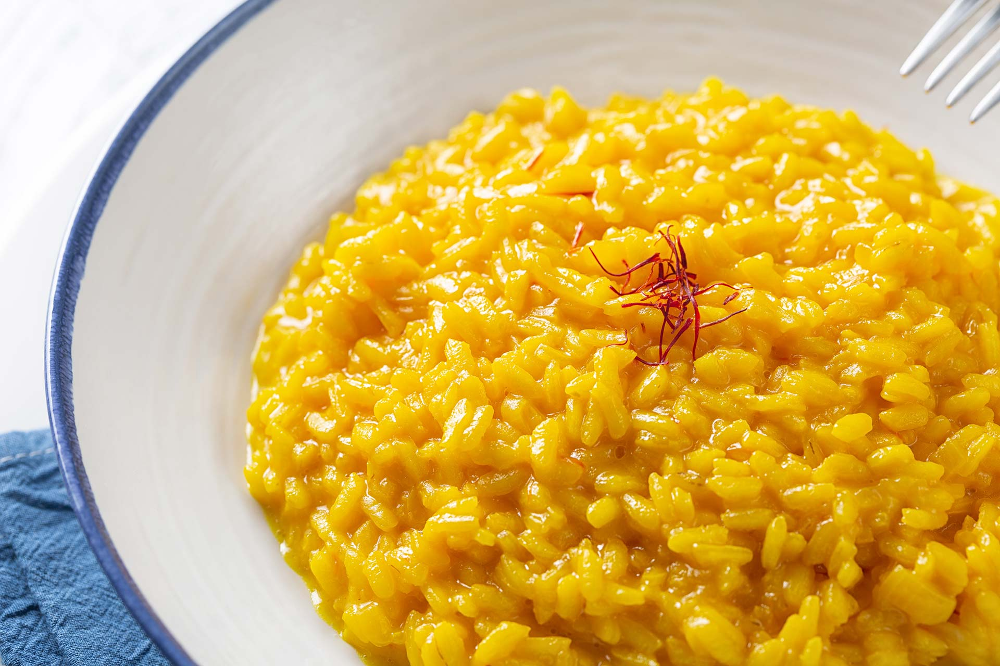

# Risotto alla Milanese

*Saffron risotto: rice toasted in butter, simmered slowly with stock and saffron, finished with butter and parmesan. The classic accompaniment to osso buco; equally good as a meal on its own. The yellow comes from saffron, not turmeric.*

**Serves:** 4

**Prep Time:** 5 minutes

**Cook Time:** 25 minutes

## Overview
Carnaroli or arborio rice toasts briefly in butter and oil with shallot, gets a splash of white wine to evaporate, then takes ladlefuls of warm saffron-infused stock until al dente. Off the heat, beaten with cold butter and parmesan to mantecare (emulsify) into a glossy, just-flowing risotto.

## Ingredients

- 1 large pinch saffron threads (about 0.5 g)
- 1 litre chicken or vegetable stock
- 50 g unsalted butter (split)
- 1 tablespoon olive oil
- 1 small shallot (very finely chopped)
- 300 g carnaroli or arborio rice
- 100 ml dry white wine
- 60 g parmesan (finely grated)
- Salt and freshly ground white pepper

## Method

### Stage 1 – Bloom the saffron
1. Crumble the saffron into 2 tablespoons of warm stock; let steep 5 minutes (the colour and flavour are released this way, not by direct cooking).
1. Keep the rest of the stock at a low simmer in a separate pan.

### Stage 2 – Toast the rice
1. Heat half the butter and the oil in a heavy wide pan over medium heat.
1. Cook the shallot for 3-4 minutes until softened but not coloured.
1. Add the rice; stir for 1-2 minutes until each grain is glossy and the edges turn translucent (the "tostatura").

### Stage 3 – Deglaze
1. Pour in the white wine; stir until completely evaporated.

### Stage 4 – Simmer with stock
1. Add a ladleful of warm stock; stir until absorbed.
1. Continue adding stock a ladleful at a time, stirring constantly, for about 18 minutes total.
1. Halfway through, stir in the saffron-infused stock (the rice turns golden).
1. Taste at 16 minutes; the rice should be al dente — tender but with a faint chalky core.

### Stage 5 – Mantecare
1. Take the pan OFF the heat.
1. Beat in the remaining butter (cold, in cubes) and the parmesan vigorously with a wooden spoon for 30-45 seconds.
1. The risotto should fall slowly off the spoon (all'onda — "in waves").
1. Taste; season with salt and white pepper.

### Stage 6 – Serve
1. Spoon onto warm flat plates and tap the plate base to spread the risotto into a thin layer.
1. Eat immediately; risotto stiffens within minutes.

## Notes
- **Bloom the saffron:** Direct in the rice gives a duller colour. The pre-soak releases full pigment.
- **Stock must be warm:** Cold stock drops the cooking temperature; the rice releases starch unevenly.
- **All'onda or gluey:** A risotto that holds its shape on the plate is overcooked. It should ripple gently; tap the plate to spread.

## Storage
- Doesn't keep well. Leftovers can be fried into arancini the next day; risotto reheated whole becomes mush.
