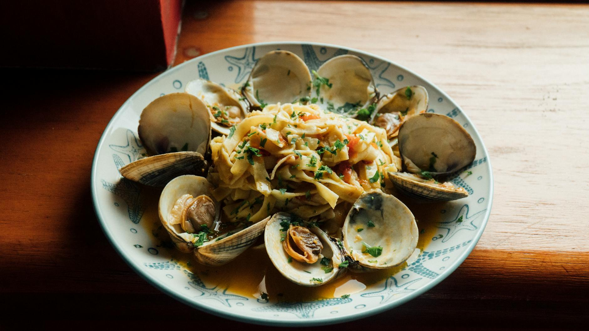

# Seafood Linguine with Chilli and White Wine

*Linguine del mare, this classic Italian recipe guarantees minimum effort yet maximum satisfaction. All the flavors of the sea meld together in a light wine sauce. The key is using absolutely fresh seafood and not overcooking it; a moment too long and prawns become rubbery, squid tough, and shellfish mushy.*

**Serves:** 4

## Overview
This is seafood in its purest form: clams, mussels, prawns, and squid cooked simply in wine and tomato, finished with fresh herbs and pasta. Each component is delicate and must be treated with care. The sauce is light and elegant, allowing the briny sweetness of the shellfish to shine. This is restaurant-quality treatment of premium ingredients.

## Ingredients

### Shellfish & Seafood
- 250 grams clams (cleaned)
- 250 grams mussels (cleaned)
- 250 grams baby squid (quartered)
- 250 grams uncooked prawns (peeled and de-veined)

### Sauce
- 100 ml dry white wine
- 6 tablespoons extra virgin olive oil
- 4 garlic cloves (peeled and sliced)
- 1/2 teaspoon dried chilli flakes
- 800 grams cherry tomatoes
- 4 tablespoons fresh flat-leaf parsley (chopped)
- Zest of 1 unwaxed lemon
- Salt to taste

### Pasta
- 500 grams linguine

## Method

### Stage 1 – Cook Clams & Mussels
1. Wash clams and mussels under cold water.
2. Discard any broken shells and those that don't close when tapped firmly.
3. Place in a large saucepan, pour in the wine, cover with lid.
4. Cook over medium heat for 3 minutes until shells have opened.
5. Discard any shellfish that remain closed.
6. Tip opened shellfish into a colander set over a bowl to catch the cooking liquor.
7. Set aside.

### Stage 2 – Build Sauce
1. Heat oil in the same saucepan.
2. Gently fry garlic until it begins to sizzle.
3. Add chilli and tomatoes.
4. Cook over medium heat for 5 minutes, stirring occasionally.
5. Season with salt.
6. Pour 6 tablespoons of reserved shellfish cooking liquor into the sauce.
7. Continue to simmer for 2 minutes.

### Stage 3 – Add Squid & Prawns
1. Stir in baby squid and prawns.
2. Continue cooking for a further 3 minutes until they turn pink.
3. They should be just cooked through, not tough.

### Stage 4 – Finish Sauce
1. Add the clams, mussels, and fresh parsley.
2. Stir until heated through.

### Stage 5 – Cook Pasta & Combine
1. Meanwhile, cook pasta in a large saucepan of boiling salted water until al dente.
2. Drain thoroughly and tip into the pan with the sauce.
3. Sprinkle with lemon zest.
4. Mix everything together over low heat for 1 minute to allow sauce to coat pasta evenly.
5. Serve immediately.

## Notes
- **Seafood Freshness:** This dish lives by the quality of its seafood; use absolutely fresh stock fish-counter quality.
- **Shellfish Cleaning:** Clams and mussels should be cleaned thoroughly under cold running water. Discard any with cracked shells.
- **Cooking Times:** Each seafood has a precise doneness point. Don't skip around; follow the timing closely.
- **Overcooking Prevention:** Overcooking is the enemy; prawns especially become rubbery instantly. The listed times are exact.

## Variations
**Extra Garlic:** Add 2 additional garlic cloves for garlic lovers.
**Saffron:** Add a pinch of saffron to the sauce for subtle color and flavor.

## Serving
Serve with: Crusty bread for sauce soaking, chilled white wine
Garnish with: Fresh flat-leaf parsley, lemon zest, and cracked pepper

## Storage
- Best eaten immediately after cooking (seafood texture suffers quickly)
- Not recommended for leftover storage or reheating
- This is a dish for immediate, moment-of-cooking enjoyment