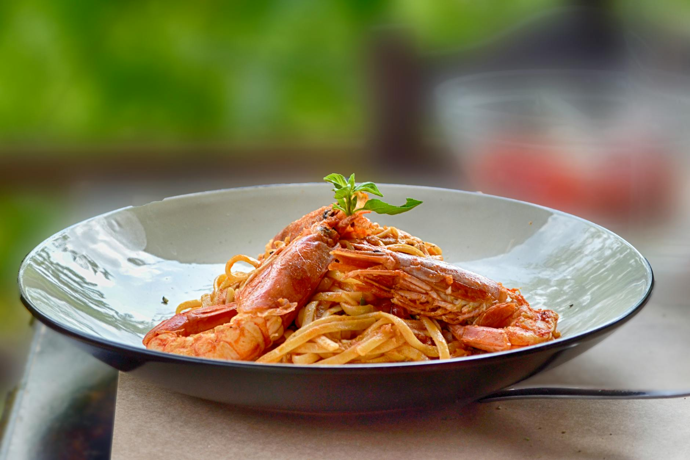

# Spaghetti Marinara

*This showpiece of Neapolitan cooking unites the sea's treasures with simple tomato sauce. The marinara preparation demands absolute freshness of seafood and exacting timing, mussels, clams, calamari, fish, and prawns each require a different cooking duration, and overshooting any of them ruins the dish.*

**Serves:** 6

## Overview
True spaghetti alla marinara celebrates the bounty of Naples' harbor. A rich tomato base simmers gently whilst fresh shellfish and seafood are seared and simmered separately, then folded into the sauce at the last moment. Each component maintains its distinct texture and flavor while harmonizing on the plate. This is sophisticated Italian bistro cooking at its finest.

## Ingredients

### Tomato Sauce Base
- 2 tablespoons olive oil
- 1 onion (finely chopped)
- 1 carrot (sliced)
- 2 garlic cloves (crushed)
- 425 grams tinned tomatoes
- 125 ml white wine
- 1 teaspoon sugar

### Seafood
- 20 black mussels (cleaned)
- 200 grams clams (cleaned)
- 125 grams calamari rings
- 125 grams skinless firm white fish fillets (cubed)
- 200 grams raw prawns (peeled and de-veined)

### To Cook
- 60 ml white wine
- 60 ml fish stock
- 1 garlic clove (crushed)
- 30 grams butter
- 375 grams spaghetti
- 10 grams flat leaf parsley (freshly chopped)

## Method

### Stage 1 – Build Tomato Sauce
1. Heat the oil in a deep frying pan, add the onion and carrot and stir continuously over a medium heat for 10 minutes, until the vegetables are golden.
2. Add the garlic, tomato, wine and sugar and bring to the boil.
3. Immediately reduce the heat and gently simmer for 30 minutes, stirring occasionally.
4. The sauce should be fragrant and slightly reduced.

### Stage 2 – Cook Shellfish
1. Wash the mussels and clams thoroughly, discarding any that have broken shells or fail to close when you tap them firmly.
2. Heat the wine with the stock and garlic in a large pan.
3. Add the mussels and clams, cover and shake the pan over a high heat for 4-5 minutes.
4. After 3 minutes, start removing opened mussels with tongs.
5. After 5 minutes, discard any unopened mussels and clams.
6. Reserve the cooking liquor (should be about 100 ml).

### Stage 3 – Sear Other Seafood
1. Melt the butter in a frying pan over medium-high heat.
2. Add the calamari, fish and prawns in batches and stir-fry for 2 minutes per batch, or until just cooked through.
3. Do not overcrowd the pan; work in 2-3 batches if needed.
4. Transfer each batch to a plate and set aside.

### Stage 4 – Combine Sauce & Seafood
1. Add the cooked calamari, fish and prawns to the tomato sauce.
2. Pour in the reserved shellfish cooking liquor.
3. Add the mussels, clams and parsley.
4. Stir gently until the seafood is heated through (about 2-3 minutes).

### Stage 5 – Finish Pasta & Serve
1. Meanwhile, cook the spaghetti in a large pan of salted boiling water until al dente.
2. Drain thoroughly and tip back into the same pan.
3. Add the spaghetti to the marinara sauce and toss gently until well combined.
4. Serve immediately to ensure the seafood maintains its texture.

## Notes
- **Shellfish Freshness:** Use the freshest mussels and clams available; discard any with broken shells or that refuse to close.
- **Cooking Precision:** Each seafood type requires different timing; follow the stages precisely to avoid overcooked, rubbery textures.
- **Shellfish Liquor:** The cooking liquid from mussels and clams is precious; always reserve it to add briny depth to the sauce.
- **Gentle Handling:** Fold seafood into sauce carefully; avoid crushing or breaking delicate pieces.

## Variations
**Lighter Version:** Omit some seafood and use only mussels and clams for a simpler marinara.
**Extra Garlic:** Add a third garlic clove to the seafood cooking pan for garlic lovers.

## Serving
Serve with: Crusty bread for sauce, chilled white wine
Garnish with: Fresh parsley, cracked black pepper, lemon wedges

## Storage
- Best eaten immediately; seafood loses quality when reheated
- Store leftovers in an airtight container in the refrigerator for up to 24 hours (texture will decline)
- Do not freeze; the texture of seafood suffers dramatically