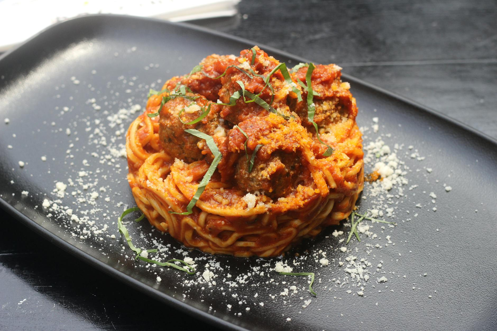

# Spaghetti with Beef Meatballs

*The archetypal Italian-American marriage of tender beef meatballs enriched with Parmesan, lemon zest, and fresh herbs, then simmered in a wine-dark sauce built from stock and passata. These are substantial, satisfying meatballs meant for families and celebration tables.*

**Serves:** 4

## Overview
Beef meatballs represent the heart of Italian home cooking, simple ingredients transformed through technique into something greater than their parts. Lemon zest and fresh herbs brighten the earthy beef, while coating in seasoned flour creates a golden crust that protects the tender interior. A wine-enriched sauce catches every drop of savory liquid. This is pure comfort.

## Ingredients

### Beef Meatballs
- 1 onion (finely chopped)
- 750 grams beef mince (or combination of pork and veal)
- 140 grams fresh breadcrumbs
- 35 grams Parmesan (freshly grated)
- 2 tablespoons flat leaf parsley (freshly chopped)
- 1 egg (beaten)
- 1 garlic clove (crushed)
- Rind and juice of 1/2 unwaxed lemon
- Salt and freshly ground black pepper
- 68 grams plain flour (seasoned with salt and pepper)
- 2 tablespoons olive oil (for frying)

### Wine-Tomato Sauce
- 425 grams passata
- 1 tablespoon tomato purée
- 120 grams beef stock
- 120 grams red wine
- 2 tablespoons fresh basil (chopped)
- 1 garlic clove (crushed)
- Salt and freshly ground black pepper to taste

### To Serve
- 500 grams spaghetti (or pasta of choice)

## Method

### Stage 1 – Prepare Meatball Mixture
1. In a large bowl, combine the mince, breadcrumbs, Parmesan, onion, parsley, egg, garlic, lemon rind, lemon juice, salt and pepper.
2. Mix well with your hands until just combined; do not overmix.
3. The mixture should hold together but remain light.

### Stage 2 – Shape & Coat Meatballs
1. Roll tablespoons of the mixture into balls between your palms.
2. Roll each ball in the seasoned flour, coating lightly and evenly.
3. Place on a tray lined with baking parchment.
4. Refrigerate for 30 minutes until firm; this prevents them from breaking apart during frying.

### Stage 3 – Fry Meatballs
1. Heat the olive oil in a frying pan over medium-high heat until shimmering.
2. Working in batches to avoid crowding, fry the meatballs until golden brown on all sides.
3. Turn gently with a spoon to cook evenly.
4. Remove from the pan with a slotted spoon and drain on paper towels.
5. Remove excess fat from the pan but leave behind the caramelized meat juices.

### Stage 4 – Build Wine-Tomato Sauce
1. Add the passata and tomato purée to the same frying pan over medium heat.
2. Add the beef stock, red wine, basil, garlic, salt and pepper.
3. Bring to a boil, then immediately reduce the heat to low.
4. Simmer very gently for 15 minutes, stirring occasionally, to meld the flavors.

### Stage 5 – Simmer Meatballs in Sauce
1. Add the cooked meatballs to the sauce.
2. Simmer gently for a further 10-15 minutes until meatballs are heated through and sauce has slightly thickened.

### Stage 6 – Cook Pasta & Serve
1. Meanwhile, bring a large saucepan of salted water to the boil.
2. Cook the spaghetti until al dente.
3. Drain thoroughly and serve topped with meatballs and sauce.

## Notes
- **Meat Choice:** A blend of pork, veal and beef (1/3 each) creates meatballs with superior texture and subtlety; beef alone is acceptable but denser.
- **Flour Coating:** The seasoned flour creates a golden crust and helps bind the sauce; don't skip this step.
- **Chilling Time:** The 30 minutes in the refrigerator is crucial for firm meatballs; cold meatballs fry better and hold their shape.
- **Wine Importance:** The red wine in the sauce adds depth and richness; don't omit or substitute.
- **Gentle Simmering:** Boiling the sauce produces a harsh flavor; maintain a gentle simmer throughout.

## Variations
**Lighter Version:** Substitute half the beef mince with ground chicken.
**Spicy Heat:** Add 1/2 teaspoon dried chilli flakes to the meatball mixture.
**Herb Variations:** Use 2 tablespoons fresh thyme instead of parsley for a different herbal character.

## Serving
Serve with: Crusty bread for sauce soaking, green salad with lemon vinaigrette, red wine
Garnish with: Fresh basil leaves, grated Parmesan, cracked black pepper

## Storage
- Refrigerate cooked meatballs and sauce together in an airtight container for up to 3 days
- The sauce improves after 24 hours as flavors deepen and meld
- Freeze in an airtight container for up to 3 months; thaw overnight in refrigerator and reheat gently on stovetop