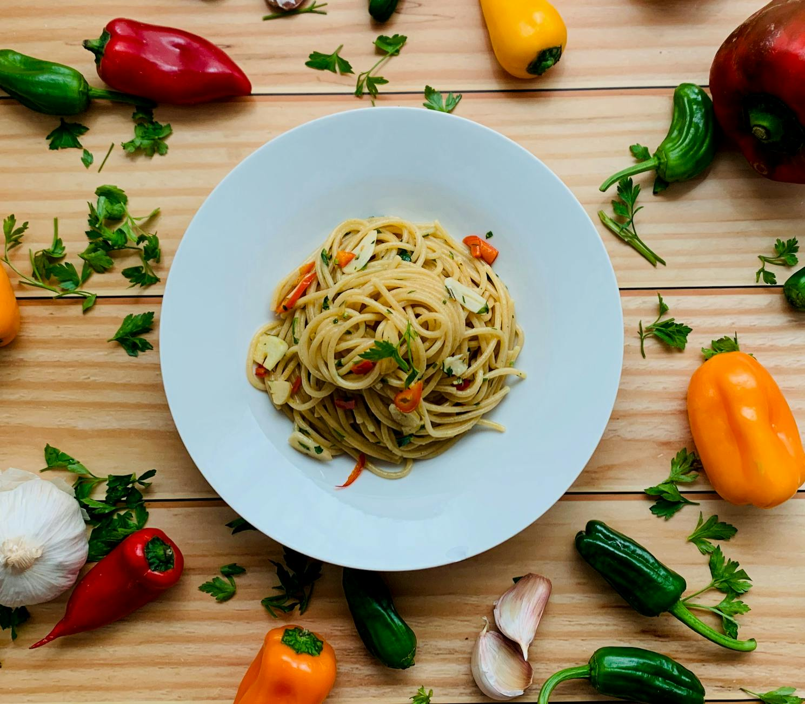

# Spaghetti with Yellow Peppers, Chilli, and Herbs

*Spaghetti con peperoni alle erbe, a vegetarian masterpiece where flavors complement rather than compete. Yellow peppers become sweet and tender through gentle cooking, while fresh thyme, rosemary, and parsley provide herbaceous undertones. No meat needed; the vegetables and herbs speak eloquently for themselves.*

**Serves:** 4

## Overview
This vegetarian dish proves that meat is optional, not essential, for creating satisfying pasta. The peppers, cooked slowly until they release their natural sweetness, create a silken sauce. Fresh herbs provide layered flavor without one dominating. This is simple food made with technique and quality ingredients. Aubergines can substitute for peppers if preferred.

## Ingredients

### Pepper Sauce
- 8 tablespoons olive oil
- 2 cloves garlic (peeled and finely sliced)
- 4 yellow peppers (de-seeded and finely sliced)
- 1 teaspoon dried chilli flakes
- 1 teaspoon fresh thyme leaves
- 1 tablespoon fresh rosemary leaves (finely chopped)
- 2 tablespoons fresh flat-leaf parsley (finely chopped)
- Salt to taste

### Pasta
- 500 grams spaghetti

## Method

### Stage 1 – Cook Peppers
1. Heat oil in a large frying pan over low heat.
2. Add garlic and peppers and gently fry for 2 minutes.

### Stage 2 – Add Herbs & Simmer
1. Add chilli flakes with all the fresh herbs.
2. Continue cooking for a further 6 minutes, stirring occasionally with a wooden spoon.
3. The peppers should be soft and sweet, not broken down.
4. Season with salt and set aside, away from the heat.

### Stage 3 – Cook Pasta
1. Meanwhile, cook pasta in a large saucepan of boiling salted water until al dente.
2. Drain thoroughly and return to the same pan.

### Stage 4 – Combine & Serve
1. Pour pepper mixture into the pasta pan.
2. Stir everything together over low heat for 30 seconds.
3. The sauce should coat the pasta evenly.
4. Divide among warmed bowls.
5. Serve immediately.

## Notes
- **Pepper Quality:** Use the ripest, most flavorful yellow peppers; they should have thick walls and glossy appearance.
- **Fresh Herbs:** All three herbs are essential; each brings its own character. Dried herbs lack this complexity.
- **Gentle Cooking:** Slow cooking of peppers releases sweetness; high heat bitterness.
- **Herb Balance:** Equal parts of each herb works well; adjust to personal preference.

## Variations
**With Aubergine:** Substitute roasted aubergine cubes for peppers for earthier flavor.
**Multiple Colors:** Use red, yellow, and orange peppers for visual variety.
**With Tomatoes:** Add 200g diced fresh tomatoes in summer for freshness.

## Serving
Serve with: Crusty bread and a light white wine
Garnish with: Additional fresh herbs and a drizzle of excellent olive oil

## Storage
- Best eaten immediately while peppers retain texture
- Keeps 2-3 days refrigerated (reheating softens peppers further)
- Not ideal for freezing; texture suffers significantly