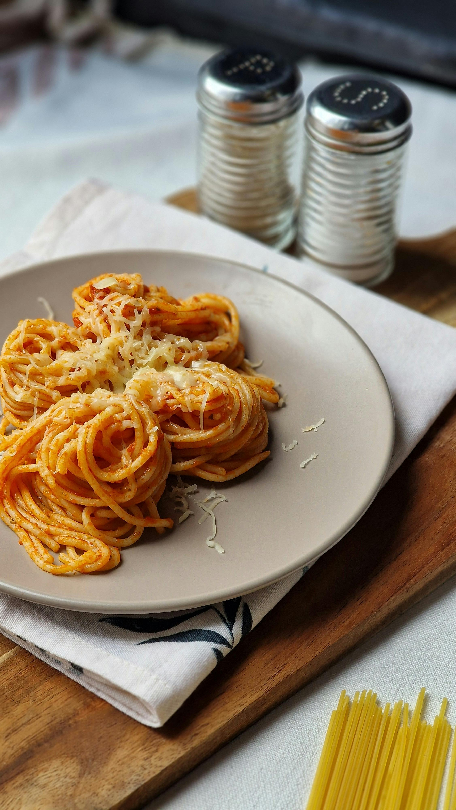

# Spaghetti with Ricotta Cheese and Toasted Pine Nuts

*Spaghetti con ricotta e pinoli, this is simplicity perfected. Warm pasta mingles with creamy ricotta, nutmeg's earthiness, sun-dried tomato's concentration, and toasted pine nuts' buttery crunch. No cooking of components, just assembly and gentle folding. The heat of the pasta itself carries the flavors.*

**Serves:** 4

## Overview
This is pasta in its most elegant minimalist form. Ricotta cheese, warmed by fresh pasta and enriched with good olive oil, becomes a delicate sauce that clings to each strand. Toasted pine nuts add textural contrast and subtle sweetness, while sun-dried tomatoes provide concentrated flavor and color. The dish is perfect year-round as a simple first course or light main.

## Ingredients

### Ricotta Mixture
- 6 tablespoons pine nuts
- 250 grams ricotta cheese (preferably fresh, not packaged)
- 100 grams sun-dried tomatoes in oil (drained and cut into thin strips)
- 3 tablespoons fresh chives (finely chopped)
- 1/4 teaspoon nutmeg (freshly grated)
- 10 fresh basil leaves (chopped, plus extra for garnish)
- 4 tablespoons extra virgin olive oil
- 2 tablespoons hot water
- Salt and pepper to taste

### Pasta
- 500 grams spaghetti

## Method

### Stage 1 – Toast Pine Nuts
1. Place a dry frying pan over medium heat.
2. Add the pine nuts and toast, stirring occasionally, until golden brown all over.
3. This should take 3-4 minutes; do not let them darken or burn.
4. Pour onto a plate and set aside to cool slightly.

### Stage 2 – Prepare Ricotta Mixture
1. Place the ricotta cheese in a large mixing bowl.
2. Add the sun-dried tomatoes, chives, nutmeg, toasted pine nuts and fresh basil.
3. Pour over the extra virgin olive oil and hot water.
4. Season with salt and pepper to taste.
5. Fold everything together gently until just combined; don't overmix.
6. Allow the mixture to rest at room temperature for 5 minutes.

### Stage 3 – Cook Pasta
1. Meanwhile, bring a large saucepan of salted water to a boil.
2. Add the spaghetti and cook until al dente.
3. Reserve a small cup of pasta water before draining.
4. Drain the pasta and tip it immediately into the large bowl with the ricotta mixture.

### Stage 4 – Combine
1. Gently fold the pasta and ricotta mixture together for 30 seconds until the ricotta coats the spaghetti.
2. If the mixture seems dry, add 1-2 tablespoons of reserved pasta water to loosen the sauce.
3. Serve immediately while warm.

## Notes
- **Ricotta Quality:** Fresh ricotta (not packaged) makes a significant difference; seek it at Italian delis or farmers' markets if possible.
- **Pine Nut Toasting:** Toast pine nuts just until golden; they burn quickly and bitterness ruins the delicate balance.
- **Gentle Folding:** This is not a creamy sauce but a delicate suspension; fold gently to avoid breaking the pasta.
- **Hot Water Purpose:** The hot water loosens the ricotta into a sauce without requiring cream; it's essential for proper consistency.

## Variations
**With Raisins:** Add 3 tablespoons softened raisins to the ricotta mixture for sweetness.
**Extra Herb:** Add 2 tablespoons fresh mint along with the basil for a brighter note.
**Without Sun-Dried Tomatoes:** Substitute fresh cherry tomatoes halved, though flavor intensity decreases.

## Serving
Serve with: Crusty warm bread, chilled white wine (Pinot Grigio or Vermentino)
Garnish with: Fresh basil leaves, extra black pepper, grated Parmesan (optional)

## Storage
- This dish is best served immediately while pasta is still warm
- Leftovers can be refrigerated in an airtight container for 1 day; reheat gently with a splash of water
- Do not freeze; the ricotta texture suffers significantly