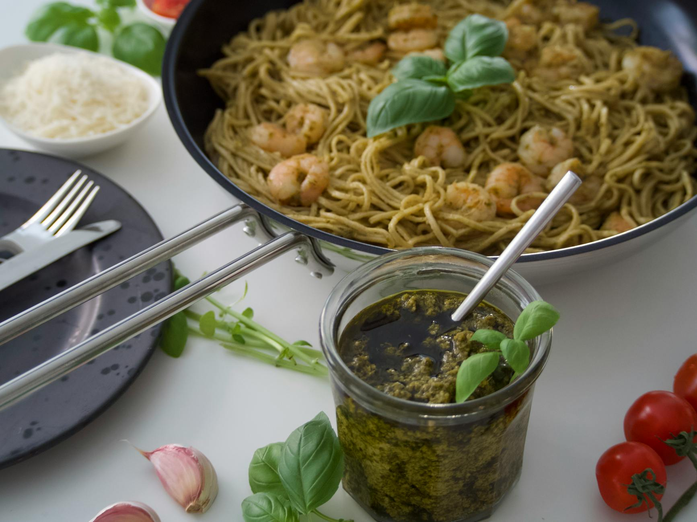

# Spaghettini with Scallops and Parsley Pesto

*Spaghettini con capesante in salsa verde, fresh scallops, with their tender sweetness, meet peppery parsley and briny capers in a green pesto that sings of the sea. This is quick cooking at its finest: moments in the pan, never more. The scallop is a delicate protein that demands respect and understands speed.*

**Serves:** 4

## Overview
This is an elegant pasta that celebrates premium seafood and the beauty of simplicity. Scallops, delicate, buttery, slightly sweet, are seared briefly to preserve their tender texture. A vibrant parsley pesto joins them, enriched with pine nuts and capers for complexity. The combination is sophisticated enough for guests, yet takes only minutes to prepare. Restaurant-quality speed and refinement.

## Ingredients

### Scallops
- 45 grams salted butter
- 250 grams small scallops (without the roe/coral)
- Salt and pepper to taste

### Parsley Pesto
- 50 grams fresh flat leaf parsley (leaves only, not curly)
- 50 grams pine nuts
- 2 tablespoons salted capers (rinsed)
- 1 garlic clove (peeled)
- 130 ml extra virgin olive oil
- Zest of 1 unwaxed lemon

### Pasta
- 500 grams spaghettini

## Method

### Stage 1 – Make Parsley Pesto
1. Place the flat leaf parsley leaves, pine nuts, capers and garlic clove in a food processor.
2. Drizzle in the extra virgin olive oil slowly while the machine runs.
3. Purée until smooth and vibrant green.
4. Transfer to a large bowl and stir in the lemon zest.
5. Season with salt and pepper to taste.

### Stage 2 – Cook Pasta
1. Bring a large saucepan of salted water to a boil.
2. Add the spaghettini and cook until al dente.
3. Reserve a small cup of pasta water before draining.

### Stage 3 – Sear Scallops
1. While the pasta finishes cooking, melt the butter in a frying pan over medium-high heat.
2. Pat the scallops dry with paper towels (moisture prevents browning).
3. Season lightly with salt and pepper.
4. Add scallops to the hot pan in a single layer.
5. Cook for exactly 1 minute on each side; do not overcrowd the pan or they won't brown properly.
6. The scallops should be opaque but still tender inside.
7. Remove from heat immediately.

### Stage 4 – Combine & Serve
1. Drain the spaghettini and tip into the bowl with the parsley pesto.
2. Add the cooked scallops with any butter from the pan.
3. Gently toss everything together for 30 seconds, allowing the pesto to coat the pasta evenly.
4. If the mixture seems dry, add 1-2 tablespoons reserved pasta water.
5. Serve immediately while everything is warm.

## Notes
- **Scallop Quality:** Use fresh, not frozen, scallops for tender texture and sweet flavor; frozen scallops become tough and watery.
- **Parsley Type:** Use only flat leaf (Italian) parsley, never curly parsley, which has a bitter, grassy flavor in pesto.
- **Scallop Timing:** One minute per side is exact; overcooking by even 30 seconds ruins their delicate texture into rubberiness.
- **Pesto Smoothness:** Food processor creates better texture than hand-chopping; the oil should fully incorporate with the herbs.

## Variations
**With White Wine:** Add 60 ml dry white wine to the pan with the butter for a lighter sauce.
**Mint Variation:** Replace half the parsley with fresh mint for brighter, fresher character.
**Extra Garlic:** Use 2 garlic cloves for more pungent pesto.

## Serving
Serve with: Crusty bread, chilled dry white wine (Pinot Grigio)
Garnish with: Fresh parsley leaves, lemon wedges, cracked black pepper

## Storage
- Best served immediately after preparation
- Leftovers can be refrigerated for 1 day but scallops lose quality quickly when reheated
- Do not freeze; the scallops' texture suffers irreversibly