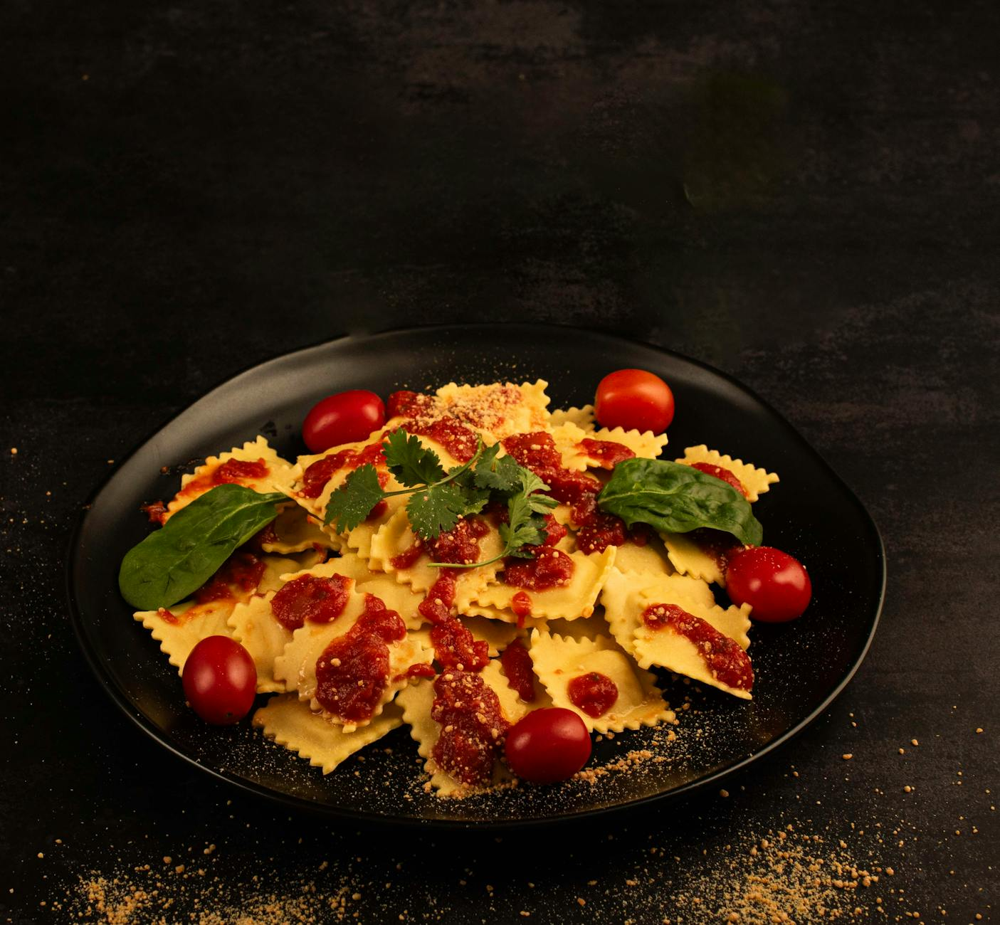

# Spicy Chorizo Ricotta Ravioli

*Ravioli con chorizo piccante, these pillows of creamy ricotta, warmed and enriched by seared Spanish chorizo and its rendered paprika-red oil, then finished with a dusting of pepper. Spicy yet refined, they can open a meal as a starter or anchor it as a main course.*

**Serves:** 6

## Overview
These are show-stopping pasta parcels filled with delicate cheese and fiery chorizo, balanced by fresh parsley and the natural heat of chillies. Making ravioli from scratch demands patience and precision, but the reward is tender pasta envelopes that hug their savory-spicy filling. The cooking is quick, just 3 minutes in boiling water, finished with nothing but fruity olive oil and cracked pepper.

## Ingredients

### Fresh Pasta Dough
- 400 grams fresh pasta dough (preferably homemade)
- 2 eggs (beaten, for sealing)
- 2 tablespoons plain flour (for dusting)

### Chorizo-Ricotta Filling
- 5 tablespoons olive oil
- 300 grams Spanish chorizo (finely chopped)
- 3 medium-hot chillies (de-seeded and finely chopped)
- 750 grams fresh ricotta cheese
- 3 tablespoons fresh flat leaf parsley (finely chopped)
- Salt and pepper to taste

### To Cook & Finish
- 200 ml extra virgin olive oil
- Salt
- Freshly ground black pepper

## Method

### Stage 1 – Prepare Filling
1. Heat 5 tablespoons olive oil in a small frying pan over medium heat.
2. Add the finely chopped chorizo and chillies.
3. Fry for 2 minutes, stirring occasionally, until the chorizo releases its oils and becomes fragrant.
4. Remove from heat and allow to cool to room temperature for 10 minutes.
5. Transfer the cooled chorizo and chillies to a large bowl with the ricotta and parsley.
6. Mix everything together gently with a fork until just combined.
7. Season with salt and pepper to taste.
8. Cover with cling film and refrigerate for 10 minutes to firm up.

### Stage 2 – Roll Pasta Dough
1. Flatten the prepared pasta dough with a rolling pin so it can fit through your pasta machine rollers.
2. Lightly flour the pasta on both sides.
3. Starting from the widest setting, feed the pasta through the rollers.
4. Fold the pasta in half and repeat, gradually moving to progressively thinner settings.
5. Continue until you reach the thinnest setting, keeping the pasta dusted with flour throughout.
6. You should have several sheets of thin, even pasta.

### Stage 3 – Assemble Ravioli
1. Lay pasta sheets on a well-floured work surface.
2. Using a teaspoon, place small mounds of filling at 4 cm (1.5 inch) intervals across the pasta sheet.
3. Lightly brush the egg wash between the fillings to seal.
4. Gently place another sheet of pasta on top, being careful not to trap air pockets.
5. Press down firmly between the parcels of filling to seal.
6. Using a pastry wheel or sharp knife, cut the pasta into squares between the fillings.
7. Place ravioli on a tray lined with parchment paper, dust lightly with flour, and allow to rest for 5 minutes.

### Stage 4 – Cook Ravioli
1. Bring a large saucepan of salted water to a rolling boil.
2. Working in batches to avoid crowding, gently drop the ravioli into the boiling water.
3. Cook for approximately 3 minutes; they'll float to the surface when nearly done.
4. Cook for a further 30 seconds after floating.
5. Using a slotted spoon, carefully remove each ravioli and place in the center of a large serving plate.
6. Work gently to avoid tearing the delicate pasta.

### Stage 5 – Finish & Serve
1. Drizzle the warm ravioli with extra virgin olive oil.
2. Season generously with freshly ground black pepper and a pinch of salt.
3. Serve immediately while the ravioli are hot and the filling is melting.

## Notes
- **Filling Temperature:** Cool the chorizo-oil mixture before mixing with ricotta; hot chorizo will break down the cheese's texture.
- **Sealing Precision:** Thorough egg-wash sealing is crucial to prevent ravioli bursting open during cooking.
- **Pasta Thickness:** The thinnest pasta machine setting is ideal; thin pasta allows the filling flavor to come through clearly.
- **Cooking Exactness:** Ravioli need only 3 minutes in boiling water; any longer and the delicate pasta becomes soggy.
- **Gentle Handling:** Use a slotted spoon exclusively when removing ravioli; forks or improper tools tear the delicate parcels.

## Variations
**Milder Heat:** Use only 1 chilli or omit the chillies entirely for less spice.
**Herb Variation:** Add 1 tablespoon fresh basil to the filling for different herbal character.
**With Sauce:** Serve with a light tomato sauce or charred butter and sage instead of just olive oil and pepper.

## Serving
Serve as: Elegant first course (2-3 ravioli per person) or main course (4-5 ravioli per person)
Garnish with: Cracked black pepper, grated Parmesan (optional), fresh parsley leaves
Pair with: Crisp white wine (Vermentino) or light red (Grenache)

## Storage
- Uncooked ravioli keep well: freeze on a tray, then transfer to freezer bags for up to 3 months; add 1 minute to cooking time when frozen
- Cooked ravioli are best served immediately
- Store cooked ravioli refrigerated in an airtight container for up to 1 day; reheat very gently with a splash of water