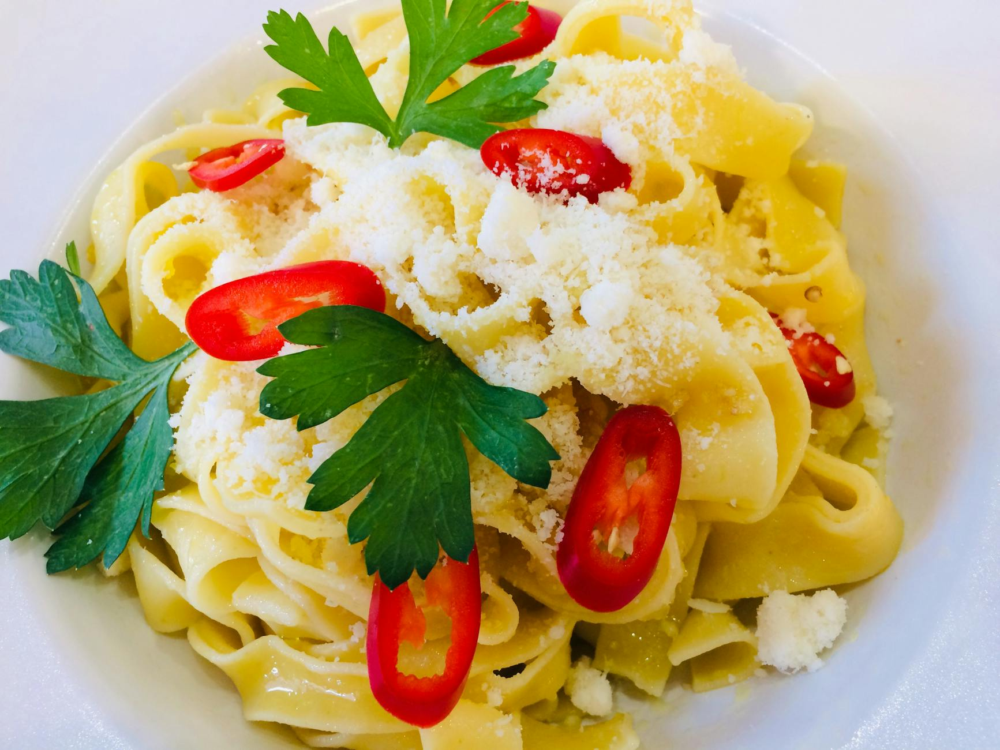

# Spicy Tagliatelle with Peppers, Courgettes, and Thyme

*Tagliatelle primavera, these tender ribbons of fresh pasta celebrate the summer garden with bright vegetables. Peppers deliver sweetness, courgettes provide delicate texture, red onions add depth, and chilli flakes contribute gentle heat. The vegetables are quickly seared to preserve their individual character and bright colors.*

**Serves:** 4

## Overview
This is vegetarian cooking at its most vibrant. Fresh vegetables, barely cooked to preserve their texture and color, toss with delicate egg tagliatelle in a simple, clean preparation. There's no cream here, just good olive oil and the vegetable juices mingling with warm pasta. The result is light, elegant, and completely satisfying.

## Ingredients

### Vegetables
- 8 tablespoons extra virgin olive oil
- 2 red onions (peeled and thinly sliced)
- 2 yellow peppers (de-seeded and chopped into 1 cm cubes)
- 1 red pepper (de-seeded and chopped into 1 cm cubes)
- 1 courgette (trimmed and chopped into 1 cm cubes)
- 1/2 teaspoon dried chilli flakes
- 1 tablespoon fresh thyme leaves
- Salt to taste

### Pasta
- 400 grams fresh tagliatelle (or fettuccine)

## Method

### Stage 1 – Sear Vegetables
1. Heat the olive oil in a large frying pan over medium heat.
2. Add the sliced red onions and cook for 2-3 minutes until they begin to soften.
3. Add the yellow and red pepper cubes along with the courgette cubes.
4. Sprinkle over the chilli flakes and thyme leaves.
5. Cook for 5-6 more minutes, stirring occasionally with a wooden spatula.
6. The vegetables should remain slightly firm and retain their color; do not overcook.
7. Season with salt to taste.
8. Set aside and keep warm.

### Stage 2 – Cook Pasta
1. Meanwhile, bring a large saucepan of salted water to a boil.
2. Add the fresh tagliatelle and cook until al dente.
3. Drain thoroughly and tip back into the same saucepan.

### Stage 3 – Combine & Finish
1. Pour the warm vegetables and all their oil into the pan with the pasta.
2. Place the pan over low heat and toss everything together for 30 seconds.
3. Ensure the flavors meld and the vegetables coat the pasta evenly.
4. Serve immediately while vegetables retain their texture and bright color.

## Notes
- **Vegetable Timing:** Do not overcook the vegetables or they will break down and lose their wonderful flavors and colors. 8-10 minutes total is exact.
- **Oil Quality:** Use a good-quality extra virgin olive oil; it carries the entire flavor profile of the dish.
- **Courgette Texture:** Add courgettes last as they cook fastest; don't let them collapse into mushiness.
- **Fresh Pasta Only:** Fresh tagliatelle is best here; dried pasta will have a coarser texture that doesn't complement delicate vegetables.

## Variations
**Add Garlic:** Include 2 crushed garlic cloves in the oil before vegetables.
**With Mushrooms:** Add 150 grams sliced button mushrooms with the peppers.
**Spicier Heat:** Increase chilli flakes to 1 teaspoon for more kick.
**Finish with Basil:** Tear fresh basil leaves over the finished dish just before serving.

## Serving
Serve with: Crusty bread, chilled white wine (Pinot Grigio)
Garnish with: Fresh thyme, cracked black pepper, grated Parmesan (optional)

## Storage
- Refrigerate leftovers in an airtight container for up to 2 days
- Reheat gently on stovetop with a splash of water
- Vegetables lose their firm texture after 24 hours, becoming softer