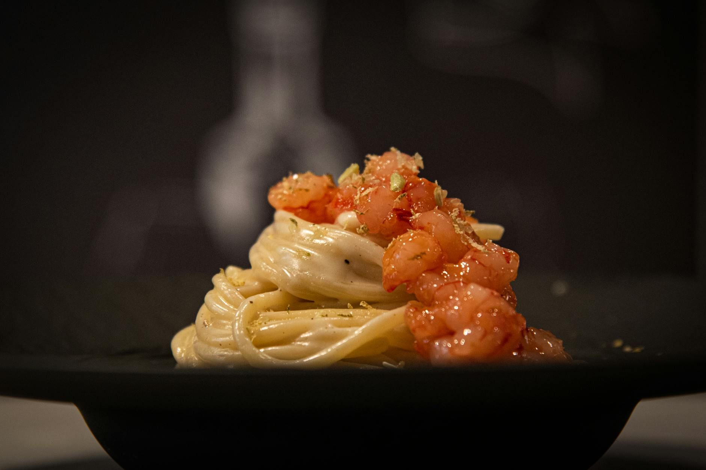

# Tagliatelle with Prawns and Brandy Cream Sauce

*Tagliatelle con gamberi brandy, this is seduction on a plate. Delicate prawns sear briefly in heated oil, then brandy ignites and evaporates, building complexity. Cream carries walnuts, balsamic, and cherry tomato into a sauce that clings to delicate ribbons of pasta. This is sophisticated cooking meant to impress.*

**Serves:** 4

## Overview
This is Italian elegance designed for romantic dinners. Fresh prawns, cooked at precisely the right moment to preserve their tender sweetness, meet a luxurious brandy-cream sauce enriched with toasted walnuts and brightened by balsamic vinegar and cherry tomatoes. The sauce is silky, the flavor sophisticated, the preparation surprisingly quick. Restaurant quality achieved at home.

## Ingredients

### Prawns & Sauce Base
- 30 grams salted butter
- 4 tablespoons extra virgin olive oil
- 2 shallots (peeled and finely chopped)
- 60 grams walnuts (chopped)
- 300 grams uncooked prawns (peeled and de-veined)
- 10 cherry tomatoes (quartered, seeds removed)

### Brandy Cream
- 60 ml brandy
- 250 ml double cream
- 1 tablespoon balsamic vinegar
- Salt and pepper to taste

### Pasta
- 400 grams fresh egg tagliatelle
- 2 tablespoons fresh flat leaf parsley (chopped)

## Method

### Stage 1 – Toast Walnuts & Soften Shallots
1. Melt the butter with the olive oil in a large frying pan over low heat.
2. Add the finely chopped shallots and walnuts.
3. Fry gently for 2 minutes, stirring occasionally with a wooden spoon.
4. The shallots should soften without coloring; walnuts should become fragrant.

### Stage 2 – Sear Prawns
1. Increase the heat to medium.
2. Add the peeled and deveined prawns to the pan.
3. Add the quartered cherry tomatoes, carefully removing the seeds with a spoon.
4. Season with salt and pepper.
5. Cook for 30 seconds only, stirring gently to coat prawns in the oil.
6. The prawns will not be fully cooked yet.

### Stage 3 – Deglaze with Brandy
1. Pour the brandy into the pan (it may ignite; this is intentional).
2. Continue cooking for 1 minute, stirring occasionally, to allow the alcohol to evaporate.
3. The brandy vapors will perfume the sauce.

### Stage 4 – Build Cream Sauce
1. Add the double cream and balsamic vinegar to the pan.
2. Stir everything together gently for 2 minutes.
3. The sauce should be silky and coat the prawns evenly.
4. The prawns will finish cooking in the residual heat.
5. Set the pan aside.

### Stage 5 – Cook Pasta & Combine
1. Meanwhile, cook the fresh tagliatelle in a large saucepan of boiling salted water until al dente.
2. Drain thoroughly and tip back into the same saucepan.
3. Pour the cream sauce with prawns into the pasta pan.
4. Add the chopped parsley.
5. Toss everything together for 30 seconds to allow the flavors to combine and sauce to coat the pasta.
6. Serve immediately.

## Notes
- **Prawn Timing:** Prawns must not be overcooked or they become rubbery. The timing is exact; 30 seconds searing plus the cream cooking time is all they need.
- **Brandy Alcohol:** The 1-minute cook time allows the harsh alcohol flavor to evaporate while retaining the brandy's depth.
- **Balsamic Balance:** The balsamic vinegar brightens the rich cream without overpowering it; it's essential to the balance.
- **Cherry Tomatoes:** Seeding the tomato quarters removes excess moisture that would dilute the cream sauce.
- **Walnut Texture:** Chopped walnuts add textural contrast to the silky sauce; don't skip this texture element.

## Variations
**Marsala Substitution:** Replace brandy with Marsala wine for a subtler, slightly sweeter sauce.
**Extra Garlic:** Add 1 crushed garlic clove with the shallots for more depth.
**Without Walnuts:** Use pine nuts instead for lighter character, or omit entirely for pure prawn and cream focus.

## Serving
Serve as: Special occasion main course, romantic dinner
Garnish with: Fresh parsley leaves, cracked black pepper, lemon wedges
Pair with: Crisp white wine (Pinot Grigio) or light sparkling wine

## Storage
- Best served immediately; prawns lose quality when reheated
- Refrigerate leftovers in an airtight container for 1 day maximum
- Do not freeze; cream sauces and prawns suffer significantly in the freezer