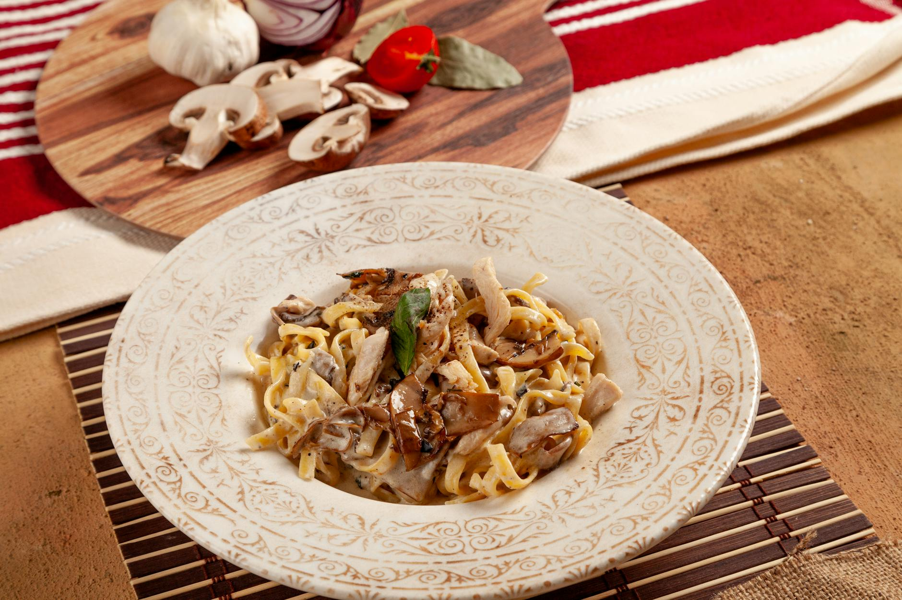

# Tagliatelle with Sausage, Rosemary, and Porcini Mushroom

*Tagliatelle con salsicce e porcini, Italian sausage, crumbled and fried until caramelized, meets earthy reconstituted porcini and fresh rosemary in a rich cream sauce. Each strand of fresh pasta carries this luxurious, warming sauce that whispers of Italian mountains and the depth of wild mushrooms.*

**Serves:** 4

## Overview
This is rustic Italian cooking elevated to elegance. Sausage meat, freed from its casing and crumbled, browns deeply to build complex flavor. Porcini mushrooms, reconstituted in warm water and chopped, contribute their distinctive earthiness. Fresh rosemary provides brightness against the rich cream sauce. The combination is hearty, satisfying, and deeply flavorful.

## Ingredients

### Sausage & Aromatics
- 400 grams Italian sausage (or good quality pork sausage)
- 6 tablespoons extra virgin olive oil
- 1 leek (washed and finely chopped)
- 2 tablespoons fresh rosemary leaves (finely chopped)

### Mushroom & Wine
- 50 grams dried porcini mushrooms
- 100 ml dry white wine

### Cream Sauce
- 150 ml double cream
- Salt and freshly ground black pepper to taste

### Pasta
- 500 grams fresh tagliatelle

## Method

### Stage 1 – Rehydrate Porcini
1. Pour 100 ml warm water over the dried porcini mushrooms.
2. Allow them to soak for 15 minutes to rehydrate and soften.
3. Drain carefully, reserving the soaking liquid (about 60 ml; it's flavorful).
4. Chop the rehydrated porcini into small pieces.

### Stage 2 – Brown Sausage
1. Remove the skins from the sausages and place the meat in a bowl, breaking it into chunks.
2. Heat the olive oil in a large frying pan over low heat.
3. Add the sausage meat and the finely chopped leek.
4. Fry for 5 minutes, stirring occasionally with a wooden spatula to crumble the meat and cook evenly.
5. The sausage should brown and render its fat; the leek should soften and meld into the meat.

### Stage 3 – Add Rosemary & Porcini
1. Add the fresh rosemary and chopped porcini mushrooms to the pan.
2. Season with salt and pepper.
3. Continue cooking for 2 minutes, stirring occasionally.
4. The rosemary will perfume the oil; the porcini will warm through.

### Stage 4 – Deglaze with Wine
1. Pour the dry white wine into the pan, scraping the bottom to release caramelized bits.
2. Cook for 1 minute to allow the alcohol to evaporate.
3. The sauce should smell of wine that's cooking off, not harsh alcohol.
4. Pour in the reserved porcini soaking liquid (about 60 ml).

### Stage 5 – Finish with Cream
1. Pour in the double cream.
2. Stir everything together and cook for 1 minute until creamy and combined.
3. The sauce should be silky and coat the back of a spoon.
4. Set aside and keep warm.

### Stage 6 – Cook Pasta & Combine
1. Meanwhile, cook the fresh tagliatelle in a large saucepan of boiling salted water until al dente.
2. Drain thoroughly and tip back into the same saucepan.
3. Pour the sausage and porcini cream sauce into the pasta pan.
4. Toss everything together for 30 seconds to allow the flavors to combine and the sauce to coat the pasta evenly.
5. Serve immediately.

## Notes
- **Sausage Selection:** Use best-quality Italian sausage if available; it has better seasoning and fat balance than generic pork sausage.
- **Caramelization:** Allow the crumbled sausage to brown deeply (5 minutes) to build complex flavor; don't rush this stage.
- **Porcini Soaking Liquid:** This liquid is precious and flavorful; always reserve it; it adds depth to the sauce.
- **Rosemary Timing:** Add rosemary late to preserve its bright herbal character; long cooking makes it bitter.
- **Fresh Pasta:** Fresh tagliatelle is essential here; dried pasta won't capture the sauce's silky quality.

## Variations
**Without Porcini:** Omit the porcini and substitute 100 grams fresh button mushrooms, sautéed separately if desired.
**Extra Leek:** Use 2 leeks instead of 1 for a deeper, more subtly sweet sauce.
**Sage Variation:** Replace rosemary with 2 tablespoons fresh sage for different herbal character.

## Serving
Serve with: Crusty bread for sauce soaking, green salad with lemon vinaigrette
Garnish with: Fresh rosemary sprig, cracked black pepper, grated Parmesan
Pair with: Medium-bodied red wine (Barbera) or white Burgundy

## Storage
- Refrigerate cooked dish in an airtight container for up to 2 days
- The sauce improves after 24 hours as flavors deepen and meld
- Freeze for up to 1 month; reheat gently on stovetop with a splash of water
- Fresh pasta texture declines after storage; reheat sauce separately if possible