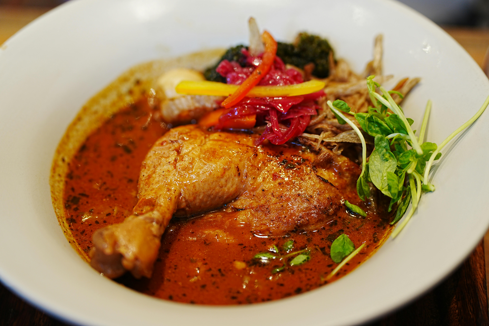

# Caribbean Chicken Curry Stew

## Overview
In many Caribbean stew dishes there is an initial step of burning sugar in oil which is used to brown the meat in. This adds a very unique sweetness to the stews from this region and this sweetness paired with the unmistakable flavour (and heat) from the wonderful scotch bonnet chilli is simply astounding. This curry uses curry powder for a fragrant and delicious result that captures the essence of Caribbean cooking.

**Serves:** 4

## Ingredients

### Green Seasoning (Marinade)
- Ginger (5cm)
- 6 cloves of garlic
- 1 tsp salt
- ½ tsp black peppercorns
- 4 spring onions
- Large pinch coriander
- Large pinch parsley
- 1 scotch bonnet (optional, for milder version use a different chilli)

### Curry
- 2 tbsp vegetable oil
- 55g brown sugar
- 3 tsp curry powder
- 600ml water or stock
- 1 bay leaf
- 2 thyme sprigs
- 1 scotch bonnet (whole)
- 1 shot of dark rum
- 900g chicken (thighs, drumsticks, wings, and breasts) 

## Method

### Stage 1 – Prepare & Marinade
1. Cut the chicken into thighs, drumsticks, wings, and breast pieces, leaving the skin on.
2. Mince together the ginger, garlic, salt, black pepper, green part of the spring onions, parsley, coriander, and scotch bonnet (if using).
3. Coat the chicken thoroughly with the green seasoning marinade.
4. Marinate for approximately 3 hours (or overnight for deeper flavour).

### Stage 2 – Caramelize & Brown
1. Heat oil in a large, heavy-bottomed pan over medium heat.
2. Add brown sugar and let it melt until it starts to bubble and turns dark in colour.
3. It will turn frothy and look almost burnt, this is correct.
4. Stir in the curry powder until sizzling and aromatic.
5. Place the marinated chicken into the pan and brown in batches, allowing it to darken and crisp.
6. Do not overcrowd the pan, each piece should make contact with the base.

### Stage 3 – Simmer
1. Pour in the water or stock to cover the chicken.
2. Add the bay leaf, thyme sprigs, and whole scotch bonnet.
3. Bring to a boil, then reduce to a simmer.
4. Cook for 30 minutes, stirring occasionally.
5. The chicken should be falling away from the bone.

### Stage 4 – Finish
1. Stir in a shot of dark rum.
2. Simmer for another 2–3 minutes.
3. Remove the whole scotch bonnet (or leave it in if you enjoy sustained heat).
4. Slice the white parts of the reserved spring onions and sprinkle over the chicken.

## Notes
- **Scotch bonnet heat:** The scotch bonnet reaches 100,000–350,000 on the Scoville scale and is THE chilli of the Caribbean. Its fruity heat penetrates meat and stews. Remove it once you reach your desired heat level, or leave it whole and intact for less intense heat.
- **Green seasoning:** This Caribbean marinade blend is essential, it adds flavour and tenderizes the meat remarkably.
- **Sugar caramelization:** The burnt sugar adds a unique depth and sweetness essential to Caribbean stews. Don't skip this step.
- **Bone-in chicken:** Leaving bones and skin on adds tremendous flavour and keeps the meat moist.
- **Rum choice:** Dark rum adds warmth and complexity; light rum is less flavourful but still acceptable.

## Serving
Serve with: Rice and peas, roti, or fried dumplings. Garnish with sliced spring onion whites.

## Storage
- Keeps 3 days refrigerated
- Freezes well up to 3 months (remove scotch bonnet before freezing to prevent continued heat development)
- Flavour develops and improves after 24 hours