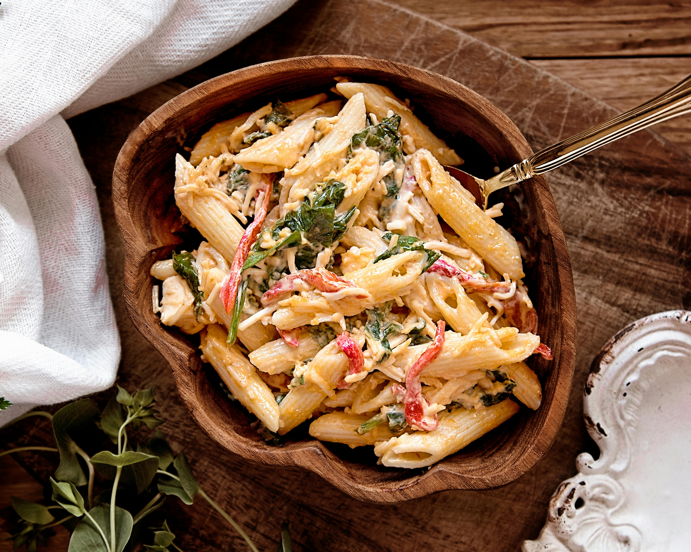

# Rasta Pasta

## Overview
A vibrant Jamaican pasta dish where tender prawns are coated in jerk seasoning and tossed with peppers, spinach, and a creamy sauce. The jerk spicing brings heat and characteristic Caribbean flavours to this contemporary twist on traditional cuisine.

**Serves:** 4

## Ingredients

### Pasta & Protein
- 227 grams penne pasta (about 2 dry cups)
- 454 grams prawns (peeled and deveined)
- 1 tbsp jerk seasoning

### Sauce & Vegetables
- 2 tbsp vegetable oil
- 1 red bell pepper (thinly sliced)
- 1 orange bell pepper (thinly sliced)
- 60 grams fresh spinach
- 2 spring onions (chopped)
- 4 garlic cloves (minced)
- 170 ml pasta water (reserved)
- 170 ml double cream
- 100 grams Parmesan cheese (shredded)
- Salt and pepper to taste

## Method

### Stage 1 – Cook Pasta
1. Prepare pasta according to package directions.
2. Drain, reserving 170 ml (approximately ¾ cup) of pasta water.
3. Set pasta aside.

### Stage 2 – Cook Prawns
1. Coat the prawns with 1 tbsp jerk seasoning.
2. Add oil to a large pan over medium heat.
3. Cook prawns for 2–3 minutes per side until cooked through.
4. Transfer prawns to a plate and set aside.

### Stage 3 – Make the Sauce
1. Add ¼ cup (60 ml) of reserved pasta water to the pan to deglaze.
2. Using a wooden spoon, scrape any seasoning from the sides of the pan into the water.
3. Add red and orange peppers, spring onions, and garlic to the pan.
4. Cook until slightly softened, about 5 minutes.
5. Add remaining pasta water (approximately 110 ml), double cream, and remaining jerk seasoning.
6. Simmer for about 3 minutes until sauce thickens slightly.
7. Stir in the Parmesan cheese until melted and smooth.
8. Taste and adjust seasoning with salt and pepper.

### Stage 4 – Combine & Serve
1. Return the prawns to the pan.
2. Add the cooked pasta and toss gently to coat in the cream sauce.
3. Cook for 1–2 minutes until everything is warmed through and well combined.

## Notes
- **Jerk seasoning:** Brings authentic Caribbean heat and flavour. Adjust quantity to taste preference.
- **Pasta water:** Essential for thinning the sauce and helping it coat the pasta evenly.
- **Spinach addition:** For extra nutrition, wilting fresh spinach into the sauce at the end is traditional.
- **Protein alternatives:** Scallops or firm white fish work well instead of prawns.

## Variations
**Cajun version:** Substitute jerk seasoning for Cajun spices for a warm, smokey profile
**Vegetarian:** Replace prawns with grilled vegetables (aubergine, courgette, mushrooms) or chickpeas
**Extra creamy:** Add an additional splash of cream or swap double cream for crème fraîche

## Serving
Serve with: Fresh lime wedges, crusty bread, and a simple green salad

## Storage
- Keeps 2 days refrigerated (pasta may soften slightly)
- Not recommended for freezing (pasta and cream sauce don't freeze well)
- Best eaten fresh or within a few hours of preparation