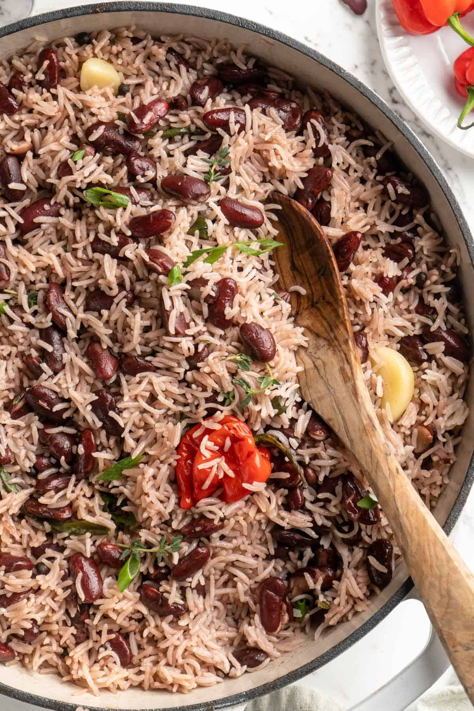

# Rice and Peas

*Jamaica's "peas" are red kidney beans, cooked first with coconut milk, scotch bonnet, thyme, scallion and garlic, then rice goes in the pot to absorb that flavoured liquid. Long-grain rice tinted faint pink, scented with thyme and just-perceptible scotch bonnet heat. The Sunday-lunch staple, eats with anything.*

**Serves:** 6

**Prep Time:** 15 minutes (plus overnight bean soak)

**Cook Time:** 1¼ hours

## Overview
Soaked kidney beans simmer with coconut milk, scallion, thyme, garlic, allspice and a whole scotch bonnet (left whole, never pierced). Once tender, rice goes in with stock to top up. The pot covers; rice steam-absorbs the bean broth; the scotch bonnet stays whole and gets removed before serving.

## Ingredients

- 200 g dried red kidney beans (soaked overnight)
- 400 ml coconut milk
- 1 litre water
- 4 spring onions (whole, ends trimmed)
- 5 sprigs fresh thyme
- 4 garlic cloves (crushed)
- 6 allspice berries (or 1 teaspoon ground)
- 1 scotch bonnet chilli (whole, unpierced)
- 1½ teaspoons salt
- Black pepper
- 500 g long-grain white rice (rinsed)

## Method

### Stage 1 – Cook the beans
1. Drain the soaked beans.
1. Put in a large pot with the coconut milk, water, spring onions, thyme, garlic, allspice and the whole scotch bonnet.
1. Bring to the boil; reduce to a steady simmer.
1. Cook 45-50 minutes until the beans are tender. Top up with hot water if it threatens to dry out.

### Stage 2 – Add the rice
1. Add the salt and the rice. Top up with hot water if needed so the liquid sits 2 cm above the rice.
1. Stir once; bring to the boil.

### Stage 3 – Steam-cook
1. Reduce the heat to lowest; cover tightly.
1. Cook 20-22 minutes without lifting the lid.
1. Off the heat, rest covered 10 minutes.

### Stage 4 – Finish
1. Carefully fish out and discard the whole scotch bonnet, the spring onions, and the thyme stems.
1. Fluff the rice with a fork. Taste; adjust salt.

### Stage 5 – Serve
1. Pile onto plates alongside curried vegetables, fried plantain or grilled food.

## Notes
- **Don't pierce the scotch bonnet:** Whole and intact, it perfumes the pot without making it eye-watering. A pierced one releases its full heat.
- **Soak the beans:** Cuts the cooking time and gives a creamier texture.
- **Coconut cream:** For a richer version, replace 200 ml of the water with extra coconut cream. Common in restaurant builds.

## Storage
- Keeps 4 days refrigerated; reheats well in a pan with a splash of water.
- Freezes 3 months.
