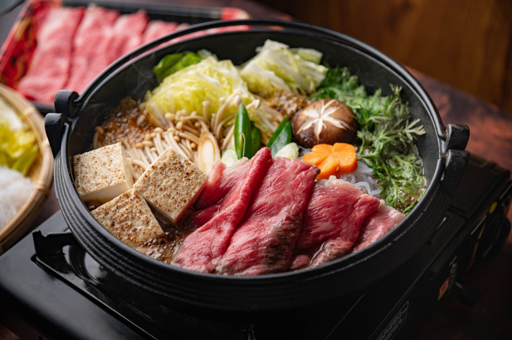

# Beef Sukiyaki

*Hot-pot beef cooked at the table in a sweet soy broth, with tofu, greens, mushrooms and noodles. Diners dip each piece in a beaten raw egg before eating. Communal, celebratory, very Japanese.*

**Serves:** 4

**Prep Time:** 20 minutes

**Cook Time:** 15 minutes

## Overview
A wide shallow pot is brushed with beef fat, the warishita sauce (soy-mirin-sake-sugar) is poured in, then thinly sliced beef and a colourful array of vegetables, tofu and shirataki noodles are added in batches as people eat. Each piece dips in raw egg yolk before going in the mouth. A portable hob at the table is traditional but not required.

## Ingredients

### Warishita sauce
- 200 ml soy sauce
- 200 ml mirin
- 100 ml sake
- 4 tablespoons caster sugar
- 200 ml dashi

### To cook
- 600 g thinly sliced beef rib-eye or sirloin (paper-thin)
- 1 small piece beef suet or 1 tablespoon vegetable oil
- 4 spring onions (cut into 4 cm pieces)
- 200 g shiitake or chestnut mushrooms (sliced)
- 100 g enoki mushrooms (separated)
- 200 g firm tofu (cut into 2 cm cubes)
- ½ Chinese cabbage (cut into 4 cm pieces)
- 1 bunch chrysanthemum greens (or spinach), trimmed
- 200 g shirataki noodles (rinsed)

### To serve
- 4 raw egg yolks (in individual bowls)
- Cooked Japanese short-grain rice

## Method

### Stage 1 – Mix the sauce
1. Whisk all the warishita ingredients together. Set aside.

### Stage 2 – Set up the pot
1. Heat a wide shallow cast-iron pan or sukiyaki pot over medium-high heat.
1. Rub the bottom with the suet (or wipe with oil).
1. Brown a few slices of beef briefly in the fat to start.

### Stage 3 – Build the simmer
1. Pour in about a third of the warishita sauce.
1. Arrange a portion of vegetables, tofu and noodles in the pan in groups (don't mix them).
1. Lay slices of beef on top of the vegetables.
1. Simmer 2-3 minutes until the beef is just cooked.

### Stage 4 – Serve
1. Each diner picks pieces from the pan, dips in their bowl of beaten raw egg yolk, and eats over a bowl of rice.
1. Top up the pot with more sauce, vegetables and beef as the level drops.

## Notes
- **Raw egg dip:** Use the freshest eggs you can find. Pasteurised eggs if you're nervous; the dip is what makes sukiyaki sukiyaki.
- **Don't crowd the pan:** Sukiyaki cooks at the table over time, not all at once. Add as you eat.
- **Chrysanthemum greens:** Hard to find outside Japanese grocers; spinach is the closest substitute (add late so it just wilts).

## Storage
- Eat immediately at the table; the dish is the experience. Leftovers can be reheated but lose their character.
