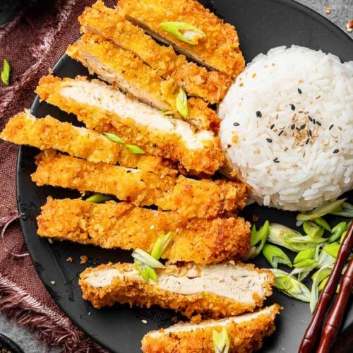

# Chicken Katsu

*Panko-crumbed chicken cutlet shallow-fried golden, sliced and served with a sweet-savoury katsu sauce. The Japanese answer to schnitzel; ubiquitous in Tokyo lunch counters and now British high streets.*

**Serves:** 4

**Prep Time:** 20 minutes

**Cook Time:** 15 minutes

## Overview
Chicken breasts are flattened, dredged in flour, egg and panko, then shallow-fried until the crust is deep golden and shatteringly crisp. Served sliced over rice with shredded cabbage and a katsu sauce built on Worcestershire and ketchup.

## Ingredients

### Chicken
- 4 chicken breasts (about 600 g)
- 4 tablespoons plain flour
- 2 eggs (beaten)
- 150 g panko breadcrumbs
- Salt and freshly ground black pepper
- 4 tablespoons vegetable oil for shallow-frying

### Katsu sauce
- 4 tablespoons tonkatsu sauce, OR
- 4 tablespoons Worcestershire sauce + 4 tablespoons ketchup + 2 teaspoons soy sauce + 2 teaspoons sugar

### To serve
- 300 g cooked Japanese short-grain rice
- ¼ small white cabbage (very finely shredded)
- 1 lemon (cut into wedges)

## Method

### Stage 1 – Prep the chicken
1. Place each chicken breast between sheets of cling film and bash with a rolling pin until 1.5 cm thick.
1. Season generously with salt and pepper.

### Stage 2 – Bread
1. Set up three plates: flour, beaten egg, panko.
1. Coat each breast in flour (shake off excess), dip in egg, then press firmly into the panko on both sides.
1. Set on a tray.

### Stage 3 – Fry
1. Heat the oil in a wide pan over medium heat (panko burns at high heat before the chicken cooks through).
1. Fry the chicken for 3-4 minutes a side until deep golden and cooked through (75°C in the centre).
1. Drain on a wire rack (paper towels make the bottom soggy).

### Stage 4 – Serve
1. Slice each cutlet into 2 cm strips on the diagonal.
1. Mound rice on each plate; pile shredded cabbage alongside.
1. Place the sliced katsu over the rice, drizzle with sauce, and serve with a lemon wedge.

## Notes
- **Pound for even thickness:** A breast that varies from 3 cm to 1 cm cooks unevenly; bash it flat first.
- **Medium heat, not hot:** Panko browns fast. Patience over 6-8 minutes gives crisp coating and cooked-through chicken.
- **Wire rack to drain:** Paper towels trap steam and soften the underside; a rack lets it stay crisp.

## Storage
- Best eaten immediately. Keeps 1 day refrigerated; reheat in a 180°C oven for 8 minutes (don't microwave; the crust goes soggy).
