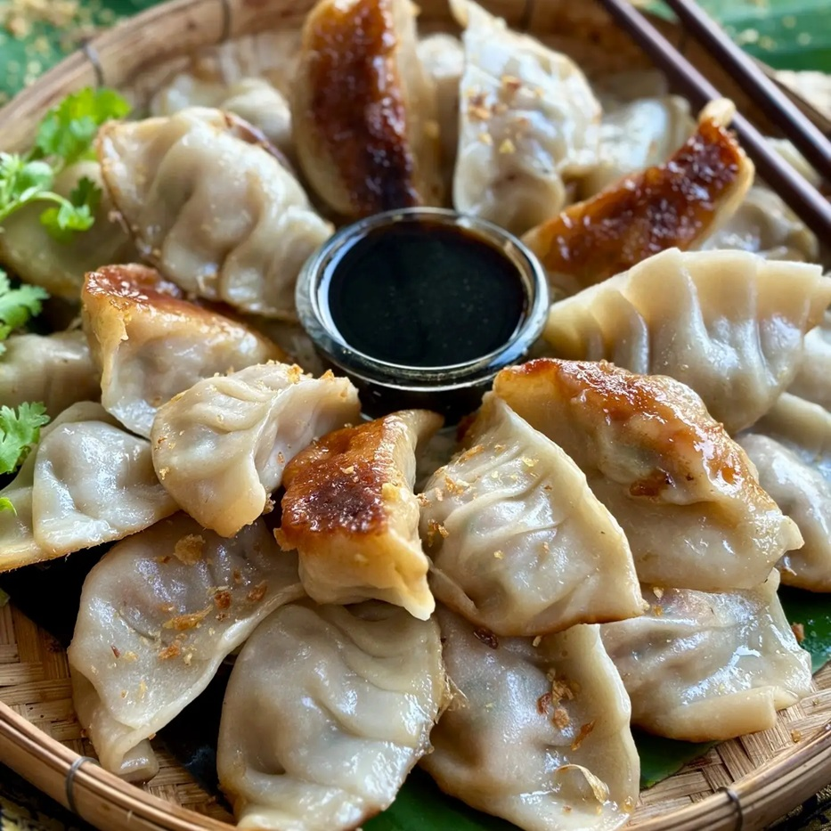

# Pork Gyoza

*Pleated half-moon dumplings with a pork-and-cabbage filling, pan-fried crisp on one side and steamed on the other. Crisp-soft contrast in every bite. The Japanese take on Chinese jiaozi; smaller, garlickier, and almost always pan-fried.*

**Makes:** 30 gyoza

**Prep Time:** 45 minutes

**Cook Time:** 10 minutes

## Overview
A pork mince filling spiked with garlic, ginger, soy, sesame oil and finely chopped cabbage is wrapped in shop-bought gyoza skins, then pan-fried on the flat bottom and finished by steaming with a splash of water in the lidded pan. Serve with a soy-rice-vinegar-chilli oil dip.

## Ingredients

### Filling
- 300 g pork mince
- 200 g Chinese cabbage (very finely chopped)
- 1 teaspoon salt (for the cabbage)
- 3 garlic cloves (crushed)
- 2 cm fresh ginger (grated)
- 2 spring onions (very finely chopped)
- 2 tablespoons soy sauce
- 1 tablespoon toasted sesame oil
- 1 teaspoon sugar
- ½ teaspoon white pepper

### Wrappers and frying
- 30 round gyoza wrappers (shop-bought, frozen aisle)
- 2 tablespoons vegetable oil
- 100 ml water (per batch)
- A small bowl of water (for sealing)

### Dipping sauce
- 4 tablespoons soy sauce
- 2 tablespoons rice vinegar
- 1 teaspoon chilli oil (or rāyu)
- 1 spring onion (sliced)

## Method

### Stage 1 – Filling
1. Toss the chopped cabbage with the teaspoon of salt; leave 10 minutes.
1. Squeeze the cabbage hard in your hands or a clean cloth to expel as much water as possible.
1. Mix with all other filling ingredients until well combined.

### Stage 2 – Wrap
1. Hold a wrapper in your palm. Place a teaspoon of filling in the centre.
1. Wet the rim of the wrapper with water using your finger.
1. Fold the wrapper over the filling to make a half-moon, pleating one side as you press the edges together (about 5-6 pleats).
1. Set on a tray; repeat. Don't let the filled gyoza touch each other or they'll stick.

### Stage 3 – Pan-fry and steam
1. Heat 1 tablespoon of oil in a large non-stick pan over medium-high heat.
1. Arrange about 15 gyoza in a circle in the pan, flat-side down.
1. Cook for 2-3 minutes until the bottoms are deep golden.
1. Add 100 ml water to the pan; immediately cover with a lid.
1. Steam for 4-5 minutes until the water has evaporated and the wrappers look translucent.
1. Uncover and cook another minute to re-crisp the bottoms.

### Stage 4 – Serve
1. Slide onto a plate, crisp-side up, in a circular pattern.
1. Mix the dipping sauce ingredients in a small bowl.

## Notes
- **Squeeze the cabbage:** Wet cabbage = wet filling = soggy gyoza that split in the pan.
- **Crisp first, steam second:** The browning gives the textural contrast; steaming cooks the pork through. Reverse the order and you lose the crust.
- **Freeze raw:** Open-freeze pleated gyoza on a tray, then bag them. Cook from frozen with an extra minute of steam.

## Storage
- Cooked gyoza eat best immediately; soften within the hour.
- Raw gyoza freeze 3 months. Cook from frozen.
