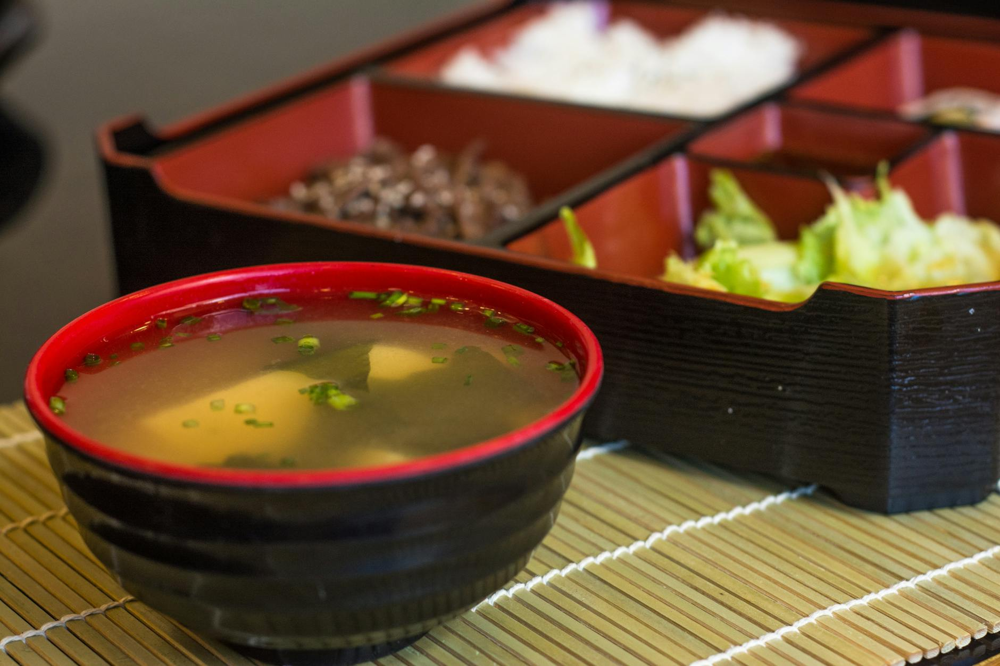

# Miso Soup

*The starter to almost every Japanese meal: dashi base, miso paste whisked in off the heat, silken tofu and seaweed. Five minutes start to finish. Critical to never boil the miso once it's in.*

**Serves:** 4

**Prep Time:** 5 minutes

**Cook Time:** 5 minutes

## Overview
Make dashi (or use instant), bring just to a simmer, drop in cubed silken tofu and rehydrated wakame seaweed, then whisk in miso paste off the heat. Boiling the miso destroys its delicate flavour and aroma.

## Ingredients

- 800 ml water
- 10 g kombu (dried kelp), or skip and use 1 teaspoon hondashi
- 10 g bonito flakes (katsuobushi), or use hondashi
- 4 tablespoons white miso paste (or 3 tablespoons white + 1 tablespoon red for depth)
- 200 g silken tofu (cut into 1 cm cubes)
- 5 g dried wakame seaweed (rehydrated in cold water for 5 minutes, drained)
- 2 spring onions (sliced)

## Method

### Stage 1 – Dashi
1. Combine the water and kombu in a pan. Heat slowly to JUST below boiling (about 80°C). Don't boil; kombu turns slimy.
1. Remove the kombu, then add the bonito flakes. Take off the heat and let steep for 3 minutes.
1. Strain through a fine sieve. (Or skip all that and dissolve 1 teaspoon hondashi in 800 ml hot water.)

### Stage 2 – Build the soup
1. Return the dashi to the pan and bring to a gentle simmer.
1. Add the cubed tofu and rehydrated wakame. Heat for 1 minute (don't stir hard; tofu breaks).

### Stage 3 – Add miso
1. Take the pan off the heat.
1. Place the miso in a small ladle or sieve and lower into the soup. Whisk gently against the ladle to dissolve (this avoids miso lumps).
1. Don't return to the boil after adding miso.

### Stage 4 – Serve
1. Ladle into bowls. Scatter spring onions over.

## Notes
- **Don't boil after adding miso:** It loses fragrance and the umami flattens. The dashi is hot enough to keep the soup warm.
- **Mix red and white miso:** All-white is sweet and gentle; all-red is salty and strong. Two-thirds white plus one-third red is the standard balance.
- **Tofu added late:** It cooks quickly, and stirring breaks the cubes. Lower it gently and let the heat do the work.

## Storage
- Best fresh. Keeps 1 day refrigerated; reheat gently without boiling.
