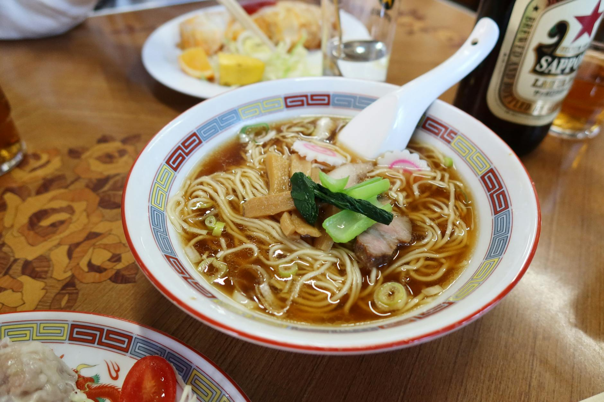

# Shoyu Ramen

*Shoyu ramen is the soy-sauce-based variant of Japan's iconic noodle soup, with a clean, golden chicken broth seasoned with kombu and shiitake.

**Serves:** 6
**Prep Time:** 15 minutes
**Cook Time:** 4 hours 30 minutes

## Overview
Of the four main ramen styles, shoyu (soy) is the cleanest and most aromatic, leaning on a clear roasted-chicken broth rather than the milky richness of tonkotsu or the heavy punch of miso. The technique splits the work: a long, gentle simmer with kombu and shiitake builds the broth, and a separate seasoning sauce called tare goes in bowl by bowl at the end. That last step is what lets you tune the saltiness without compromising the broth's clarity.

## Ingredients

### Roasted Stock Base
- 2 kg chicken wings
- 2 carrots (cut into small pieces)

### Broth
- 2 x 20 cm pieces kombu
- 6 dried shiitake mushrooms
- 6 spring onions (plus extra finely sliced to serve)
- 1 head of garlic (halved)
- 4 cm piece ginger (sliced)
- ¼ cup soy sauce
- 12 cups water

### Tare (Seasoning Sauce)
- ¼ cup soy sauce
- 2 tablespoons mirin

### To Serve
- Cooked ramen noodles
- Chashu pork (or any protein or vegetables you like)
- Medium-soft boiled eggs (halved)
- Reserved shiitake mushrooms (sliced, stems discarded)
- Finely sliced spring onion

## Method

### Stage 1 – Roast the Chicken
1. Preheat the oven to 200°C (390°F).
2. Cut the chicken wings through their joints into smaller pieces.
3. Spread the wings and carrot pieces in a large roasting tin.
4. Roast for 45 to 60 minutes, until deeply golden brown.

### Stage 2 – Deglaze the Tin
1. Transfer the roasting tin to the stovetop and turn the heat to high.
2. When the roasting juices begin to bubble, pour in 2 cups of water.
3. Use a wooden spoon to scrape up all the browned bits from the bottom of the pan.
4. Tip the chicken, carrots and deglazing liquid into a large stock pot.

### Stage 3 – Simmer the Broth
1. Place the stock pot over high heat.
2. Add the kombu, dried shiitake, the 6 spring onions, halved garlic head, sliced ginger and soy sauce.
3. Top up with the remaining 10 cups of water.
4. Bring to a simmer, then reduce the heat to low.
5. Simmer gently for 3 hours, skimming the surface every so often.

### Stage 4 – Make the Tare
1. While the stock simmers, mix the soy sauce and mirin in a small bowl.
2. Set aside.

### Stage 5 – Strain the Broth
1. Lift out and reserve the shiitake mushrooms.
2. Discard the chicken, carrots, kombu, spring onions, garlic and ginger.
3. Strain the broth through a fine mesh sieve into a clean saucepan.
4. Taste and season with the tare a little at a time. Add almost all of it if needed; the right amount depends on the saltiness of your soy sauce and how much the broth has reduced.

### Stage 6 – Plate Up
1. Place cooked ramen noodles into each serving bowl.
2. Ladle over the hot seasoned broth.
3. Top with chashu pork (or your chosen protein).
4. Slice the reserved shiitake mushrooms (discard the stems) and add to the bowls.
5. Add half a soft-boiled egg to each.
6. Sprinkle with finely sliced spring onion.

## Notes
- **Roast first, simmer second:** Roasting the wings and carrots before simmering builds the broth's golden colour and roasted depth. Don't skip this step.
- **Kombu:** Dried kelp, sold at Japanese and Asian grocers. Wipe (don't wash) before use; the white film is part of the umami. Add it at the start of the simmer; long cooking won't make it bitter the way it does in dashi.
- **Tare:** Adding the soy-mirin tare at the end (rather than during the simmer) lets you control saltiness in the final bowl. Start with half and build up.
- **Eggs:** For classic ramen eggs, soft-boil for 6½ minutes then plunge into ice water. For a marinated finish, steep peeled eggs in extra tare for a few hours before serving.
- **Stock keeps well:** The strained broth (before tare) freezes beautifully and is the most useful thing you can have in the freezer for a quick noodle bowl.

## Variations
**Vegetarian shoyu:** Replace the chicken wings with a mix of mushrooms (3 cups dried) and umeboshi plums; double the kombu for body.
**Tonkotsu-style:** Add 1 kg of pork bones with the chicken wings and simmer for 6 hours instead of 3 for a richer, cloudier broth.
**Cold soup:** Chill the strained broth and serve as a hiyashi ramen with cold noodles in summer.

## Serving
Serve with: A sheet of toasted nori on top, a few drops of chilli oil, and a wedge of lime
Garnish with: A scatter of toasted sesame seeds and a curl of pickled bamboo (menma)

## Storage
- Strained broth keeps 3 days refrigerated, or freezes well up to 3 months
- Tare keeps indefinitely refrigerated in a sealed jar
- Cooked noodles do not store well; cook fresh for each serving
- Soft-boiled eggs keep 2 days refrigerated
