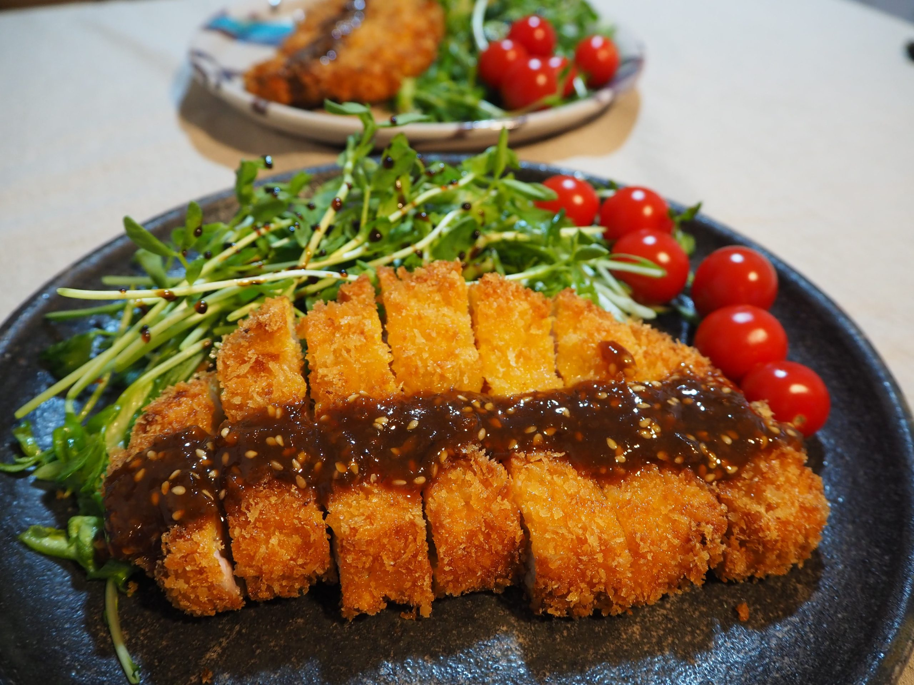

# Tonkatsu

*Panko-crumbed pork cutlet, the original katsu (chicken came later). Pork loin or fillet, shallow-fried golden, sliced and served with shredded cabbage and tonkatsu sauce. Find at any Japanese yōshoku restaurant.*

**Serves:** 4

**Prep Time:** 20 minutes

**Cook Time:** 15 minutes

## Overview
Thick pork loin steaks are scored, seasoned, breaded with flour-egg-panko, and shallow-fried until the crust is shatter-crisp. Served with cabbage so finely shredded it's practically a slaw, and a sticky-sweet katsu sauce.

## Ingredients

### Pork
- 4 pork loin steaks (about 180 g each, 1.5-2 cm thick)
- 4 tablespoons plain flour
- 2 eggs (beaten)
- 150 g panko breadcrumbs
- Salt and freshly ground black pepper
- Vegetable oil for shallow-frying (about 4 tablespoons)

### Katsu sauce
- 4 tablespoons Worcestershire sauce
- 4 tablespoons ketchup
- 2 teaspoons soy sauce
- 2 teaspoons sugar
- 1 teaspoon Dijon mustard

### To serve
- 300 g cooked Japanese short-grain rice
- ¼ small white cabbage (very finely shredded)
- 1 lemon (cut into wedges)
- 1 tablespoon toasted sesame seeds

## Method

### Stage 1 – Prep the pork
1. Pat the pork steaks dry. Trim excess fat but leave a thin rim.
1. Score the surface in a shallow cross-hatch on both sides (prevents curling).
1. Season generously with salt and pepper.

### Stage 2 – Bread
1. Set up three plates: flour, beaten egg, panko.
1. Coat each steak in flour, then egg, then press firmly into panko on both sides.

### Stage 3 – Fry
1. Heat 4 tablespoons of oil in a wide heavy pan over medium heat.
1. Fry for 3-4 minutes a side until deep golden and cooked through (62°C in the centre).
1. Drain on a wire rack.

### Stage 4 – Sauce and serve
1. Whisk the sauce ingredients in a small bowl.
1. Slice each cutlet into 2 cm strips.
1. Plate with rice, cabbage and sliced tonkatsu. Drizzle with sauce, scatter sesame seeds, and add a lemon wedge.

## Notes
- **Score the pork:** The strip of fat around pork loin contracts as it cooks, curling the cutlet; cross-hatch scoring prevents this.
- **Don't overcook:** Modern pork is safe at 62°C. Cooked beyond that and you've made boot leather.
- **Grate ginger into the cabbage:** Some traditions add a tiny bit of ginger to the slaw; brightens the dish.

## Storage
- Eat immediately. Keeps 1 day refrigerated; reheat in a 180°C oven for 8 minutes.
