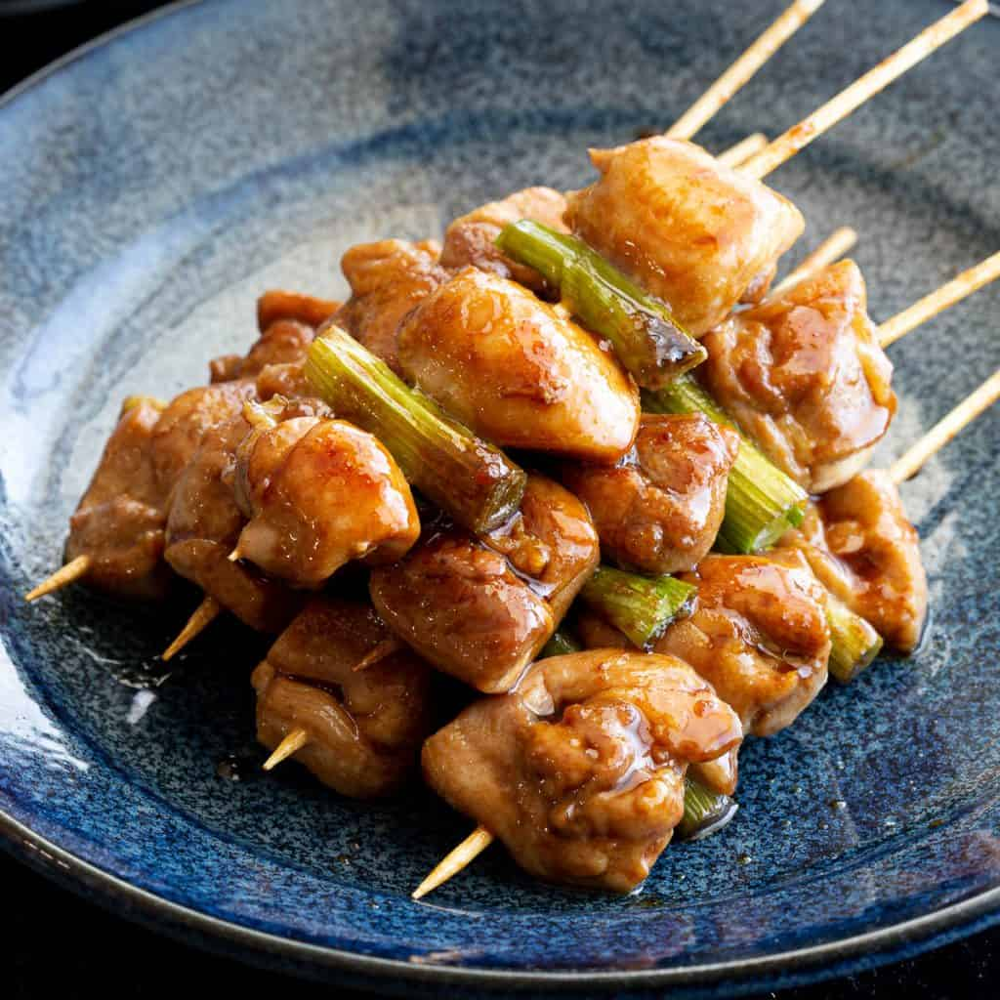

# Yakitori

*Skewered grilled chicken in a glossy soy-mirin tare. Izakaya street food at its most pure: chicken thigh, scallion, sometimes liver or skin, all charred over high heat and brushed with the sticky house sauce. Eat off the skewer.*

**Serves:** 4 (about 12 skewers)

**Prep Time:** 20 minutes (plus 30 minutes soaking skewers)

**Cook Time:** 12 minutes

## Overview
Chicken thigh and spring onion are threaded alternately on bamboo skewers, grilled hot to char the outside while the centre stays juicy, and brushed repeatedly with a reduced soy-mirin-sake-sugar tare. Salt-only versions (shio) and tare-glazed (tare) are both classics.

## Ingredients

### Tare (sauce)
- 100 ml soy sauce
- 100 ml mirin
- 50 ml sake
- 2 tablespoons caster sugar
- 1 garlic clove (smashed)
- 1 cm ginger (sliced)

### Skewers
- 600 g boneless chicken thigh (skin on if possible, cut into 2.5 cm cubes)
- 6 spring onions or 2 leeks (white parts, cut into 2.5 cm pieces)
- 12 bamboo skewers (soaked 30 minutes in water)
- A pinch of salt
- Shichimi togarashi (to serve)

## Method

### Stage 1 – Reduce the tare
1. Combine the soy, mirin, sake, sugar, garlic and ginger in a small saucepan.
1. Simmer over medium heat for 10-12 minutes until reduced by about a third and slightly syrupy.
1. Strain into a bowl; discard the aromatics.

### Stage 2 – Skewer
1. Thread the chicken and spring onion alternately onto the soaked skewers (4-5 pieces of chicken per skewer with onion between).
1. Pat dry; season very lightly with salt.

### Stage 3 – Grill
1. Heat a griddle pan, BBQ or grill on its highest setting.
1. Grill the skewers for 4 minutes a side until browned.
1. Brush with tare on both sides; cook another 2 minutes turning, brushing each turn until the glaze is sticky and lacquered.

### Stage 4 – Serve
1. Pile on a plate, brush with one final coat of tare.
1. Sprinkle shichimi over.

## Notes
- **Soak the skewers:** 30 minutes in water prevents them charring through and snapping when you handle them.
- **Don't tare too early:** The sugar in the sauce burns at high heat. Salt-then-grill, then tare in the last minutes.
- **Skin-on thigh:** The fat renders into the chicken; skinless is leaner but less juicy.

## Storage
- Best from the grill. Keeps 1 day refrigerated; reheat under a hot grill 2 minutes to re-crisp.
