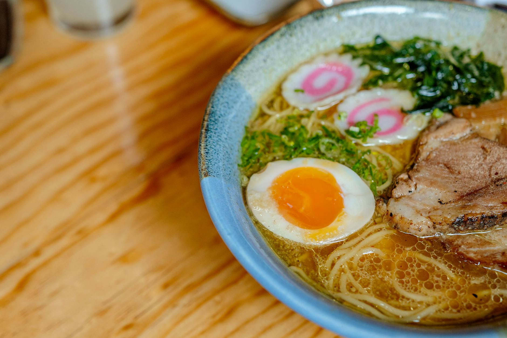

# Yasai Ramen

*Vegetable ramen built on a mushroom-and-kombu broth: soy-tare for backbone, miso for body, fresh ramen noodles, and a colourful pile of toppings — soft-boiled egg, sweet corn, blanched bok choy, fried tofu, scallions, sesame, nori. The broth simmers 30 minutes; the assembly is the meal.*

**Serves:** 2

**Prep Time:** 20 minutes

**Cook Time:** 35 minutes

## Overview
Mushroom (dried shiitake) and kombu (kelp) infuse hot water for the broth base. Garlic-and-ginger oil fries; miso paste, soy and mirin make the tare. Noodles cook fresh; everything assembles in deep bowls with toppings stacked artfully.

## Ingredients

### Broth
- 1.2 litres hot water
- 25 g dried shiitake mushrooms
- 1 piece kombu (10 x 5 cm)
- 4 spring onions (whole, smashed)
- 4 garlic cloves (smashed)
- 4 cm fresh ginger (sliced)

### Tare and aroma
- 2 tablespoons sesame oil
- 4 tablespoons white or red miso paste
- 3 tablespoons light soy sauce
- 2 tablespoons mirin
- 1 tablespoon Shaoxing rice wine (optional)
- 1 teaspoon sugar

### Toppings
- 200 g firm tofu (cubed)
- 1 tablespoon vegetable oil (for the tofu)
- 1 tablespoon soy sauce
- 2 large eggs (soft-boiled, halved)
- 1 small bok choy or pak choi (halved lengthwise)
- 100 g sweet corn (frozen or tinned)
- 4 spring onions (sliced)
- 1 sheet nori (cut into 4 strips)
- 1 teaspoon toasted sesame seeds
- A few drops chilli oil (optional)

### Noodles
- 200 g fresh or 150 g dried ramen noodles

## Method

### Stage 1 – Broth
1. Pour the hot water over the shiitake and kombu in a large bowl; rest 20 minutes.
1. Strain into a pot; squeeze the mushrooms gently. Save the rehydrated shiitake (slice for topping); discard the kombu.
1. Add the spring onions, garlic and ginger to the strained broth; bring to a simmer.
1. Cook 25-30 minutes uncovered, just bubbling.

### Stage 2 – Tofu
1. Heat the oil in a small pan over medium-high heat.
1. Fry the tofu cubes 4-5 minutes, turning, until deep golden.
1. Drizzle with the soy sauce; toss to coat; remove.

### Stage 3 – Tare
1. Strain the broth again into a clean pot.
1. Whisk the sesame oil, miso, soy, mirin, sake (if using) and sugar in each serving bowl — about half the mixture per bowl.

### Stage 4 – Blanch the bok choy
1. Bring a large pot of water to the boil.
1. Drop in the bok choy halves; cook 1 minute; lift out.
1. Add the corn; cook 1 minute; lift out.

### Stage 5 – Cook the noodles
1. Cook the ramen noodles in the boiling water per packet instructions (usually 2-3 minutes for fresh).
1. Drain.

### Stage 6 – Assemble
1. Pour about 500 ml of hot broth into each prepared bowl, whisking the tare in.
1. Add the noodles; arrange the bok choy, corn, sliced shiitake, fried tofu, sliced egg and nori on top.
1. Scatter sesame seeds and spring onions; drizzle with chilli oil if using.
1. Eat right away.

## Notes
- **Don't boil the miso:** It loses its complex aroma. Whisk into the bowl, not the pot. Or add tare to the pot only briefly off the heat before serving.
- **Soft-boiled egg:** 6½ minutes from rolling boil; ice bath; peel. The yolk should be still-jammy in the centre.
- **Broth depth:** A handful of dried mushrooms more makes a deeper broth. Shiitakes work best; porcini or mixed dried mushrooms also good.

## Storage
- Broth keeps 4 days refrigerated and freezes 3 months. Cooked noodles and assembled bowls don't keep — always cook noodles fresh.
