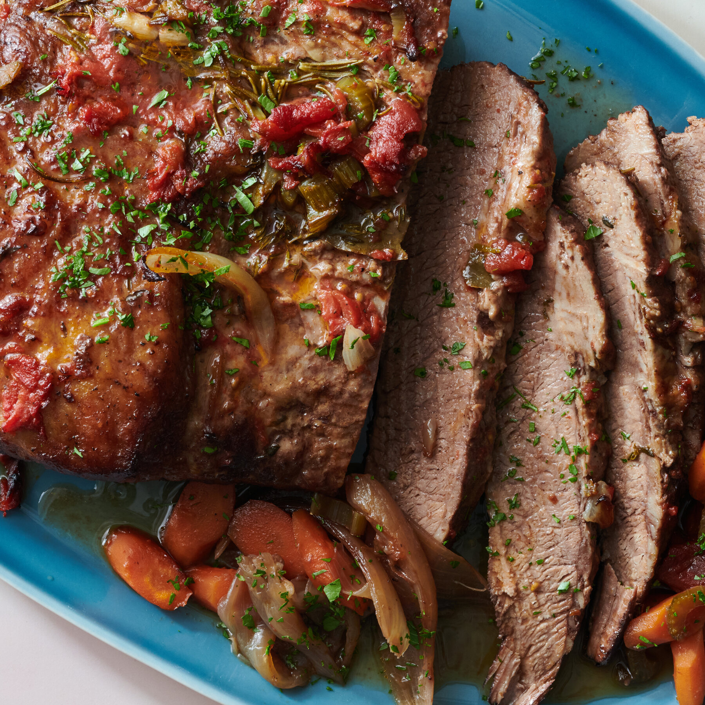

# Jewish Brisket

*Slow-braised beef brisket in a sweet-savoury onion-and-tomato sauce, the meat cooked until it can be cut with a fork. The defining holiday main of Ashkenazi Jewish cooking — served at Rosh Hashanah, Passover, Shabbat, weddings. Best made the day before so it slices cleanly and the flavours deepen.*

**Serves:** 8

**Prep Time:** 20 minutes

**Cook Time:** 4 hours

## Overview
Brisket sears in a heavy pot; onions caramelise on the rendered fat; garlic and tomato paste deepen with paprika and brown sugar. Wine and stock loosen; the brisket goes back in fat-side up; the lot covers and braises low and slow for 3+ hours. Cool overnight; slice cold against the grain; reheat in the sauce.

## Ingredients

- 2 kg beef brisket (point or flat; trimmed of excess fat but leaving a thin cap)
- 2 tablespoons vegetable oil
- Salt and black pepper

### Braise
- 4 large onions (sliced)
- 8 garlic cloves (smashed)
- 3 tablespoons tomato paste
- 2 tablespoons brown sugar
- 1 tablespoon sweet paprika
- 1 teaspoon ground black pepper
- 250 ml dry red wine (or 250 ml extra stock)
- 750 ml beef stock
- 4 carrots (cut into 4 cm chunks)
- 4 celery sticks (cut into 4 cm chunks)
- 3 bay leaves
- 4 sprigs fresh thyme
- 2 tablespoons cider vinegar
- 1 teaspoon salt

## Method

### Stage 1 – Sear
1. Heat the oven to 160°C (140°C fan).
1. Pat the brisket dry; salt and pepper generously on all sides.
1. Heat the oil in a large heavy oven-proof pot over high heat.
1. Sear the brisket 4-5 minutes per side until deeply browned. Lift out.

### Stage 2 – Onions
1. Reduce the heat to medium.
1. Add the onions to the pot (use the rendered fat); cook 12-15 minutes, stirring, until soft and golden.
1. Stir in the garlic; cook 1 minute.

### Stage 3 – Build the braise
1. Stir in the tomato paste, brown sugar, paprika and black pepper; cook 2 minutes.
1. Pour in the wine; let it bubble vigorously 2 minutes (deglaze the pot).
1. Add the stock, bay, thyme, vinegar and salt.

### Stage 4 – Braise
1. Return the brisket fat-side up; the liquid should come about 2/3 up the meat. Top up with stock if needed.
1. Cover with the lid; transfer to the oven.
1. Cook 2½ hours.
1. Add the carrots and celery around the meat; return to the oven; cook 1-1½ hours more, until the brisket is fork-tender (a fork goes in with no resistance).

### Stage 5 – Cool overnight
1. Lift the brisket onto a board; cool 1 hour.
1. Wrap and refrigerate the meat overnight (or at least 4 hours).
1. Refrigerate the sauce separately; the fat will rise and solidify.

### Stage 6 – Reheat and serve
1. Skim the solid fat off the cold sauce; discard.
1. Slice the cold brisket against the grain into 1 cm slices (warm meat shreds; cold slices clean).
1. Lay the slices in a baking dish; pour the sauce and vegetables over.
1. Cover; reheat at 160°C for 30-40 minutes until hot through.

### Stage 7 – Plate
1. Lift slices onto plates with vegetables; spoon sauce generously over.
1. Serve with mashed potato, kasha or noodles.

## Notes
- **Cook the day before:** The two essential techniques — slicing cold for clean slices, and skimming the fat — both need overnight rest. Same-day brisket falls apart unevenly.
- **Against the grain:** Brisket has very long muscle fibres. Slice perpendicular to the grain or every bite is chewy.
- **Don't trim all the fat:** Some fat cap renders into the sauce and bastes the meat. Trim the thick parts; leave a 5 mm cap.

## Storage
- Keeps 5 days refrigerated; arguably best on day 2-3.
- Freezes 3 months in its sauce.
