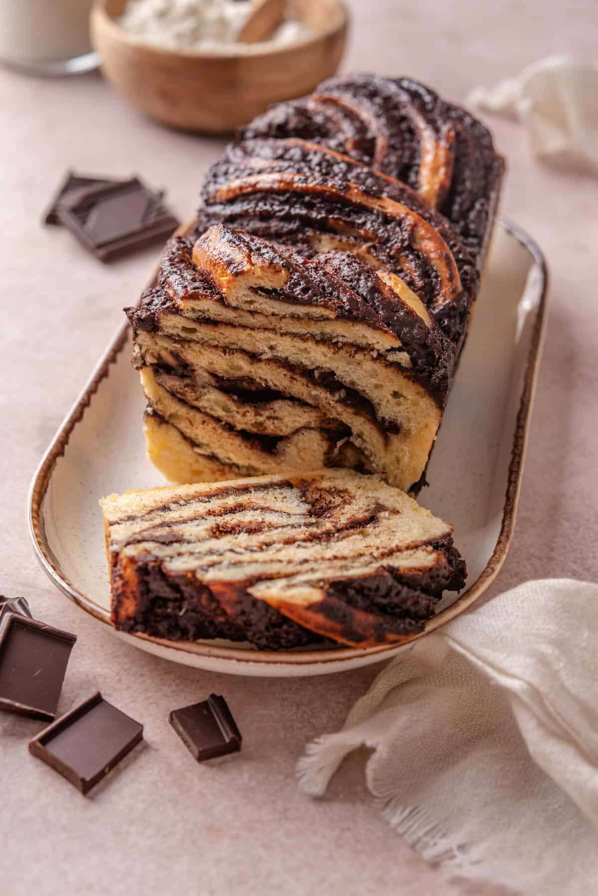

# Chocolate Babka

*An enriched yeast bread spread with chocolate filling, rolled tight and twisted into a loaf so each slice shows a swirl of dark chocolate ribbons through golden brioche. Polish-Jewish in origin; modern babka — leaning chocolate-heavy, often glazed — comes via the New York Jewish bakery scene. A weekend project; the result is far better than any shop-bought version.*

**Makes:** 1 large loaf

**Prep Time:** 30 minutes (plus 2 hour first rise + 1 hour second rise)

**Cook Time:** 45 minutes

## Overview
A rich enriched dough is mixed and kneaded; first rise overnight in the fridge for the best flavour and easier handling. The next day, the cold dough rolls into a wide rectangle; chocolate filling spreads thick to the edges; rolls into a tight log. The log is sliced lengthwise, twisted into a braid (cut sides facing up to expose the chocolate), tucked into a loaf tin and proofed. Bakes; brushes with sugar syrup hot from the oven.

## Ingredients

### Dough
- 500 g strong white bread flour (plus more for rolling)
- 100 g caster sugar
- 1 sachet (7 g) fast-action yeast
- 1 teaspoon salt
- 4 large eggs
- 100 ml whole milk (lukewarm)
- 150 g unsalted butter (very soft, cubed)

### Chocolate filling
- 200 g dark chocolate (70%, chopped)
- 150 g unsalted butter
- 80 g icing sugar (sifted)
- 3 tablespoons cocoa powder (sifted)
- ½ teaspoon ground cinnamon

### Sugar syrup
- 100 g caster sugar
- 100 ml water

## Method

### Stage 1 – Dough (the day before, ideally)
1. Combine the flour, sugar, yeast and salt in a stand mixer bowl.
1. Add the eggs and milk; mix on low with a dough hook 3 minutes until shaggy.
1. With the mixer running, add the soft butter a cube at a time, allowing each to incorporate before the next.
1. Once all the butter is in, knead 8-10 minutes more until smooth, elastic and pulling cleanly from the bowl.
1. Cover and refrigerate overnight (or 4-6 hours minimum).

### Stage 2 – Filling
1. Melt the chocolate and butter together in a heatproof bowl over barely-simmering water.
1. Whisk in the icing sugar, cocoa and cinnamon until smooth.
1. Cool to room temperature — it should be spreadable, not runny. If it sets too firm, soften gently.

### Stage 3 – Roll and fill
1. Tip the cold dough onto a lightly floured surface; roll into a 50 x 30 cm rectangle.
1. Spread the filling evenly, leaving a 1 cm border on the long edges.

### Stage 4 – Roll and shape
1. Roll up tightly from one long edge into a long sausage; pinch the seam closed.
1. Place seam-side down; with a sharp knife, slice the log lengthwise — cutting it in half so the cut sides expose the chocolate spiral.
1. Holding both halves cut-side up, twist them around each other into a 2-strand braid (like a rope).
1. Pinch the ends to seal.
1. Lift carefully into a buttered, parchment-lined 23 cm loaf tin.

### Stage 5 – Second rise
1. Cover loosely; rise 60-90 minutes at room temperature, until almost doubled and the dough springs back slowly when pressed.

### Stage 6 – Bake
1. Heat the oven to 180°C (160°C fan).
1. Bake 40-45 minutes until deep golden and a skewer in the centre comes out without raw dough (chocolate streaks are fine).
1. If the top browns too fast, cover loosely with foil at 30 minutes.

### Stage 7 – Sugar syrup
1. While baking, simmer the sugar and water 3 minutes; cool slightly.
1. As the babka comes out of the oven, brush the syrup all over the top — it'll soak in and gloss the surface.

### Stage 8 – Cool and slice
1. Cool 30 minutes in the tin; lift out using parchment.
1. Cool fully before slicing — warm babka tears.

## Notes
- **Cold dough is essential:** Refrigerated overnight, the dough is firm enough to roll thin and twist neatly. Room-temperature dough tears and won't hold the spiral.
- **Don't be shy with filling:** Thin filling means thin streaks and a less interesting slice. Spread thickly and right to the edges.
- **Sugar syrup:** Skip and the babka tastes flat and looks dull. The hot brush is what finishes the bread.

## Storage
- Keeps 3 days at room temperature wrapped tightly; the chocolate softens slightly on day 2.
- Freezes 2 months whole or sliced.
