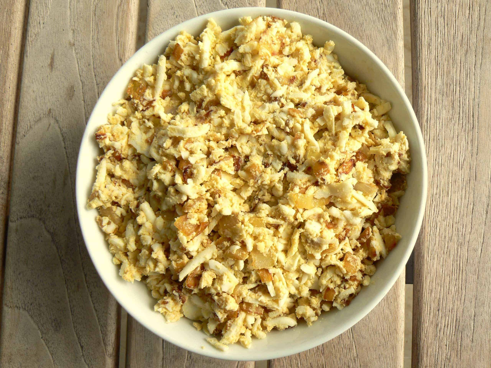

# Chopped Egg and Onion

*An Ashkenazi Jewish starter: hard-boiled eggs and softened onions chopped to a coarse paste, bound with schmaltz (chicken fat) or oil, seasoned only with salt and pepper. Eats on rye bread, with crackers, or piled onto matzo. The kind of dish that's been on Jewish appetiser tables for over a century, and tastes better than it has any right to.*

**Serves:** 4-6 as a starter

**Prep Time:** 15 minutes

**Cook Time:** 20 minutes

## Overview
Eggs hard-boil and cool. Onions cook slowly in oil or schmaltz until deeply golden and sweet. Both chop together with a fork or knife (not a food processor — the texture matters); salt and pepper season. Serve at room temperature.

## Ingredients

- 6 large eggs
- 2 medium onions (finely chopped)
- 4 tablespoons schmaltz (rendered chicken fat) or sunflower oil
- 1 teaspoon salt (or to taste)
- ½ teaspoon white pepper

### To serve
- Rye bread, matzo, or crackers
- Sliced cucumber or radish

## Method

### Stage 1 – Hard-boil the eggs
1. Place the eggs in a pan; cover with cold water by 2 cm.
1. Bring to a steady boil; reduce to a simmer; cook exactly 10 minutes.
1. Drain; cover with cold water until cool.
1. Peel.

### Stage 2 – Caramelise the onions
1. Heat the schmaltz or oil in a wide pan over medium-low heat.
1. Cook the onions 18-20 minutes, stirring occasionally, until deeply golden and very soft. Don't rush — this is half the dish.
1. Cool to room temperature.

### Stage 3 – Chop and combine
1. Roughly chop the eggs in a wide bowl with a fork — coarse, not fine.
1. Add the cooled onions with all their fat from the pan.
1. Season with salt and white pepper; mix to combine.
1. Taste; adjust salt and pepper.

### Stage 4 – Rest
1. Cover and refrigerate at least 30 minutes (the flavours marry).
1. Bring back to room temperature before serving — cold mutes the flavour.

### Stage 5 – Serve
1. Pile into a small bowl; serve with rye bread, matzo or crackers, and a few cucumber slices to refresh between bites.

## Notes
- **Schmaltz is the soul:** If you can render chicken fat (or buy a jar at a Jewish deli), the dish is transformed. Sunflower oil is the everyday substitute.
- **Coarse texture:** A food processor or blender turns it into pâté. Chop by hand or use a fork; the pieces of egg and onion should be visible.
- **Don't skimp on the onion-cooking:** Pale onions give a sharp, raw-tasting spread. The onions need real time to sweeten.

## Storage
- Keeps 4 days refrigerated. Bring back to room temperature before serving each time.
