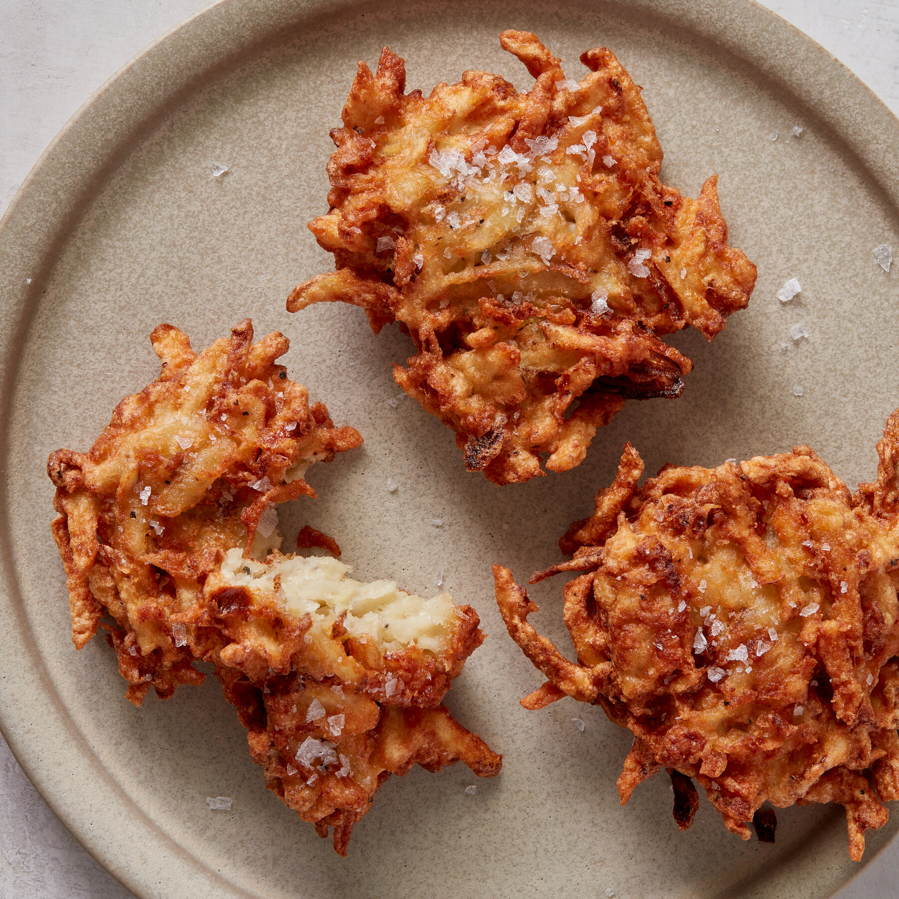

# Latkes

*Crisp Ashkenazi potato pancakes, fried in oil until shatteringly golden on the outside and soft inside. Eaten at Hanukkah (the oil is the point — celebrating the miracle of the Temple's lasting lamp), but eaten constantly the rest of the year too. Sour cream and apple sauce on top; argue forever about which is correct.*

**Makes:** about 16 latkes

**Prep Time:** 20 minutes

**Cook Time:** 25 minutes

## Overview
Potatoes and onion are coarsely grated; the mixture is squeezed bone-dry in a cloth (this is the difference between great latkes and soggy ones). Egg and matzo meal (or flour) bind; the lot fries in shallow oil over medium-high heat until each side is crisp and deeply golden. Drain and salt; eat hot.

## Ingredients

- 1 kg floury potatoes (Maris Piper, King Edward; peeled)
- 1 large onion
- 2 large eggs
- 4 tablespoons matzo meal (or plain flour)
- 1½ teaspoons salt
- ½ teaspoon black pepper
- Sunflower or vegetable oil for shallow frying

### To serve
- Soured cream
- Apple sauce
- Smoked salmon (optional)

## Method

### Stage 1 – Grate
1. Coarsely grate the potatoes and onion (a box grater is fine; food processor with grating disc faster).
1. Pile into a clean tea towel; gather corners; twist hard over the sink to wring out as much liquid as possible. The drier you can get this, the crispier the latkes.

### Stage 2 – Mix
1. Tip the wrung mix into a wide bowl.
1. Beat in the eggs, matzo meal, salt and pepper.

### Stage 3 – Fry
1. Heat 5 mm of oil in a wide heavy frying pan over medium-high heat — a piece of mixture should sizzle vigorously when dropped in.
1. Drop heaped tablespoons of mixture into the pan; flatten gently to 1 cm thick discs about 7 cm across.
1. Fry 3-4 minutes per side until each is deep golden and crisp at the edges; the inside should be cooked through.
1. Lift onto a wire rack lined with kitchen paper; salt immediately.
1. Cook in 3-4 batches, adding more oil and adjusting the heat as needed.

### Stage 4 – Serve
1. Pile latkes onto a platter; serve hot with soured cream and apple sauce.

## Notes
- **Wring the potato bone-dry:** This is the most important step. Wet mixture gives soggy, greasy latkes that won't crisp.
- **Fry hot, but not smoking:** Too cool and they absorb oil; too hot and they burn before cooking through. Medium-high; adjust between batches.
- **Eat fresh:** Latkes lose their crisp within minutes. The cook should fry while everyone else is sitting down.

## Storage
- Best eaten right away. Reheat at 200°C for 6 minutes in a single layer to restore the crisp.
- Freeze cooked latkes 1 month; reheat from frozen at 200°C for 12 minutes.
